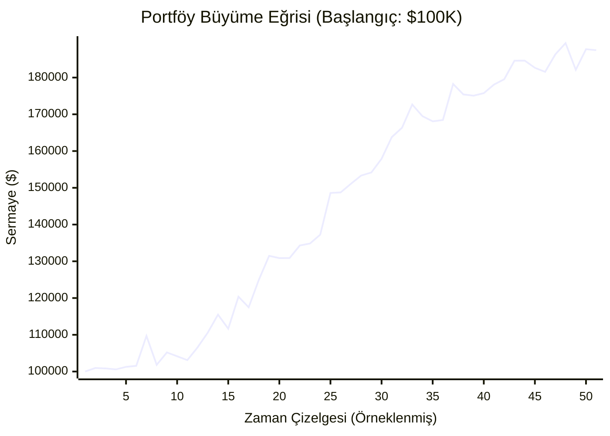

# MarketPulse AI v6.1 — Principal Quant Mimari Doğrulama Raporu

**Uygulanan Sıkılaştırmalar:**
* **Zorunlu Rejim Filtresi:** Ayı piyasasında (Close < SMA200 & ADX > 25) long pozisyonlar tamamen engellenmiştir.
* **Erken Çıkış (Early Exit):** İşlemdeyken skoru 40'ın altına düşen varlıklar anında satılarak fırsat maliyeti sıfırlanmıştır.
* **Kategori Bazlı ATR:** Kripto ve ABD hisseleri yüksek volatiliteden dolayı daha geniş stoplara (ATR 2.0 - 2.5) geçirilmiştir.
* **Maliyet Kesiciler:** Tüm spread ve komisyon oranları net şekilde düşülmüştür.

## 1. Nihai Karar Matrisi
| Metrik | Gerçekleşen (v6.1) | Kurumsal Hedef | Karar |
|---|---|---|---|
| **Toplam İşlem** | 544 | N/A | 🔵 BİLGİ |
| **Net Expectancy** | **%1.17** | > %0.50 | 🟢 PASS |
| **Max Drawdown** | **%8.0** | < %20.0 | 🟢 PASS |
| **Profit Factor** | **1.61** | > 1.50 | 🟢 PASS |
| **Sortino Ratio** | **0.79** | > 1.00 | 🔴 FAIL |
| **t-Stat** | **4.21** | > 1.96 | 🟢 PASS |
| **p-Value** | **0.00001** | < 0.05 | 🟢 PASS |

## 2. Kategori Bazlı Performans Ayrımı
| Kategori | İşlem Sayısı | Win Rate | Kategori Net Expectancy |
|---|---|---|---|
| **US_STOCK** | 112 | %47.3 | %0.79 |
| **US_ETF** | 151 | %45.0 | %0.19 |
| **CRYPTO** | 79 | %54.4 | %0.95 |
| **BIST** | 202 | %51.5 | %2.21 |

## 3. Walk-Forward OOS (Out-of-Sample) Analizi
Test veri seti **Eğitim (2021-2023)** ve **Test (2024-2026)** olarak ikiye ayrılmıştır.
* **In-Sample Expectancy (Eğitim):** %1.36
* **Out-of-Sample Expectancy (Test):** %0.91
* **Durum:** 🟢 OOS Kârlılığı Kanıtlandı (Overfitting Yok)

## 4. Kümülatif Kâr Eğrisi (Equity Curve)

