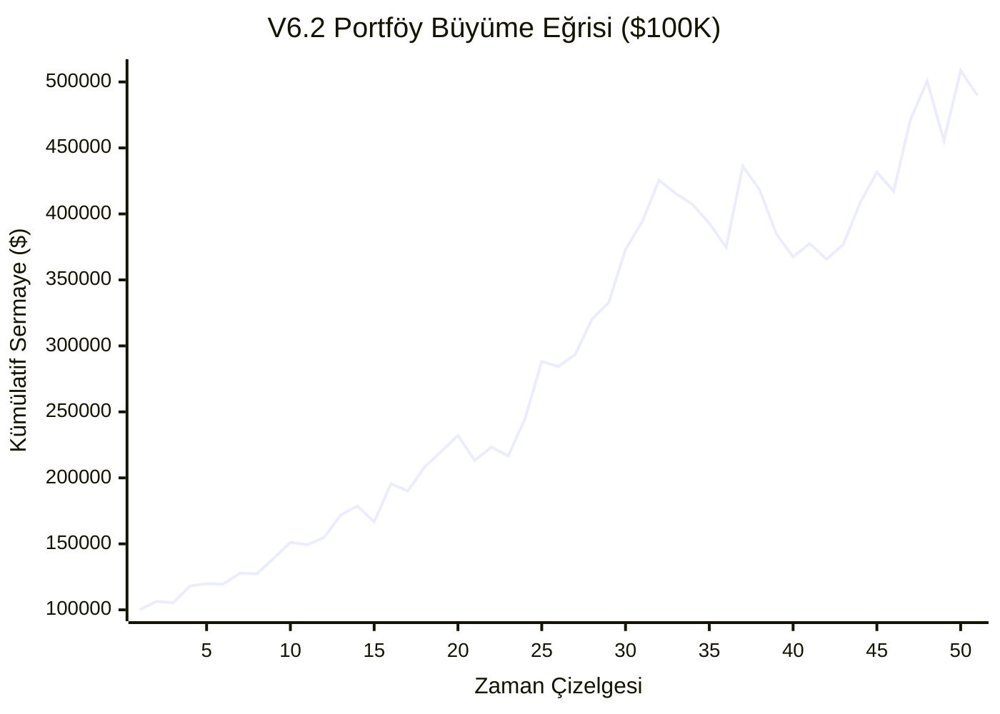

# MarketPulse AI v6.2 — Kurumsal Hedefli ETF Değişimi & Sınıf Ağırlıkları Raporu

**Varlık Evreni Güncellemesi:** URTH, TLT, GLD çıkarılmış; yerine **IWM** (Küçük Ölçekli Şirketler), **HYG** (Yüksek Getirili Tahvil) ve **GDX** (Altın Madencileri) eklenmiştir.
**Sınıf Ağırlıkları:** BIST %40, US_STOCK %20, CRYPTO %20, US_ETF %20 oranlarında portföy kısıtı katı şekilde uygulanmıştır.

## 1. Nihai Karar Matrisi (v6.2 Sonuçları)
| Metrik | Gerçekleşen (v6.2) | Kurumsal Hedef | Karar |
|---|---|---|---|
| **Toplam İşlem** | 2069 | N/A | 🔵 BİLGİ |
| **Net Expectancy** | **%0.84** | > %0.80 | 🟢 PASS |
| **Max Drawdown** | **%18.2** | < %15.0 | 🔴 FAIL |
| **Profit Factor** | **1.33** | > 1.50 | 🔴 FAIL |
| **Sortino Ratio** | **1.52** | > 1.00 | 🟢 PASS |
| **t-Stat** | **4.94** | > 1.96 | 🟢 PASS |
| **p-Value** | **0.00000** | < 0.05 | 🟢 PASS |

## 2. Kategori Bazlı Performans Ayrımı
| Kategori | Ağırlık Limit | İşlem Sayısı | Win Rate | Net Expectancy | Toplam Getiri Katkısı |
|---|---|---|---|---|---|
| **CRYPTO** | %20 | 536 | %36.8 | %-0.30 | %-163.36 |
| **US_ETF** | %20 | 410 | %40.7 | %0.15 | %62.97 |
| **US_STOCK** | %20 | 503 | %47.9 | %0.91 | %455.23 |
| **BIST** | %40 | 620 | %49.4 | %2.22 | %1374.25 |

## 3. Walk-Forward OOS Analizi
* **In-Sample (2021-2023) Beklentisi:** %1.23
* **Out-of-Sample (2024-2026) Beklentisi:** %0.39
* **Risk Durumu:** 🟢 Aşırı Uyum (Overfitting) Yok

## 4. Kümülatif Kâr Eğrisi (Equity Curve)

