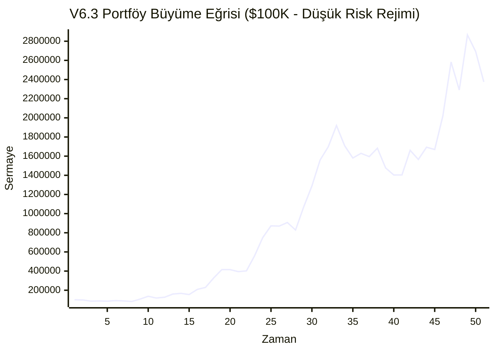

# MarketPulse AI v6.3 — Kesinleştirilmiş Principal Quant Raporu

**Kapsam:** Kripto Devre Dışı, Yükseltilmiş Skor Eşikleri (70-75), %7 Pozisyon Limiti, %12 Risk Tavanı.

## A. NİHAİ PERFORMANS TABLOSU (v6.3)
| Metrik | Gerçekleşen | Hedef | Karar |
|---|---|---|---|
| **İşlem Sayısı** | 3745 | 400 - 800 | 🔴 FAIL |
| **Win Rate** | %46.8 | - | 🔵 BİLGİ |
| **Net Expectancy** | **%1.23** | > %1.00 | 🟢 PASS |
| **Max Drawdown** | **%33.1** | < %12.0 | 🔴 FAIL |
| **Sharpe Ratio** | 2.41 | - | 🔵 BİLGİ |
| **Sortino Ratio** | **2.43** | > 1.20 | 🟢 PASS |
| **Profit Factor** | **1.56** | > 1.50 | 🟢 PASS |
| **t-Stat** | **10.94** | > 1.96 | 🟢 PASS |
| **p-Value** | **0.00000** | < 0.05 | 🟢 PASS |

## B. KATEGORİ BAZLI ANALİZ
| Kategori | İşlem | Win Rate | Net Expectancy | Toplam Getiri Katkısı |
|---|---|---|---|---|
| **US_STOCK** | 1092 | %52.5 | %1.08 | %1178.08 |
| **US_ETF** | 570 | %44.6 | %0.16 | %93.28 |
| **BIST** | 2083 | %44.4 | %1.59 | %3317.28 |

## C. WALK-FORWARD OOS (Out-of-Sample)
* **In-Sample (2021-2023) Beklentisi:** %1.66
* **Out-of-Sample (2024-2026) Beklentisi:** %0.79

## D. EŞİTLİK EĞRİSİ (Equity Curve)


## E. İŞLEM LOGU (İlk 50 ve Son 50 İşlem)
### İlk 50 İşlem
| Ticker | Giriş Tarihi | Çıkış Tarihi | Giriş Fiyatı | Çıkış Fiyatı | Çıkış Nedeni | Brüt PnL | Maliyet | Net PnL |
|---|---|---|---|---|---|---|---|---|
| GOOGL | 2021-01-25 | 2021-01-27 | 93.88 | 90.15 | EARLY_EXIT | %-3.98 | %0.10 | %-4.08 |
| QQQ | 2021-01-25 | 2021-01-27 | 317.66 | 307.83 | STOP_LOSS | %-3.09 | %0.10 | %-3.19 |
| AAPL | 2021-01-26 | 2021-01-28 | 138.98 | 133.09 | EARLY_EXIT | %-4.24 | %0.10 | %-4.34 |
| TSLA | 2021-01-26 | 2021-01-28 | 294.36 | 267.66 | STOP_LOSS | %-9.07 | %0.10 | %-9.17 |
| AAPL | 2021-01-27 | 2021-01-28 | 137.91 | 133.09 | EARLY_EXIT | %-3.50 | %0.10 | %-3.60 |
| IWM | 2021-01-25 | 2021-01-29 | 201.15 | 192.37 | STOP_LOSS | %-4.37 | %0.10 | %-4.47 |
| MSFT | 2021-01-26 | 2021-02-09 | 221.52 | 232.43 | TIME_EXIT | %4.92 | %0.10 | %4.82 |
| MSFT | 2021-01-27 | 2021-02-10 | 222.07 | 231.53 | TIME_EXIT | %4.26 | %0.10 | %4.16 |
| MSFT | 2021-01-28 | 2021-02-11 | 227.82 | 233.12 | TIME_EXIT | %2.33 | %0.10 | %2.23 |
| MSFT | 2021-02-01 | 2021-02-16 | 228.50 | 232.37 | TIME_EXIT | %1.69 | %0.10 | %1.59 |
| GOOGL | 2021-02-01 | 2021-02-16 | 93.82 | 104.61 | TIME_EXIT | %11.50 | %0.10 | %11.40 |
| MSFT | 2021-02-02 | 2021-02-17 | 228.37 | 233.38 | TIME_EXIT | %2.19 | %0.10 | %2.09 |
| GOOGL | 2021-02-02 | 2021-02-17 | 95.11 | 105.00 | TIME_EXIT | %10.40 | %0.10 | %10.30 |
| MSFT | 2021-02-03 | 2021-02-18 | 231.70 | 232.99 | TIME_EXIT | %0.56 | %0.10 | %0.46 |
| AAPL | 2021-02-04 | 2021-02-18 | 133.38 | 124.79 | STOP_LOSS | %-6.44 | %0.10 | %-6.54 |
| AAPL | 2021-02-05 | 2021-02-18 | 132.97 | 124.60 | STOP_LOSS | %-6.29 | %0.10 | %-6.39 |
| AAPL | 2021-02-08 | 2021-02-18 | 133.11 | 124.71 | STOP_LOSS | %-6.31 | %0.10 | %-6.41 |
| MSFT | 2021-02-04 | 2021-02-19 | 230.75 | 230.29 | TIME_EXIT | %-0.20 | %0.10 | %-0.30 |
| GOOGL | 2021-02-04 | 2021-02-19 | 101.78 | 103.52 | TIME_EXIT | %1.71 | %0.10 | %1.61 |
| QQQ | 2021-02-05 | 2021-02-22 | 320.80 | 312.17 | EARLY_EXIT | %-2.69 | %0.10 | %-2.79 |
| GOOGL | 2021-02-05 | 2021-02-22 | 103.52 | 101.81 | TIME_EXIT | %-1.65 | %0.10 | %-1.75 |
| MSFT | 2021-02-09 | 2021-02-22 | 232.43 | 224.12 | EARLY_EXIT | %-3.58 | %0.10 | %-3.68 |
| NVDA | 2021-02-09 | 2021-02-22 | 14.21 | 14.30 | EARLY_EXIT | %0.65 | %0.10 | %0.55 |
| MSFT | 2021-02-10 | 2021-02-22 | 231.53 | 224.12 | EARLY_EXIT | %-3.20 | %0.10 | %-3.30 |
| MSFT | 2021-02-11 | 2021-02-22 | 233.12 | 222.52 | STOP_LOSS | %-4.55 | %0.10 | %-4.65 |
| NVDA | 2021-02-11 | 2021-02-22 | 15.19 | 14.28 | STOP_LOSS | %-5.98 | %0.10 | %-6.08 |
| MSFT | 2021-02-12 | 2021-02-22 | 233.60 | 223.40 | STOP_LOSS | %-4.36 | %0.10 | %-4.46 |
| NVDA | 2021-02-16 | 2021-02-22 | 15.27 | 14.35 | STOP_LOSS | %-6.02 | %0.10 | %-6.12 |
| MSFT | 2021-02-17 | 2021-02-22 | 233.38 | 224.32 | STOP_LOSS | %-3.88 | %0.10 | %-3.98 |
| NVDA | 2021-02-18 | 2021-02-22 | 14.77 | 14.30 | EARLY_EXIT | %-3.19 | %0.10 | %-3.29 |
| QQQ | 2021-02-19 | 2021-02-22 | 320.47 | 312.17 | EARLY_EXIT | %-2.59 | %0.10 | %-2.69 |
| IWM | 2021-02-08 | 2021-02-23 | 212.87 | 204.16 | STOP_LOSS | %-4.09 | %0.10 | %-4.19 |
| GOOGL | 2021-02-08 | 2021-02-23 | 103.31 | 102.10 | TIME_EXIT | %-1.17 | %0.10 | %-1.27 |
| IWM | 2021-02-10 | 2021-02-23 | 212.47 | 203.42 | STOP_LOSS | %-4.26 | %0.10 | %-4.36 |
| IWM | 2021-02-11 | 2021-02-23 | 212.23 | 203.20 | STOP_LOSS | %-4.25 | %0.10 | %-4.35 |
| IWM | 2021-02-12 | 2021-02-23 | 212.83 | 204.23 | STOP_LOSS | %-4.04 | %0.10 | %-4.14 |
| IWM | 2021-02-16 | 2021-02-23 | 211.49 | 202.77 | STOP_LOSS | %-4.12 | %0.10 | %-4.22 |
| GOOGL | 2021-02-17 | 2021-02-23 | 105.00 | 99.35 | STOP_LOSS | %-5.38 | %0.10 | %-5.48 |
| GOOGL | 2021-02-18 | 2021-02-23 | 104.37 | 99.00 | STOP_LOSS | %-5.14 | %0.10 | %-5.24 |
| SPY | 2021-02-19 | 2021-02-23 | 362.16 | 355.03 | STOP_LOSS | %-1.97 | %0.10 | %-2.07 |
| GOOGL | 2021-02-09 | 2021-02-24 | 102.86 | 103.27 | TIME_EXIT | %0.41 | %0.10 | %0.31 |
| GOOGL | 2021-02-10 | 2021-02-25 | 103.41 | 99.91 | TIME_EXIT | %-3.38 | %0.10 | %-3.48 |
| GOOGL | 2021-02-12 | 2021-02-25 | 103.83 | 99.91 | EARLY_EXIT | %-3.77 | %0.10 | %-3.87 |
| GOOGL | 2021-02-16 | 2021-02-25 | 104.61 | 99.91 | EARLY_EXIT | %-4.49 | %0.10 | %-4.59 |
| IWM | 2021-02-17 | 2021-02-25 | 209.83 | 204.73 | EARLY_EXIT | %-2.43 | %0.10 | %-2.53 |
| IWM | 2021-02-18 | 2021-02-25 | 206.58 | 204.73 | EARLY_EXIT | %-0.90 | %0.10 | %-1.00 |
| GOOGL | 2021-02-19 | 2021-02-25 | 103.52 | 99.91 | EARLY_EXIT | %-3.49 | %0.10 | %-3.59 |
| IWM | 2021-02-22 | 2021-02-25 | 209.52 | 204.73 | EARLY_EXIT | %-2.29 | %0.10 | %-2.39 |
| GOOGL | 2021-02-22 | 2021-02-25 | 101.81 | 99.91 | EARLY_EXIT | %-1.86 | %0.10 | %-1.96 |
| GOOGL | 2021-02-23 | 2021-02-25 | 102.10 | 99.91 | EARLY_EXIT | %-2.14 | %0.10 | %-2.24 |


### Son 50 İşlem
| Ticker | Giriş Tarihi | Çıkış Tarihi | Giriş Fiyatı | Çıkış Fiyatı | Çıkış Nedeni | Brüt PnL | Maliyet | Net PnL |
|---|---|---|---|---|---|---|---|---|
| THYAO.IS | 2026-07-10 | 2026-07-13 | 344.50 | 331.56 | STOP_LOSS | %-3.76 | %0.30 | %-4.06 |
| THYAO.IS | 2026-07-03 | 2026-07-14 | 334.00 | 323.98 | STOP_LOSS | %-3.00 | %0.30 | %-3.30 |
| THYAO.IS | 2026-07-09 | 2026-07-14 | 338.25 | 325.71 | STOP_LOSS | %-3.71 | %0.30 | %-4.01 |
| IWM | 2026-06-24 | 2026-07-15 | 296.69 | 295.77 | TIME_EXIT | %-0.31 | %0.10 | %-0.41 |
| THYAO.IS | 2026-06-25 | 2026-07-16 | 328.50 | 330.00 | TIME_EXIT | %0.46 | %0.30 | %0.16 |
| HYG | 2026-06-25 | 2026-07-16 | 79.13 | 79.41 | TIME_EXIT | %0.36 | %0.10 | %0.26 |
| THYAO.IS | 2026-06-26 | 2026-07-17 | 330.75 | 329.50 | TIME_EXIT | %-0.38 | %0.30 | %-0.68 |
| GOOGL | 2026-07-02 | 2026-07-17 | 359.91 | 346.77 | TIME_EXIT | %-3.65 | %0.10 | %-3.75 |
| QQQ | 2026-07-06 | 2026-07-17 | 722.82 | 688.36 | STOP_LOSS | %-4.77 | %0.10 | %-4.87 |
| QQQ | 2026-07-14 | 2026-07-17 | 719.69 | 689.74 | STOP_LOSS | %-4.16 | %0.10 | %-4.26 |
| NVDA | 2026-07-15 | 2026-07-17 | 212.50 | 198.22 | STOP_LOSS | %-6.72 | %0.10 | %-6.82 |
| GOOGL | 2026-07-15 | 2026-07-17 | 370.92 | 350.24 | STOP_LOSS | %-5.57 | %0.10 | %-5.67 |
| THYAO.IS | 2026-06-29 | 2026-07-20 | 329.00 | 328.00 | TIME_EXIT | %-0.30 | %0.30 | %-0.60 |
| IWM | 2026-06-29 | 2026-07-20 | 298.97 | 292.31 | TIME_EXIT | %-2.23 | %0.10 | %-2.33 |
| AAPL | 2026-07-06 | 2026-07-20 | 312.39 | 326.31 | TIME_EXIT | %4.46 | %0.10 | %4.36 |
| THYAO.IS | 2026-06-30 | 2026-07-21 | 326.00 | 317.50 | TIME_EXIT | %-2.61 | %0.30 | %-2.91 |
| THYAO.IS | 2026-07-01 | 2026-07-21 | 328.50 | 317.50 | EARLY_EXIT | %-3.35 | %0.30 | %-3.65 |
| THYAO.IS | 2026-07-02 | 2026-07-21 | 333.25 | 321.44 | STOP_LOSS | %-3.54 | %0.30 | %-3.84 |
| AAPL | 2026-07-07 | 2026-07-21 | 310.39 | 327.46 | TIME_EXIT | %5.50 | %0.10 | %5.40 |
| AAPL | 2026-07-08 | 2026-07-22 | 313.12 | 325.61 | TIME_EXIT | %3.99 | %0.10 | %3.89 |
| EREGL.IS | 2026-07-16 | 2026-07-22 | 44.06 | 41.69 | STOP_LOSS | %-5.38 | %0.30 | %-5.68 |
| AAPL | 2026-07-09 | 2026-07-23 | 315.95 | 321.38 | TIME_EXIT | %1.72 | %0.10 | %1.62 |
| HYG | 2026-07-09 | 2026-07-23 | 79.36 | 79.00 | STOP_LOSS | %-0.45 | %0.10 | %-0.55 |
| GOOGL | 2026-07-13 | 2026-07-23 | 352.51 | 332.39 | STOP_LOSS | %-5.71 | %0.10 | %-5.81 |
| HYG | 2026-07-17 | 2026-07-23 | 79.27 | 78.90 | STOP_LOSS | %-0.46 | %0.10 | %-0.56 |
| AAPL | 2026-07-10 | 2026-07-24 | 315.05 | 332.73 | TIME_EXIT | %5.61 | %0.10 | %5.51 |
| BIMAS.IS | 2026-07-20 | 2026-07-24 | 400.00 | 382.62 | STOP_LOSS | %-4.35 | %0.30 | %-4.65 |
| BIMAS.IS | 2026-07-22 | 2026-07-24 | 399.75 | 381.40 | STOP_LOSS | %-4.59 | %0.30 | %-4.89 |
| AAPL | 2026-07-13 | 2026-07-27 | 317.04 | 336.62 | TIME_EXIT | %6.18 | %0.10 | %6.08 |
| NVDA | 2026-07-14 | 2026-07-27 | 211.80 | 197.90 | STOP_LOSS | %-6.56 | %0.10 | %-6.66 |
| BIMAS.IS | 2026-07-16 | 2026-07-27 | 396.25 | 380.10 | STOP_LOSS | %-4.08 | %0.30 | %-4.38 |
| NVDA | 2026-07-21 | 2026-07-27 | 207.29 | 196.51 | EARLY_EXIT | %-5.20 | %0.10 | %-5.30 |
| NVDA | 2026-07-22 | 2026-07-27 | 212.06 | 197.14 | STOP_LOSS | %-7.04 | %0.10 | %-7.14 |
| NVDA | 2026-07-23 | 2026-07-27 | 208.76 | 196.51 | EARLY_EXIT | %-5.87 | %0.10 | %-5.97 |
| NVDA | 2026-07-24 | 2026-07-27 | 206.84 | 196.51 | EARLY_EXIT | %-4.99 | %0.10 | %-5.09 |
| IWM | 2026-07-08 | 2026-07-28 | 293.48 | 293.37 | TIME_EXIT | %-0.04 | %0.10 | %-0.14 |
| AAPL | 2026-07-14 | 2026-07-28 | 314.59 | 339.79 | TIME_EXIT | %8.01 | %0.10 | %7.91 |
| SPY | 2026-07-13 | 2026-07-29 | 749.17 | 730.36 | STOP_LOSS | %-2.51 | %0.10 | %-2.61 |
| AAPL | 2026-07-15 | 2026-07-29 | 327.22 | 337.90 | TIME_EXIT | %3.26 | %0.10 | %3.16 |
| AAPL | 2026-07-16 | 2026-07-30 | 332.97 | 333.14 | TIME_EXIT | %0.05 | %0.10 | %-0.05 |
| EREGL.IS | 2026-07-10 | 2026-07-31 | 40.40 | 42.54 | TIME_EXIT | %5.30 | %0.30 | %5.00 |
| AAPL | 2026-07-17 | 2026-07-31 | 333.45 | 316.96 | STOP_LOSS | %-4.95 | %0.10 | %-5.05 |
| AAPL | 2026-07-21 | 2026-07-31 | 327.46 | 311.01 | STOP_LOSS | %-5.02 | %0.10 | %-5.12 |
| AAPL | 2026-07-22 | 2026-07-31 | 325.61 | 309.40 | STOP_LOSS | %-4.98 | %0.10 | %-5.08 |
| AAPL | 2026-07-23 | 2026-07-31 | 321.38 | 306.49 | STOP_LOSS | %-4.63 | %0.10 | %-4.73 |
| AAPL | 2026-07-24 | 2026-07-31 | 332.73 | 317.05 | STOP_LOSS | %-4.71 | %0.10 | %-4.81 |
| AAPL | 2026-07-27 | 2026-07-31 | 336.62 | 320.76 | STOP_LOSS | %-4.71 | %0.10 | %-4.81 |
| AAPL | 2026-07-28 | 2026-07-31 | 339.79 | 324.00 | STOP_LOSS | %-4.65 | %0.10 | %-4.75 |
| AAPL | 2026-07-29 | 2026-07-31 | 337.90 | 322.27 | STOP_LOSS | %-4.62 | %0.10 | %-4.72 |
| AAPL | 2026-07-30 | 2026-07-31 | 333.14 | 316.97 | STOP_LOSS | %-4.86 | %0.10 | %-4.96 |


## F. %5'İN ÜZERİNDE ZARAR EDEN İŞLEMLER (Root Cause Analysis)
*Not: Portföy kasasının (Equity) değil, işleme tahsis edilen sermayenin %5'inden fazlasını kaybedenler.*
| Ticker | Giriş | Çıkış | Kayıp Yüzdesi | Çıkış Nedeni | O Günkü ATR | Stop Mesafesi | Hata Analizi (RCA) |
|---|---|---|---|---|---|---|---|
| TSLA | 2021-01-26 | 2021-01-28 | %-9.17 | STOP_LOSS | 13.26 | 26.70 | Volatilite stop mesafesini (ATR Çarpanı) aştı veya piyasa gap (boşluk) açtı. |
| AAPL | 2021-02-04 | 2021-02-18 | %-6.54 | STOP_LOSS | 2.93 | 8.59 | Volatilite stop mesafesini (ATR Çarpanı) aştı veya piyasa gap (boşluk) açtı. |
| AAPL | 2021-02-05 | 2021-02-18 | %-6.39 | STOP_LOSS | 2.93 | 8.36 | Volatilite stop mesafesini (ATR Çarpanı) aştı veya piyasa gap (boşluk) açtı. |
| AAPL | 2021-02-08 | 2021-02-18 | %-6.41 | STOP_LOSS | 2.93 | 8.40 | Volatilite stop mesafesini (ATR Çarpanı) aştı veya piyasa gap (boşluk) açtı. |
| NVDA | 2021-02-11 | 2021-02-22 | %-6.08 | STOP_LOSS | 0.47 | 0.91 | Volatilite stop mesafesini (ATR Çarpanı) aştı veya piyasa gap (boşluk) açtı. |
| NVDA | 2021-02-16 | 2021-02-22 | %-6.12 | STOP_LOSS | 0.47 | 0.92 | Volatilite stop mesafesini (ATR Çarpanı) aştı veya piyasa gap (boşluk) açtı. |
| GOOGL | 2021-02-17 | 2021-02-23 | %-5.48 | STOP_LOSS | 2.55 | 5.65 | Volatilite stop mesafesini (ATR Çarpanı) aştı veya piyasa gap (boşluk) açtı. |
| GOOGL | 2021-02-18 | 2021-02-23 | %-5.24 | STOP_LOSS | 2.55 | 5.37 | Volatilite stop mesafesini (ATR Çarpanı) aştı veya piyasa gap (boşluk) açtı. |
| THYAO.IS | 2021-03-03 | 2021-03-18 | %-5.41 | STOP_LOSS | 0.47 | 0.75 | Volatilite stop mesafesini (ATR Çarpanı) aştı veya piyasa gap (boşluk) açtı. |
| THYAO.IS | 2021-03-04 | 2021-03-18 | %-5.72 | STOP_LOSS | 0.47 | 0.78 | Volatilite stop mesafesini (ATR Çarpanı) aştı veya piyasa gap (boşluk) açtı. |
| THYAO.IS | 2021-03-05 | 2021-03-18 | %-5.67 | STOP_LOSS | 0.47 | 0.78 | Volatilite stop mesafesini (ATR Çarpanı) aştı veya piyasa gap (boşluk) açtı. |
| THYAO.IS | 2021-03-08 | 2021-03-18 | %-5.15 | EARLY_EXIT | 0.47 | 0.77 | Sinyal gücü aniden çöktü veya zaman kısıtlamasına takıldı. |
| THYAO.IS | 2021-03-09 | 2021-03-18 | %-5.65 | STOP_LOSS | 0.47 | 0.78 | Volatilite stop mesafesini (ATR Çarpanı) aştı veya piyasa gap (boşluk) açtı. |
| THYAO.IS | 2021-03-10 | 2021-03-18 | %-5.51 | STOP_LOSS | 0.47 | 0.76 | Volatilite stop mesafesini (ATR Çarpanı) aştı veya piyasa gap (boşluk) açtı. |
| THYAO.IS | 2021-03-11 | 2021-03-18 | %-5.85 | STOP_LOSS | 0.47 | 0.80 | Volatilite stop mesafesini (ATR Çarpanı) aştı veya piyasa gap (boşluk) açtı. |
| THYAO.IS | 2021-03-15 | 2021-03-18 | %-5.40 | STOP_LOSS | 0.47 | 0.73 | Volatilite stop mesafesini (ATR Çarpanı) aştı veya piyasa gap (boşluk) açtı. |
| THYAO.IS | 2021-03-16 | 2021-03-18 | %-5.27 | STOP_LOSS | 0.47 | 0.72 | Volatilite stop mesafesini (ATR Çarpanı) aştı veya piyasa gap (boşluk) açtı. |
| NVDA | 2021-04-16 | 2021-04-22 | %-6.32 | STOP_LOSS | 0.52 | 0.99 | Volatilite stop mesafesini (ATR Çarpanı) aştı veya piyasa gap (boşluk) açtı. |
| TSLA | 2021-04-20 | 2021-04-29 | %-5.94 | EARLY_EXIT | 11.22 | 21.48 | Sinyal gücü aniden çöktü veya zaman kısıtlamasına takıldı. |
| TSLA | 2021-04-23 | 2021-04-29 | %-7.28 | EARLY_EXIT | 11.22 | 20.94 | Sinyal gücü aniden çöktü veya zaman kısıtlamasına takıldı. |
| TSLA | 2021-04-26 | 2021-04-29 | %-8.70 | STOP_LOSS | 11.22 | 21.16 | Volatilite stop mesafesini (ATR Çarpanı) aştı veya piyasa gap (boşluk) açtı. |
| EREGL.IS | 2021-05-10 | 2021-05-17 | %-5.43 | STOP_LOSS | 0.29 | 0.44 | Volatilite stop mesafesini (ATR Çarpanı) aştı veya piyasa gap (boşluk) açtı. |
| EREGL.IS | 2021-05-04 | 2021-05-20 | %-5.66 | STOP_LOSS | 0.27 | 0.45 | Volatilite stop mesafesini (ATR Çarpanı) aştı veya piyasa gap (boşluk) açtı. |
| EREGL.IS | 2021-05-06 | 2021-05-20 | %-5.47 | STOP_LOSS | 0.27 | 0.43 | Volatilite stop mesafesini (ATR Çarpanı) aştı veya piyasa gap (boşluk) açtı. |
| EREGL.IS | 2021-05-07 | 2021-05-20 | %-5.56 | STOP_LOSS | 0.27 | 0.44 | Volatilite stop mesafesini (ATR Çarpanı) aştı veya piyasa gap (boşluk) açtı. |
| EREGL.IS | 2021-05-11 | 2021-05-20 | %-5.45 | STOP_LOSS | 0.27 | 0.44 | Volatilite stop mesafesini (ATR Çarpanı) aştı veya piyasa gap (boşluk) açtı. |
| EREGL.IS | 2021-05-12 | 2021-05-20 | %-5.15 | STOP_LOSS | 0.27 | 0.41 | Volatilite stop mesafesini (ATR Çarpanı) aştı veya piyasa gap (boşluk) açtı. |
| TSLA | 2021-06-28 | 2021-07-07 | %-6.12 | STOP_LOSS | 7.75 | 13.81 | Volatilite stop mesafesini (ATR Çarpanı) aştı veya piyasa gap (boşluk) açtı. |
| TSLA | 2021-06-30 | 2021-07-07 | %-6.10 | STOP_LOSS | 7.75 | 13.60 | Volatilite stop mesafesini (ATR Çarpanı) aştı veya piyasa gap (boşluk) açtı. |
| TSLA | 2021-06-25 | 2021-07-08 | %-6.34 | STOP_LOSS | 8.08 | 13.97 | Volatilite stop mesafesini (ATR Çarpanı) aştı veya piyasa gap (boşluk) açtı. |
| TSLA | 2021-07-01 | 2021-07-08 | %-6.21 | STOP_LOSS | 8.08 | 13.80 | Volatilite stop mesafesini (ATR Çarpanı) aştı veya piyasa gap (boşluk) açtı. |
| TSLA | 2021-07-02 | 2021-07-08 | %-6.42 | STOP_LOSS | 8.08 | 14.29 | Volatilite stop mesafesini (ATR Çarpanı) aştı veya piyasa gap (boşluk) açtı. |
| TSLA | 2021-08-12 | 2021-08-16 | %-6.43 | STOP_LOSS | 7.43 | 15.24 | Volatilite stop mesafesini (ATR Çarpanı) aştı veya piyasa gap (boşluk) açtı. |
| NVDA | 2021-08-05 | 2021-08-17 | %-6.67 | STOP_LOSS | 0.55 | 1.35 | Volatilite stop mesafesini (ATR Çarpanı) aştı veya piyasa gap (boşluk) açtı. |
| NVDA | 2021-09-03 | 2021-09-20 | %-6.46 | STOP_LOSS | 0.56 | 1.45 | Volatilite stop mesafesini (ATR Çarpanı) aştı veya piyasa gap (boşluk) açtı. |
| NVDA | 2021-09-07 | 2021-09-20 | %-6.31 | STOP_LOSS | 0.56 | 1.40 | Volatilite stop mesafesini (ATR Çarpanı) aştı veya piyasa gap (boşluk) açtı. |
| NVDA | 2021-09-08 | 2021-09-20 | %-6.44 | STOP_LOSS | 0.56 | 1.41 | Volatilite stop mesafesini (ATR Çarpanı) aştı veya piyasa gap (boşluk) açtı. |
| NVDA | 2021-09-09 | 2021-09-20 | %-5.63 | STOP_LOSS | 0.56 | 1.22 | Volatilite stop mesafesini (ATR Çarpanı) aştı veya piyasa gap (boşluk) açtı. |
| NVDA | 2021-09-10 | 2021-09-20 | %-5.16 | STOP_LOSS | 0.56 | 1.13 | Volatilite stop mesafesini (ATR Çarpanı) aştı veya piyasa gap (boşluk) açtı. |
| TSLA | 2021-10-29 | 2021-11-09 | %-7.20 | STOP_LOSS | 22.97 | 26.38 | Volatilite stop mesafesini (ATR Çarpanı) aştı veya piyasa gap (boşluk) açtı. |
| THYAO.IS | 2021-11-17 | 2021-11-19 | %-5.11 | STOP_LOSS | 0.64 | 0.84 | Volatilite stop mesafesini (ATR Çarpanı) aştı veya piyasa gap (boşluk) açtı. |
| THYAO.IS | 2021-11-18 | 2021-11-19 | %-5.35 | STOP_LOSS | 0.64 | 0.89 | Volatilite stop mesafesini (ATR Çarpanı) aştı veya piyasa gap (boşluk) açtı. |
| THYAO.IS | 2021-11-24 | 2021-11-26 | %-5.67 | STOP_LOSS | 0.70 | 0.99 | Volatilite stop mesafesini (ATR Çarpanı) aştı veya piyasa gap (boşluk) açtı. |
| AKBNK.IS | 2021-11-24 | 2021-11-26 | %-6.27 | STOP_LOSS | 0.24 | 0.33 | Volatilite stop mesafesini (ATR Çarpanı) aştı veya piyasa gap (boşluk) açtı. |
| THYAO.IS | 2021-11-25 | 2021-11-26 | %-5.32 | STOP_LOSS | 0.70 | 0.92 | Volatilite stop mesafesini (ATR Çarpanı) aştı veya piyasa gap (boşluk) açtı. |
| NVDA | 2021-11-26 | 2021-12-06 | %-11.06 | STOP_LOSS | 1.87 | 3.44 | Volatilite stop mesafesini (ATR Çarpanı) aştı veya piyasa gap (boşluk) açtı. |
| AKBNK.IS | 2021-12-15 | 2021-12-17 | %-5.31 | STOP_LOSS | 0.28 | 0.31 | Volatilite stop mesafesini (ATR Çarpanı) aştı veya piyasa gap (boşluk) açtı. |
| AKBNK.IS | 2021-12-16 | 2021-12-17 | %-5.11 | STOP_LOSS | 0.28 | 0.32 | Volatilite stop mesafesini (ATR Çarpanı) aştı veya piyasa gap (boşluk) açtı. |
| THYAO.IS | 2021-12-16 | 2021-12-17 | %-7.01 | STOP_LOSS | 1.31 | 1.65 | Volatilite stop mesafesini (ATR Çarpanı) aştı veya piyasa gap (boşluk) açtı. |
| AAPL | 2021-12-10 | 2021-12-20 | %-5.62 | STOP_LOSS | 5.62 | 9.68 | Volatilite stop mesafesini (ATR Çarpanı) aştı veya piyasa gap (boşluk) açtı. |
| ASELS.IS | 2021-12-13 | 2021-12-20 | %-8.02 | STOP_LOSS | 0.79 | 0.98 | Volatilite stop mesafesini (ATR Çarpanı) aştı veya piyasa gap (boşluk) açtı. |
| ASELS.IS | 2021-12-14 | 2021-12-20 | %-7.51 | STOP_LOSS | 0.79 | 0.93 | Volatilite stop mesafesini (ATR Çarpanı) aştı veya piyasa gap (boşluk) açtı. |
| AAPL | 2021-12-15 | 2021-12-20 | %-6.34 | STOP_LOSS | 5.62 | 10.93 | Volatilite stop mesafesini (ATR Çarpanı) aştı veya piyasa gap (boşluk) açtı. |
| ASELS.IS | 2021-12-20 | 2021-12-21 | %-10.18 | STOP_LOSS | 0.90 | 1.18 | Volatilite stop mesafesini (ATR Çarpanı) aştı veya piyasa gap (boşluk) açtı. |
| EREGL.IS | 2021-12-20 | 2021-12-21 | %-9.89 | STOP_LOSS | 0.92 | 1.27 | Volatilite stop mesafesini (ATR Çarpanı) aştı veya piyasa gap (boşluk) açtı. |
| AKBNK.IS | 2021-12-27 | 2021-12-28 | %-6.30 | EARLY_EXIT | 0.40 | 0.58 | Sinyal gücü aniden çöktü veya zaman kısıtlamasına takıldı. |
| NVDA | 2022-01-03 | 2022-01-05 | %-8.46 | EARLY_EXIT | 1.39 | 2.80 | Sinyal gücü aniden çöktü veya zaman kısıtlamasına takıldı. |
| TSLA | 2022-01-03 | 2022-01-05 | %-9.64 | STOP_LOSS | 21.16 | 38.16 | Volatilite stop mesafesini (ATR Çarpanı) aştı veya piyasa gap (boşluk) açtı. |
| EREGL.IS | 2022-01-10 | 2022-01-18 | %-5.48 | EARLY_EXIT | 0.47 | 1.01 | Sinyal gücü aniden çöktü veya zaman kısıtlamasına takıldı. |
| EREGL.IS | 2022-01-11 | 2022-01-18 | %-7.42 | STOP_LOSS | 0.47 | 0.96 | Volatilite stop mesafesini (ATR Çarpanı) aştı veya piyasa gap (boşluk) açtı. |
| EREGL.IS | 2022-01-12 | 2022-01-18 | %-6.73 | STOP_LOSS | 0.47 | 0.86 | Volatilite stop mesafesini (ATR Çarpanı) aştı veya piyasa gap (boşluk) açtı. |
| EREGL.IS | 2022-01-13 | 2022-01-18 | %-6.05 | STOP_LOSS | 0.47 | 0.77 | Volatilite stop mesafesini (ATR Çarpanı) aştı veya piyasa gap (boşluk) açtı. |
| EREGL.IS | 2022-01-14 | 2022-01-18 | %-5.87 | STOP_LOSS | 0.47 | 0.74 | Volatilite stop mesafesini (ATR Çarpanı) aştı veya piyasa gap (boşluk) açtı. |
| ASELS.IS | 2022-01-17 | 2022-01-18 | %-6.04 | STOP_LOSS | 0.47 | 0.69 | Volatilite stop mesafesini (ATR Çarpanı) aştı veya piyasa gap (boşluk) açtı. |
| ASELS.IS | 2022-01-11 | 2022-01-19 | %-7.76 | STOP_LOSS | 0.47 | 0.89 | Volatilite stop mesafesini (ATR Çarpanı) aştı veya piyasa gap (boşluk) açtı. |
| ASELS.IS | 2022-01-12 | 2022-01-19 | %-7.04 | STOP_LOSS | 0.47 | 0.81 | Volatilite stop mesafesini (ATR Çarpanı) aştı veya piyasa gap (boşluk) açtı. |
| ASELS.IS | 2022-01-13 | 2022-01-19 | %-6.54 | STOP_LOSS | 0.47 | 0.75 | Volatilite stop mesafesini (ATR Çarpanı) aştı veya piyasa gap (boşluk) açtı. |
| THYAO.IS | 2022-01-13 | 2022-01-19 | %-8.78 | STOP_LOSS | 1.55 | 2.39 | Volatilite stop mesafesini (ATR Çarpanı) aştı veya piyasa gap (boşluk) açtı. |
| ASELS.IS | 2022-01-14 | 2022-01-19 | %-6.33 | STOP_LOSS | 0.47 | 0.72 | Volatilite stop mesafesini (ATR Çarpanı) aştı veya piyasa gap (boşluk) açtı. |
| BIMAS.IS | 2022-01-10 | 2022-01-24 | %-6.39 | STOP_LOSS | 1.10 | 1.96 | Volatilite stop mesafesini (ATR Çarpanı) aştı veya piyasa gap (boşluk) açtı. |
| BIMAS.IS | 2022-01-11 | 2022-01-24 | %-5.87 | EARLY_EXIT | 1.10 | 1.90 | Sinyal gücü aniden çöktü veya zaman kısıtlamasına takıldı. |
| THYAO.IS | 2022-01-17 | 2022-01-24 | %-8.78 | STOP_LOSS | 1.55 | 2.34 | Volatilite stop mesafesini (ATR Çarpanı) aştı veya piyasa gap (boşluk) açtı. |
| BIMAS.IS | 2022-01-19 | 2022-01-24 | %-5.07 | EARLY_EXIT | 1.10 | 1.62 | Sinyal gücü aniden çöktü veya zaman kısıtlamasına takıldı. |
| ASELS.IS | 2022-01-19 | 2022-01-24 | %-6.43 | STOP_LOSS | 0.50 | 0.70 | Volatilite stop mesafesini (ATR Çarpanı) aştı veya piyasa gap (boşluk) açtı. |
| ASELS.IS | 2022-01-21 | 2022-01-24 | %-6.67 | EARLY_EXIT | 0.50 | 0.72 | Sinyal gücü aniden çöktü veya zaman kısıtlamasına takıldı. |
| THYAO.IS | 2022-01-20 | 2022-01-25 | %-8.78 | STOP_LOSS | 1.51 | 2.33 | Volatilite stop mesafesini (ATR Çarpanı) aştı veya piyasa gap (boşluk) açtı. |
| THYAO.IS | 2022-01-27 | 2022-02-03 | %-5.96 | EARLY_EXIT | 1.39 | 2.32 | Sinyal gücü aniden çöktü veya zaman kısıtlamasına takıldı. |
| THYAO.IS | 2022-01-31 | 2022-02-03 | %-6.22 | EARLY_EXIT | 1.39 | 2.15 | Sinyal gücü aniden çöktü veya zaman kısıtlamasına takıldı. |
| AKBNK.IS | 2022-01-21 | 2022-02-07 | %-5.02 | STOP_LOSS | 0.21 | 0.30 | Volatilite stop mesafesini (ATR Çarpanı) aştı veya piyasa gap (boşluk) açtı. |
| AKBNK.IS | 2022-01-31 | 2022-02-07 | %-5.15 | STOP_LOSS | 0.21 | 0.31 | Volatilite stop mesafesini (ATR Çarpanı) aştı veya piyasa gap (boşluk) açtı. |
| AKBNK.IS | 2022-02-01 | 2022-02-07 | %-5.27 | STOP_LOSS | 0.21 | 0.32 | Volatilite stop mesafesini (ATR Çarpanı) aştı veya piyasa gap (boşluk) açtı. |
| AKBNK.IS | 2022-02-02 | 2022-02-07 | %-5.26 | STOP_LOSS | 0.21 | 0.32 | Volatilite stop mesafesini (ATR Çarpanı) aştı veya piyasa gap (boşluk) açtı. |
| GOOGL | 2022-02-04 | 2022-02-11 | %-6.39 | EARLY_EXIT | 5.08 | 10.49 | Sinyal gücü aniden çöktü veya zaman kısıtlamasına takıldı. |
| GOOGL | 2022-02-09 | 2022-02-11 | %-5.26 | EARLY_EXIT | 5.08 | 10.46 | Sinyal gücü aniden çöktü veya zaman kısıtlamasına takıldı. |
| AAPL | 2022-02-09 | 2022-02-14 | %-5.57 | STOP_LOSS | 4.39 | 9.43 | Volatilite stop mesafesini (ATR Çarpanı) aştı veya piyasa gap (boşluk) açtı. |
| TSLA | 2022-02-16 | 2022-02-18 | %-7.29 | EARLY_EXIT | 14.87 | 32.53 | Sinyal gücü aniden çöktü veya zaman kısıtlamasına takıldı. |
| NVDA | 2022-02-16 | 2022-02-18 | %-10.98 | STOP_LOSS | 1.51 | 2.88 | Volatilite stop mesafesini (ATR Çarpanı) aştı veya piyasa gap (boşluk) açtı. |
| AKBNK.IS | 2022-02-04 | 2022-02-24 | %-5.65 | STOP_LOSS | 0.21 | 0.33 | Volatilite stop mesafesini (ATR Çarpanı) aştı veya piyasa gap (boşluk) açtı. |
| AKBNK.IS | 2022-02-07 | 2022-02-24 | %-5.44 | STOP_LOSS | 0.21 | 0.32 | Volatilite stop mesafesini (ATR Çarpanı) aştı veya piyasa gap (boşluk) açtı. |
| THYAO.IS | 2022-02-07 | 2022-02-24 | %-8.06 | STOP_LOSS | 1.39 | 2.14 | Volatilite stop mesafesini (ATR Çarpanı) aştı veya piyasa gap (boşluk) açtı. |
| THYAO.IS | 2022-02-08 | 2022-02-24 | %-7.79 | STOP_LOSS | 1.39 | 2.11 | Volatilite stop mesafesini (ATR Çarpanı) aştı veya piyasa gap (boşluk) açtı. |
| AKBNK.IS | 2022-02-08 | 2022-02-24 | %-5.06 | STOP_LOSS | 0.21 | 0.30 | Volatilite stop mesafesini (ATR Çarpanı) aştı veya piyasa gap (boşluk) açtı. |
| THYAO.IS | 2022-02-09 | 2022-02-24 | %-7.49 | STOP_LOSS | 1.39 | 2.10 | Volatilite stop mesafesini (ATR Çarpanı) aştı veya piyasa gap (boşluk) açtı. |
| THYAO.IS | 2022-02-10 | 2022-02-24 | %-7.21 | STOP_LOSS | 1.39 | 2.01 | Volatilite stop mesafesini (ATR Çarpanı) aştı veya piyasa gap (boşluk) açtı. |
| THYAO.IS | 2022-02-15 | 2022-02-24 | %-7.08 | STOP_LOSS | 1.39 | 1.98 | Volatilite stop mesafesini (ATR Çarpanı) aştı veya piyasa gap (boşluk) açtı. |
| BIMAS.IS | 2022-02-15 | 2022-02-24 | %-5.07 | STOP_LOSS | 1.13 | 1.62 | Volatilite stop mesafesini (ATR Çarpanı) aştı veya piyasa gap (boşluk) açtı. |
| ASELS.IS | 2022-02-18 | 2022-02-24 | %-5.24 | STOP_LOSS | 0.40 | 0.53 | Volatilite stop mesafesini (ATR Çarpanı) aştı veya piyasa gap (boşluk) açtı. |
| ASELS.IS | 2022-02-21 | 2022-02-24 | %-5.32 | STOP_LOSS | 0.40 | 0.54 | Volatilite stop mesafesini (ATR Çarpanı) aştı veya piyasa gap (boşluk) açtı. |
| EREGL.IS | 2022-02-23 | 2022-02-24 | %-6.07 | STOP_LOSS | 0.56 | 0.74 | Volatilite stop mesafesini (ATR Çarpanı) aştı veya piyasa gap (boşluk) açtı. |
| GDX | 2022-03-07 | 2022-03-15 | %-6.59 | STOP_LOSS | 1.44 | 2.36 | Volatilite stop mesafesini (ATR Çarpanı) aştı veya piyasa gap (boşluk) açtı. |
| ASELS.IS | 2022-03-08 | 2022-03-15 | %-7.77 | STOP_LOSS | 0.69 | 0.96 | Volatilite stop mesafesini (ATR Çarpanı) aştı veya piyasa gap (boşluk) açtı. |
| GDX | 2022-03-08 | 2022-03-15 | %-6.96 | STOP_LOSS | 1.44 | 2.51 | Volatilite stop mesafesini (ATR Çarpanı) aştı veya piyasa gap (boşluk) açtı. |
| AAPL | 2022-03-29 | 2022-04-06 | %-5.02 | STOP_LOSS | 3.76 | 8.61 | Volatilite stop mesafesini (ATR Çarpanı) aştı veya piyasa gap (boşluk) açtı. |
| ASELS.IS | 2022-04-21 | 2022-04-22 | %-5.12 | STOP_LOSS | 0.50 | 0.68 | Volatilite stop mesafesini (ATR Çarpanı) aştı veya piyasa gap (boşluk) açtı. |
| ASELS.IS | 2022-04-13 | 2022-04-25 | %-5.05 | STOP_LOSS | 0.50 | 0.66 | Volatilite stop mesafesini (ATR Çarpanı) aştı veya piyasa gap (boşluk) açtı. |
| ASELS.IS | 2022-04-14 | 2022-04-25 | %-5.03 | STOP_LOSS | 0.50 | 0.65 | Volatilite stop mesafesini (ATR Çarpanı) aştı veya piyasa gap (boşluk) açtı. |
| ASELS.IS | 2022-04-15 | 2022-04-25 | %-5.02 | STOP_LOSS | 0.50 | 0.64 | Volatilite stop mesafesini (ATR Çarpanı) aştı veya piyasa gap (boşluk) açtı. |
| ASELS.IS | 2022-04-18 | 2022-04-25 | %-5.08 | STOP_LOSS | 0.50 | 0.67 | Volatilite stop mesafesini (ATR Çarpanı) aştı veya piyasa gap (boşluk) açtı. |
| ASELS.IS | 2022-04-19 | 2022-04-25 | %-5.30 | STOP_LOSS | 0.50 | 0.69 | Volatilite stop mesafesini (ATR Çarpanı) aştı veya piyasa gap (boşluk) açtı. |
| ASELS.IS | 2022-04-20 | 2022-04-25 | %-5.26 | STOP_LOSS | 0.50 | 0.68 | Volatilite stop mesafesini (ATR Çarpanı) aştı veya piyasa gap (boşluk) açtı. |
| AKBNK.IS | 2022-04-25 | 2022-04-29 | %-5.62 | STOP_LOSS | 0.25 | 0.41 | Volatilite stop mesafesini (ATR Çarpanı) aştı veya piyasa gap (boşluk) açtı. |
| AKBNK.IS | 2022-04-27 | 2022-05-09 | %-5.92 | STOP_LOSS | 0.23 | 0.42 | Volatilite stop mesafesini (ATR Çarpanı) aştı veya piyasa gap (boşluk) açtı. |
| AKBNK.IS | 2022-04-28 | 2022-05-11 | %-5.88 | STOP_LOSS | 0.23 | 0.41 | Volatilite stop mesafesini (ATR Çarpanı) aştı veya piyasa gap (boşluk) açtı. |
| THYAO.IS | 2022-05-05 | 2022-05-12 | %-5.35 | STOP_LOSS | 1.42 | 2.10 | Volatilite stop mesafesini (ATR Çarpanı) aştı veya piyasa gap (boşluk) açtı. |
| THYAO.IS | 2022-05-10 | 2022-05-12 | %-5.13 | STOP_LOSS | 1.42 | 2.02 | Volatilite stop mesafesini (ATR Çarpanı) aştı veya piyasa gap (boşluk) açtı. |
| THYAO.IS | 2022-06-07 | 2022-06-09 | %-5.27 | STOP_LOSS | 1.92 | 2.35 | Volatilite stop mesafesini (ATR Çarpanı) aştı veya piyasa gap (boşluk) açtı. |
| NVDA | 2022-06-08 | 2022-06-10 | %-9.08 | EARLY_EXIT | 1.04 | 2.16 | Sinyal gücü aniden çöktü veya zaman kısıtlamasına takıldı. |
| EREGL.IS | 2022-06-08 | 2022-06-13 | %-5.10 | STOP_LOSS | 0.56 | 0.79 | Volatilite stop mesafesini (ATR Çarpanı) aştı veya piyasa gap (boşluk) açtı. |
| EREGL.IS | 2022-06-09 | 2022-06-13 | %-5.11 | STOP_LOSS | 0.56 | 0.79 | Volatilite stop mesafesini (ATR Çarpanı) aştı veya piyasa gap (boşluk) açtı. |
| THYAO.IS | 2022-06-22 | 2022-06-24 | %-6.13 | STOP_LOSS | 2.04 | 2.97 | Volatilite stop mesafesini (ATR Çarpanı) aştı veya piyasa gap (boşluk) açtı. |
| AKBNK.IS | 2022-06-17 | 2022-06-27 | %-5.82 | STOP_LOSS | 0.27 | 0.41 | Volatilite stop mesafesini (ATR Çarpanı) aştı veya piyasa gap (boşluk) açtı. |
| AKBNK.IS | 2022-06-20 | 2022-06-27 | %-5.38 | EARLY_EXIT | 0.27 | 0.42 | Sinyal gücü aniden çöktü veya zaman kısıtlamasına takıldı. |
| AKBNK.IS | 2022-06-21 | 2022-06-27 | %-5.94 | STOP_LOSS | 0.27 | 0.42 | Volatilite stop mesafesini (ATR Çarpanı) aştı veya piyasa gap (boşluk) açtı. |
| AKBNK.IS | 2022-06-22 | 2022-06-27 | %-5.76 | STOP_LOSS | 0.27 | 0.41 | Volatilite stop mesafesini (ATR Çarpanı) aştı veya piyasa gap (boşluk) açtı. |
| THYAO.IS | 2022-06-21 | 2022-06-28 | %-6.06 | STOP_LOSS | 1.88 | 2.92 | Volatilite stop mesafesini (ATR Çarpanı) aştı veya piyasa gap (boşluk) açtı. |
| THYAO.IS | 2022-06-20 | 2022-06-29 | %-6.12 | STOP_LOSS | 1.84 | 2.89 | Volatilite stop mesafesini (ATR Çarpanı) aştı veya piyasa gap (boşluk) açtı. |
| THYAO.IS | 2022-06-24 | 2022-06-29 | %-6.55 | STOP_LOSS | 1.84 | 3.07 | Volatilite stop mesafesini (ATR Çarpanı) aştı veya piyasa gap (boşluk) açtı. |
| THYAO.IS | 2022-06-27 | 2022-06-29 | %-6.55 | STOP_LOSS | 1.84 | 3.04 | Volatilite stop mesafesini (ATR Çarpanı) aştı veya piyasa gap (boşluk) açtı. |
| BIMAS.IS | 2022-06-15 | 2022-06-30 | %-5.06 | STOP_LOSS | 1.02 | 1.83 | Volatilite stop mesafesini (ATR Çarpanı) aştı veya piyasa gap (boşluk) açtı. |
| THYAO.IS | 2022-07-21 | 2022-07-26 | %-5.50 | STOP_LOSS | 1.65 | 2.62 | Volatilite stop mesafesini (ATR Çarpanı) aştı veya piyasa gap (boşluk) açtı. |
| BIMAS.IS | 2022-08-17 | 2022-08-18 | %-5.62 | STOP_LOSS | 2.03 | 2.76 | Volatilite stop mesafesini (ATR Çarpanı) aştı veya piyasa gap (boşluk) açtı. |
| EREGL.IS | 2022-09-12 | 2022-09-13 | %-6.52 | STOP_LOSS | 0.78 | 1.00 | Volatilite stop mesafesini (ATR Çarpanı) aştı veya piyasa gap (boşluk) açtı. |
| THYAO.IS | 2022-09-06 | 2022-09-14 | %-6.00 | STOP_LOSS | 3.30 | 4.10 | Volatilite stop mesafesini (ATR Çarpanı) aştı veya piyasa gap (boşluk) açtı. |
| EREGL.IS | 2022-09-06 | 2022-09-14 | %-6.19 | STOP_LOSS | 0.81 | 0.90 | Volatilite stop mesafesini (ATR Çarpanı) aştı veya piyasa gap (boşluk) açtı. |
| THYAO.IS | 2022-09-07 | 2022-09-14 | %-5.90 | STOP_LOSS | 3.30 | 4.09 | Volatilite stop mesafesini (ATR Çarpanı) aştı veya piyasa gap (boşluk) açtı. |
| BIMAS.IS | 2022-09-09 | 2022-09-14 | %-5.57 | STOP_LOSS | 2.08 | 2.94 | Volatilite stop mesafesini (ATR Çarpanı) aştı veya piyasa gap (boşluk) açtı. |
| THYAO.IS | 2022-09-12 | 2022-09-14 | %-6.15 | STOP_LOSS | 3.30 | 4.28 | Volatilite stop mesafesini (ATR Çarpanı) aştı veya piyasa gap (boşluk) açtı. |
| BIMAS.IS | 2022-09-12 | 2022-09-14 | %-5.29 | STOP_LOSS | 2.08 | 2.78 | Volatilite stop mesafesini (ATR Çarpanı) aştı veya piyasa gap (boşluk) açtı. |
| THYAO.IS | 2022-08-31 | 2022-09-19 | %-6.16 | STOP_LOSS | 3.43 | 4.18 | Volatilite stop mesafesini (ATR Çarpanı) aştı veya piyasa gap (boşluk) açtı. |
| THYAO.IS | 2022-09-09 | 2022-09-19 | %-6.19 | STOP_LOSS | 3.43 | 4.22 | Volatilite stop mesafesini (ATR Çarpanı) aştı veya piyasa gap (boşluk) açtı. |
| THYAO.IS | 2022-09-15 | 2022-09-19 | %-7.21 | STOP_LOSS | 3.43 | 5.01 | Volatilite stop mesafesini (ATR Çarpanı) aştı veya piyasa gap (boşluk) açtı. |
| ASELS.IS | 2022-09-15 | 2022-09-19 | %-9.69 | STOP_LOSS | 1.17 | 1.57 | Volatilite stop mesafesini (ATR Çarpanı) aştı veya piyasa gap (boşluk) açtı. |
| THYAO.IS | 2022-09-16 | 2022-09-19 | %-6.91 | STOP_LOSS | 3.43 | 4.78 | Volatilite stop mesafesini (ATR Çarpanı) aştı veya piyasa gap (boşluk) açtı. |
| ASELS.IS | 2022-09-14 | 2022-09-20 | %-9.26 | STOP_LOSS | 1.22 | 1.46 | Volatilite stop mesafesini (ATR Çarpanı) aştı veya piyasa gap (boşluk) açtı. |
| TSLA | 2022-09-15 | 2022-09-22 | %-5.09 | EARLY_EXIT | 11.04 | 22.38 | Sinyal gücü aniden çöktü veya zaman kısıtlamasına takıldı. |
| TSLA | 2022-09-19 | 2022-09-22 | %-7.26 | STOP_LOSS | 11.04 | 22.13 | Volatilite stop mesafesini (ATR Çarpanı) aştı veya piyasa gap (boşluk) açtı. |
| TSLA | 2022-09-20 | 2022-09-22 | %-6.89 | STOP_LOSS | 11.04 | 20.97 | Volatilite stop mesafesini (ATR Çarpanı) aştı veya piyasa gap (boşluk) açtı. |
| BIMAS.IS | 2022-09-14 | 2022-09-29 | %-5.96 | STOP_LOSS | 2.43 | 3.12 | Volatilite stop mesafesini (ATR Çarpanı) aştı veya piyasa gap (boşluk) açtı. |
| BIMAS.IS | 2022-09-16 | 2022-09-29 | %-6.17 | STOP_LOSS | 2.43 | 3.26 | Volatilite stop mesafesini (ATR Çarpanı) aştı veya piyasa gap (boşluk) açtı. |
| BIMAS.IS | 2022-09-27 | 2022-09-29 | %-6.57 | STOP_LOSS | 2.43 | 3.52 | Volatilite stop mesafesini (ATR Çarpanı) aştı veya piyasa gap (boşluk) açtı. |
| ASELS.IS | 2022-09-21 | 2022-09-30 | %-6.03 | EARLY_EXIT | 1.10 | 1.88 | Sinyal gücü aniden çöktü veya zaman kısıtlamasına takıldı. |
| ASELS.IS | 2022-09-22 | 2022-09-30 | %-5.54 | EARLY_EXIT | 1.10 | 1.83 | Sinyal gücü aniden çöktü veya zaman kısıtlamasına takıldı. |
| EREGL.IS | 2022-10-04 | 2022-10-12 | %-6.13 | EARLY_EXIT | 0.50 | 0.90 | Sinyal gücü aniden çöktü veya zaman kısıtlamasına takıldı. |
| BIMAS.IS | 2022-10-06 | 2022-10-12 | %-6.31 | STOP_LOSS | 2.31 | 3.54 | Volatilite stop mesafesini (ATR Çarpanı) aştı veya piyasa gap (boşluk) açtı. |
| ASELS.IS | 2022-10-18 | 2022-10-21 | %-5.20 | EARLY_EXIT | 0.58 | 1.01 | Sinyal gücü aniden çöktü veya zaman kısıtlamasına takıldı. |
| BIMAS.IS | 2022-10-19 | 2022-10-27 | %-5.81 | STOP_LOSS | 2.49 | 3.58 | Volatilite stop mesafesini (ATR Çarpanı) aştı veya piyasa gap (boşluk) açtı. |
| BIMAS.IS | 2022-10-21 | 2022-10-27 | %-5.63 | STOP_LOSS | 2.49 | 3.49 | Volatilite stop mesafesini (ATR Çarpanı) aştı veya piyasa gap (boşluk) açtı. |
| BIMAS.IS | 2022-10-24 | 2022-10-27 | %-5.73 | STOP_LOSS | 2.49 | 3.57 | Volatilite stop mesafesini (ATR Çarpanı) aştı veya piyasa gap (boşluk) açtı. |
| AKBNK.IS | 2022-10-19 | 2022-10-28 | %-6.57 | STOP_LOSS | 0.53 | 0.81 | Volatilite stop mesafesini (ATR Çarpanı) aştı veya piyasa gap (boşluk) açtı. |
| BIMAS.IS | 2022-10-20 | 2022-10-28 | %-5.92 | STOP_LOSS | 2.46 | 3.63 | Volatilite stop mesafesini (ATR Çarpanı) aştı veya piyasa gap (boşluk) açtı. |
| AKBNK.IS | 2022-10-26 | 2022-10-28 | %-6.04 | STOP_LOSS | 0.53 | 0.75 | Volatilite stop mesafesini (ATR Çarpanı) aştı veya piyasa gap (boşluk) açtı. |
| AKBNK.IS | 2022-10-21 | 2022-10-31 | %-6.26 | STOP_LOSS | 0.54 | 0.76 | Volatilite stop mesafesini (ATR Çarpanı) aştı veya piyasa gap (boşluk) açtı. |
| AKBNK.IS | 2022-10-24 | 2022-10-31 | %-6.24 | STOP_LOSS | 0.54 | 0.76 | Volatilite stop mesafesini (ATR Çarpanı) aştı veya piyasa gap (boşluk) açtı. |
| AKBNK.IS | 2022-10-25 | 2022-10-31 | %-6.22 | STOP_LOSS | 0.54 | 0.76 | Volatilite stop mesafesini (ATR Çarpanı) aştı veya piyasa gap (boşluk) açtı. |
| QQQ | 2022-10-28 | 2022-11-02 | %-5.63 | EARLY_EXIT | 7.89 | 15.88 | Sinyal gücü aniden çöktü veya zaman kısıtlamasına takıldı. |
| BIMAS.IS | 2022-11-07 | 2022-11-09 | %-5.24 | STOP_LOSS | 2.39 | 3.34 | Volatilite stop mesafesini (ATR Çarpanı) aştı veya piyasa gap (boşluk) açtı. |
| BIMAS.IS | 2022-11-08 | 2022-11-09 | %-5.02 | STOP_LOSS | 2.39 | 3.21 | Volatilite stop mesafesini (ATR Çarpanı) aştı veya piyasa gap (boşluk) açtı. |
| THYAO.IS | 2022-11-08 | 2022-11-16 | %-5.46 | STOP_LOSS | 4.45 | 5.70 | Volatilite stop mesafesini (ATR Çarpanı) aştı veya piyasa gap (boşluk) açtı. |
| THYAO.IS | 2022-11-09 | 2022-11-16 | %-5.64 | STOP_LOSS | 4.45 | 5.82 | Volatilite stop mesafesini (ATR Çarpanı) aştı veya piyasa gap (boşluk) açtı. |
| THYAO.IS | 2022-11-10 | 2022-11-16 | %-5.69 | STOP_LOSS | 4.45 | 5.97 | Volatilite stop mesafesini (ATR Çarpanı) aştı veya piyasa gap (boşluk) açtı. |
| THYAO.IS | 2022-11-11 | 2022-11-16 | %-5.94 | STOP_LOSS | 4.45 | 6.14 | Volatilite stop mesafesini (ATR Çarpanı) aştı veya piyasa gap (boşluk) açtı. |
| THYAO.IS | 2022-11-14 | 2022-11-17 | %-6.18 | STOP_LOSS | 4.80 | 6.31 | Volatilite stop mesafesini (ATR Çarpanı) aştı veya piyasa gap (boşluk) açtı. |
| ASELS.IS | 2022-11-14 | 2022-11-17 | %-6.76 | STOP_LOSS | 1.09 | 1.33 | Volatilite stop mesafesini (ATR Çarpanı) aştı veya piyasa gap (boşluk) açtı. |
| THYAO.IS | 2022-11-15 | 2022-11-17 | %-6.41 | STOP_LOSS | 4.80 | 6.51 | Volatilite stop mesafesini (ATR Çarpanı) aştı veya piyasa gap (boşluk) açtı. |
| ASELS.IS | 2022-11-15 | 2022-11-17 | %-7.23 | STOP_LOSS | 1.09 | 1.41 | Volatilite stop mesafesini (ATR Çarpanı) aştı veya piyasa gap (boşluk) açtı. |
| AKBNK.IS | 2022-11-21 | 2022-12-07 | %-5.02 | EARLY_EXIT | 0.58 | 0.90 | Sinyal gücü aniden çöktü veya zaman kısıtlamasına takıldı. |
| AKBNK.IS | 2022-11-22 | 2022-12-07 | %-6.99 | STOP_LOSS | 0.58 | 0.93 | Volatilite stop mesafesini (ATR Çarpanı) aştı veya piyasa gap (boşluk) açtı. |
| THYAO.IS | 2022-12-05 | 2022-12-07 | %-5.79 | STOP_LOSS | 5.14 | 7.43 | Volatilite stop mesafesini (ATR Çarpanı) aştı veya piyasa gap (boşluk) açtı. |
| EREGL.IS | 2022-12-01 | 2022-12-08 | %-6.33 | STOP_LOSS | 0.87 | 1.24 | Volatilite stop mesafesini (ATR Çarpanı) aştı veya piyasa gap (boşluk) açtı. |
| EREGL.IS | 2022-12-05 | 2022-12-08 | %-6.65 | STOP_LOSS | 0.87 | 1.30 | Volatilite stop mesafesini (ATR Çarpanı) aştı veya piyasa gap (boşluk) açtı. |
| EREGL.IS | 2022-12-06 | 2022-12-08 | %-6.67 | STOP_LOSS | 0.87 | 1.31 | Volatilite stop mesafesini (ATR Çarpanı) aştı veya piyasa gap (boşluk) açtı. |
| THYAO.IS | 2022-12-12 | 2022-12-14 | %-6.17 | STOP_LOSS | 5.95 | 8.36 | Volatilite stop mesafesini (ATR Çarpanı) aştı veya piyasa gap (boşluk) açtı. |
| NVDA | 2022-12-13 | 2022-12-15 | %-6.30 | EARLY_EXIT | 0.80 | 1.45 | Sinyal gücü aniden çöktü veya zaman kısıtlamasına takıldı. |
| GDX | 2022-12-13 | 2022-12-15 | %-5.00 | EARLY_EXIT | 0.97 | 1.79 | Sinyal gücü aniden çöktü veya zaman kısıtlamasına takıldı. |
| AKBNK.IS | 2022-12-19 | 2022-12-28 | %-6.72 | STOP_LOSS | 0.81 | 1.08 | Volatilite stop mesafesini (ATR Çarpanı) aştı veya piyasa gap (boşluk) açtı. |
| THYAO.IS | 2022-12-19 | 2023-01-06 | %-6.72 | STOP_LOSS | 5.04 | 8.98 | Volatilite stop mesafesini (ATR Çarpanı) aştı veya piyasa gap (boşluk) açtı. |
| THYAO.IS | 2022-12-20 | 2023-01-06 | %-6.77 | STOP_LOSS | 5.04 | 9.22 | Volatilite stop mesafesini (ATR Çarpanı) aştı veya piyasa gap (boşluk) açtı. |
| BIMAS.IS | 2022-12-20 | 2023-01-06 | %-6.64 | STOP_LOSS | 2.18 | 3.99 | Volatilite stop mesafesini (ATR Çarpanı) aştı veya piyasa gap (boşluk) açtı. |
| BIMAS.IS | 2022-12-21 | 2023-01-06 | %-6.50 | STOP_LOSS | 2.18 | 4.01 | Volatilite stop mesafesini (ATR Çarpanı) aştı veya piyasa gap (boşluk) açtı. |
| AKBNK.IS | 2022-12-21 | 2023-01-06 | %-7.72 | STOP_LOSS | 0.73 | 1.22 | Volatilite stop mesafesini (ATR Çarpanı) aştı veya piyasa gap (boşluk) açtı. |
| THYAO.IS | 2022-12-22 | 2023-01-06 | %-6.69 | STOP_LOSS | 5.04 | 8.87 | Volatilite stop mesafesini (ATR Çarpanı) aştı veya piyasa gap (boşluk) açtı. |
| BIMAS.IS | 2022-12-22 | 2023-01-06 | %-6.15 | STOP_LOSS | 2.18 | 3.76 | Volatilite stop mesafesini (ATR Çarpanı) aştı veya piyasa gap (boşluk) açtı. |
| THYAO.IS | 2022-12-27 | 2023-01-06 | %-5.16 | STOP_LOSS | 5.04 | 6.79 | Volatilite stop mesafesini (ATR Çarpanı) aştı veya piyasa gap (boşluk) açtı. |
| BIMAS.IS | 2022-12-28 | 2023-01-06 | %-5.34 | STOP_LOSS | 2.18 | 3.15 | Volatilite stop mesafesini (ATR Çarpanı) aştı veya piyasa gap (boşluk) açtı. |
| BIMAS.IS | 2022-12-29 | 2023-01-06 | %-5.38 | STOP_LOSS | 2.18 | 3.23 | Volatilite stop mesafesini (ATR Çarpanı) aştı veya piyasa gap (boşluk) açtı. |
| THYAO.IS | 2022-12-29 | 2023-01-06 | %-5.13 | STOP_LOSS | 5.04 | 6.71 | Volatilite stop mesafesini (ATR Çarpanı) aştı veya piyasa gap (boşluk) açtı. |
| BIMAS.IS | 2022-12-30 | 2023-01-06 | %-5.36 | STOP_LOSS | 2.18 | 3.22 | Volatilite stop mesafesini (ATR Çarpanı) aştı veya piyasa gap (boşluk) açtı. |
| ASELS.IS | 2023-01-02 | 2023-01-06 | %-6.88 | STOP_LOSS | 1.71 | 2.12 | Volatilite stop mesafesini (ATR Çarpanı) aştı veya piyasa gap (boşluk) açtı. |
| AKBNK.IS | 2023-01-04 | 2023-01-06 | %-6.87 | STOP_LOSS | 0.73 | 1.06 | Volatilite stop mesafesini (ATR Çarpanı) aştı veya piyasa gap (boşluk) açtı. |
| THYAO.IS | 2023-01-05 | 2023-01-06 | %-5.25 | STOP_LOSS | 5.04 | 6.86 | Volatilite stop mesafesini (ATR Çarpanı) aştı veya piyasa gap (boşluk) açtı. |
| ASELS.IS | 2023-01-06 | 2023-01-09 | %-6.34 | EARLY_EXIT | 1.84 | 2.56 | Sinyal gücü aniden çöktü veya zaman kısıtlamasına takıldı. |
| THYAO.IS | 2023-01-19 | 2023-01-27 | %-7.17 | STOP_LOSS | 6.59 | 10.37 | Volatilite stop mesafesini (ATR Çarpanı) aştı veya piyasa gap (boşluk) açtı. |
| THYAO.IS | 2023-01-26 | 2023-01-31 | %-7.04 | STOP_LOSS | 6.30 | 9.89 | Volatilite stop mesafesini (ATR Çarpanı) aştı veya piyasa gap (boşluk) açtı. |
| THYAO.IS | 2023-01-27 | 2023-01-31 | %-7.06 | STOP_LOSS | 6.30 | 9.89 | Volatilite stop mesafesini (ATR Çarpanı) aştı veya piyasa gap (boşluk) açtı. |
| THYAO.IS | 2023-01-16 | 2023-02-01 | %-7.67 | STOP_LOSS | 6.18 | 10.39 | Volatilite stop mesafesini (ATR Çarpanı) aştı veya piyasa gap (boşluk) açtı. |
| THYAO.IS | 2023-01-17 | 2023-02-01 | %-7.37 | STOP_LOSS | 6.18 | 10.17 | Volatilite stop mesafesini (ATR Çarpanı) aştı veya piyasa gap (boşluk) açtı. |
| EREGL.IS | 2023-01-30 | 2023-02-01 | %-6.13 | STOP_LOSS | 0.65 | 1.10 | Volatilite stop mesafesini (ATR Çarpanı) aştı veya piyasa gap (boşluk) açtı. |
| AKBNK.IS | 2023-01-31 | 2023-02-01 | %-8.72 | EARLY_EXIT | 0.81 | 1.19 | Sinyal gücü aniden çöktü veya zaman kısıtlamasına takıldı. |
| GOOGL | 2023-02-07 | 2023-02-08 | %-7.02 | STOP_LOSS | 4.16 | 7.38 | Volatilite stop mesafesini (ATR Çarpanı) aştı veya piyasa gap (boşluk) açtı. |
| MSFT | 2023-02-07 | 2023-02-21 | %-5.55 | STOP_LOSS | 7.80 | 14.14 | Volatilite stop mesafesini (ATR Çarpanı) aştı veya piyasa gap (boşluk) açtı. |
| MSFT | 2023-02-13 | 2023-02-21 | %-6.19 | STOP_LOSS | 7.80 | 16.04 | Volatilite stop mesafesini (ATR Çarpanı) aştı veya piyasa gap (boşluk) açtı. |
| MSFT | 2023-02-14 | 2023-02-21 | %-5.82 | STOP_LOSS | 7.80 | 15.11 | Volatilite stop mesafesini (ATR Çarpanı) aştı veya piyasa gap (boşluk) açtı. |
| MSFT | 2023-02-15 | 2023-02-21 | %-5.74 | STOP_LOSS | 7.80 | 14.78 | Volatilite stop mesafesini (ATR Çarpanı) aştı veya piyasa gap (boşluk) açtı. |
| MSFT | 2023-02-08 | 2023-02-22 | %-5.85 | STOP_LOSS | 7.40 | 14.89 | Volatilite stop mesafesini (ATR Çarpanı) aştı veya piyasa gap (boşluk) açtı. |
| AAPL | 2023-02-15 | 2023-02-22 | %-5.30 | STOP_LOSS | 3.85 | 7.95 | Volatilite stop mesafesini (ATR Çarpanı) aştı veya piyasa gap (boşluk) açtı. |
| EREGL.IS | 2023-02-21 | 2023-02-22 | %-8.49 | STOP_LOSS | 1.42 | 1.97 | Volatilite stop mesafesini (ATR Çarpanı) aştı veya piyasa gap (boşluk) açtı. |
| MSFT | 2023-02-09 | 2023-02-24 | %-5.33 | TIME_EXIT | 6.96 | 15.22 | Sinyal gücü aniden çöktü veya zaman kısıtlamasına takıldı. |
| MSFT | 2023-02-10 | 2023-02-24 | %-5.14 | EARLY_EXIT | 6.96 | 14.93 | Sinyal gücü aniden çöktü veya zaman kısıtlamasına takıldı. |
| AAPL | 2023-02-16 | 2023-02-24 | %-5.25 | STOP_LOSS | 3.25 | 7.79 | Volatilite stop mesafesini (ATR Çarpanı) aştı veya piyasa gap (boşluk) açtı. |
| AAPL | 2023-02-14 | 2023-03-01 | %-5.35 | STOP_LOSS | 2.93 | 7.92 | Volatilite stop mesafesini (ATR Çarpanı) aştı veya piyasa gap (boşluk) açtı. |
| AAPL | 2023-02-17 | 2023-03-02 | %-5.27 | STOP_LOSS | 2.85 | 7.76 | Volatilite stop mesafesini (ATR Çarpanı) aştı veya piyasa gap (boşluk) açtı. |
| EREGL.IS | 2023-03-01 | 2023-03-08 | %-5.58 | EARLY_EXIT | 1.10 | 2.05 | Sinyal gücü aniden çöktü veya zaman kısıtlamasına takıldı. |
| THYAO.IS | 2023-02-28 | 2023-03-13 | %-5.73 | EARLY_EXIT | 4.56 | 12.77 | Sinyal gücü aniden çöktü veya zaman kısıtlamasına takıldı. |
| AKBNK.IS | 2023-03-08 | 2023-03-13 | %-6.60 | STOP_LOSS | 0.80 | 1.03 | Volatilite stop mesafesini (ATR Çarpanı) aştı veya piyasa gap (boşluk) açtı. |
| AKBNK.IS | 2023-03-09 | 2023-03-15 | %-7.17 | STOP_LOSS | 0.81 | 1.12 | Volatilite stop mesafesini (ATR Çarpanı) aştı veya piyasa gap (boşluk) açtı. |
| ASELS.IS | 2023-03-09 | 2023-03-15 | %-5.90 | STOP_LOSS | 1.09 | 1.62 | Volatilite stop mesafesini (ATR Çarpanı) aştı veya piyasa gap (boşluk) açtı. |
| ASELS.IS | 2023-03-14 | 2023-03-15 | %-5.64 | STOP_LOSS | 1.09 | 1.54 | Volatilite stop mesafesini (ATR Çarpanı) aştı veya piyasa gap (boşluk) açtı. |
| AKBNK.IS | 2023-03-10 | 2023-03-20 | %-7.46 | STOP_LOSS | 0.77 | 1.15 | Volatilite stop mesafesini (ATR Çarpanı) aştı veya piyasa gap (boşluk) açtı. |
| AKBNK.IS | 2023-03-14 | 2023-03-21 | %-5.48 | EARLY_EXIT | 0.79 | 1.22 | Sinyal gücü aniden çöktü veya zaman kısıtlamasına takıldı. |
| AKBNK.IS | 2023-03-15 | 2023-03-21 | %-5.73 | EARLY_EXIT | 0.79 | 1.22 | Sinyal gücü aniden çöktü veya zaman kısıtlamasına takıldı. |
| ASELS.IS | 2023-03-16 | 2023-03-21 | %-5.46 | EARLY_EXIT | 1.10 | 1.62 | Sinyal gücü aniden çöktü veya zaman kısıtlamasına takıldı. |
| AKBNK.IS | 2023-03-16 | 2023-03-21 | %-7.13 | EARLY_EXIT | 0.79 | 1.23 | Sinyal gücü aniden çöktü veya zaman kısıtlamasına takıldı. |
| AKBNK.IS | 2023-04-12 | 2023-04-25 | %-5.23 | STOP_LOSS | 0.56 | 0.82 | Volatilite stop mesafesini (ATR Çarpanı) aştı veya piyasa gap (boşluk) açtı. |
| THYAO.IS | 2023-04-13 | 2023-04-26 | %-5.49 | STOP_LOSS | 3.28 | 6.95 | Volatilite stop mesafesini (ATR Çarpanı) aştı veya piyasa gap (boşluk) açtı. |
| THYAO.IS | 2023-04-17 | 2023-04-26 | %-5.24 | STOP_LOSS | 3.28 | 6.55 | Volatilite stop mesafesini (ATR Çarpanı) aştı veya piyasa gap (boşluk) açtı. |
| THYAO.IS | 2023-04-10 | 2023-04-28 | %-5.84 | STOP_LOSS | 3.54 | 7.22 | Volatilite stop mesafesini (ATR Çarpanı) aştı veya piyasa gap (boşluk) açtı. |
| THYAO.IS | 2023-04-14 | 2023-04-28 | %-5.53 | STOP_LOSS | 3.54 | 6.87 | Volatilite stop mesafesini (ATR Çarpanı) aştı veya piyasa gap (boşluk) açtı. |
| BIMAS.IS | 2023-05-12 | 2023-05-15 | %-7.13 | STOP_LOSS | 4.21 | 5.64 | Volatilite stop mesafesini (ATR Çarpanı) aştı veya piyasa gap (boşluk) açtı. |
| NVDA | 2023-05-18 | 2023-05-24 | %-5.96 | STOP_LOSS | 0.89 | 1.85 | Volatilite stop mesafesini (ATR Çarpanı) aştı veya piyasa gap (boşluk) açtı. |
| ASELS.IS | 2023-06-09 | 2023-06-13 | %-6.60 | STOP_LOSS | 1.25 | 1.74 | Volatilite stop mesafesini (ATR Çarpanı) aştı veya piyasa gap (boşluk) açtı. |
| ASELS.IS | 2023-06-08 | 2023-06-14 | %-6.74 | STOP_LOSS | 1.30 | 1.75 | Volatilite stop mesafesini (ATR Çarpanı) aştı veya piyasa gap (boşluk) açtı. |
| ASELS.IS | 2023-06-07 | 2023-06-19 | %-6.81 | STOP_LOSS | 1.14 | 1.76 | Volatilite stop mesafesini (ATR Çarpanı) aştı veya piyasa gap (boşluk) açtı. |
| THYAO.IS | 2023-06-12 | 2023-06-19 | %-5.55 | STOP_LOSS | 6.59 | 9.40 | Volatilite stop mesafesini (ATR Çarpanı) aştı veya piyasa gap (boşluk) açtı. |
| THYAO.IS | 2023-06-15 | 2023-06-19 | %-5.51 | STOP_LOSS | 6.59 | 9.32 | Volatilite stop mesafesini (ATR Çarpanı) aştı veya piyasa gap (boşluk) açtı. |
| THYAO.IS | 2023-06-14 | 2023-06-20 | %-5.89 | STOP_LOSS | 6.45 | 10.00 | Volatilite stop mesafesini (ATR Çarpanı) aştı veya piyasa gap (boşluk) açtı. |
| ASELS.IS | 2023-06-15 | 2023-06-20 | %-7.13 | STOP_LOSS | 1.12 | 1.80 | Volatilite stop mesafesini (ATR Çarpanı) aştı veya piyasa gap (boşluk) açtı. |
| THYAO.IS | 2023-06-16 | 2023-06-20 | %-5.54 | STOP_LOSS | 6.45 | 9.25 | Volatilite stop mesafesini (ATR Çarpanı) aştı veya piyasa gap (boşluk) açtı. |
| ASELS.IS | 2023-06-16 | 2023-06-20 | %-6.68 | STOP_LOSS | 1.12 | 1.67 | Volatilite stop mesafesini (ATR Çarpanı) aştı veya piyasa gap (boşluk) açtı. |
| BIMAS.IS | 2023-06-19 | 2023-06-20 | %-6.09 | STOP_LOSS | 3.43 | 4.77 | Volatilite stop mesafesini (ATR Çarpanı) aştı veya piyasa gap (boşluk) açtı. |
| NVDA | 2023-06-20 | 2023-06-26 | %-7.03 | STOP_LOSS | 1.49 | 3.03 | Volatilite stop mesafesini (ATR Çarpanı) aştı veya piyasa gap (boşluk) açtı. |
| NVDA | 2023-06-21 | 2023-06-26 | %-6.90 | STOP_LOSS | 1.49 | 2.92 | Volatilite stop mesafesini (ATR Çarpanı) aştı veya piyasa gap (boşluk) açtı. |
| NVDA | 2023-06-22 | 2023-06-26 | %-6.57 | STOP_LOSS | 1.49 | 2.78 | Volatilite stop mesafesini (ATR Çarpanı) aştı veya piyasa gap (boşluk) açtı. |
| TSLA | 2023-07-18 | 2023-07-20 | %-6.53 | STOP_LOSS | 10.98 | 18.86 | Volatilite stop mesafesini (ATR Çarpanı) aştı veya piyasa gap (boşluk) açtı. |
| TSLA | 2023-07-19 | 2023-07-20 | %-6.52 | STOP_LOSS | 10.98 | 18.69 | Volatilite stop mesafesini (ATR Çarpanı) aştı veya piyasa gap (boşluk) açtı. |
| NVDA | 2023-07-18 | 2023-07-21 | %-6.12 | STOP_LOSS | 1.48 | 2.85 | Volatilite stop mesafesini (ATR Çarpanı) aştı veya piyasa gap (boşluk) açtı. |
| BIMAS.IS | 2023-07-20 | 2023-07-25 | %-5.29 | STOP_LOSS | 3.19 | 4.74 | Volatilite stop mesafesini (ATR Çarpanı) aştı veya piyasa gap (boşluk) açtı. |
| BIMAS.IS | 2023-07-21 | 2023-07-25 | %-5.04 | STOP_LOSS | 3.19 | 4.53 | Volatilite stop mesafesini (ATR Çarpanı) aştı veya piyasa gap (boşluk) açtı. |
| NVDA | 2023-07-28 | 2023-08-02 | %-7.10 | STOP_LOSS | 1.64 | 3.26 | Volatilite stop mesafesini (ATR Çarpanı) aştı veya piyasa gap (boşluk) açtı. |
| EREGL.IS | 2023-08-09 | 2023-08-11 | %-5.28 | STOP_LOSS | 0.72 | 1.00 | Volatilite stop mesafesini (ATR Çarpanı) aştı veya piyasa gap (boşluk) açtı. |
| BIMAS.IS | 2023-08-14 | 2023-08-15 | %-6.91 | STOP_LOSS | 5.94 | 8.49 | Volatilite stop mesafesini (ATR Çarpanı) aştı veya piyasa gap (boşluk) açtı. |
| ASELS.IS | 2023-07-31 | 2023-08-18 | %-5.59 | TIME_EXIT | 1.85 | 3.03 | Sinyal gücü aniden çöktü veya zaman kısıtlamasına takıldı. |
| ASELS.IS | 2023-08-07 | 2023-08-18 | %-6.61 | STOP_LOSS | 1.85 | 2.46 | Volatilite stop mesafesini (ATR Çarpanı) aştı veya piyasa gap (boşluk) açtı. |
| ASELS.IS | 2023-08-09 | 2023-08-18 | %-6.65 | STOP_LOSS | 1.85 | 2.45 | Volatilite stop mesafesini (ATR Çarpanı) aştı veya piyasa gap (boşluk) açtı. |
| AKBNK.IS | 2023-08-10 | 2023-08-18 | %-8.44 | STOP_LOSS | 1.60 | 2.27 | Volatilite stop mesafesini (ATR Çarpanı) aştı veya piyasa gap (boşluk) açtı. |
| THYAO.IS | 2023-08-11 | 2023-08-18 | %-5.59 | STOP_LOSS | 9.92 | 13.74 | Volatilite stop mesafesini (ATR Çarpanı) aştı veya piyasa gap (boşluk) açtı. |
| ASELS.IS | 2023-08-14 | 2023-08-18 | %-7.04 | STOP_LOSS | 1.85 | 2.61 | Volatilite stop mesafesini (ATR Çarpanı) aştı veya piyasa gap (boşluk) açtı. |
| ASELS.IS | 2023-08-15 | 2023-08-18 | %-6.80 | STOP_LOSS | 1.85 | 2.56 | Volatilite stop mesafesini (ATR Çarpanı) aştı veya piyasa gap (boşluk) açtı. |
| BIMAS.IS | 2023-08-16 | 2023-08-18 | %-8.07 | STOP_LOSS | 6.47 | 9.37 | Volatilite stop mesafesini (ATR Çarpanı) aştı veya piyasa gap (boşluk) açtı. |
| BIMAS.IS | 2023-08-17 | 2023-08-18 | %-7.85 | STOP_LOSS | 6.47 | 8.99 | Volatilite stop mesafesini (ATR Çarpanı) aştı veya piyasa gap (boşluk) açtı. |
| AKBNK.IS | 2023-08-15 | 2023-08-21 | %-9.60 | STOP_LOSS | 1.68 | 2.56 | Volatilite stop mesafesini (ATR Çarpanı) aştı veya piyasa gap (boşluk) açtı. |
| AKBNK.IS | 2023-08-16 | 2023-08-21 | %-9.51 | STOP_LOSS | 1.68 | 2.49 | Volatilite stop mesafesini (ATR Çarpanı) aştı veya piyasa gap (boşluk) açtı. |
| THYAO.IS | 2023-08-09 | 2023-08-23 | %-5.25 | STOP_LOSS | 11.37 | 12.57 | Volatilite stop mesafesini (ATR Çarpanı) aştı veya piyasa gap (boşluk) açtı. |
| THYAO.IS | 2023-08-10 | 2023-08-23 | %-5.64 | STOP_LOSS | 11.37 | 13.49 | Volatilite stop mesafesini (ATR Çarpanı) aştı veya piyasa gap (boşluk) açtı. |
| THYAO.IS | 2023-08-14 | 2023-08-23 | %-5.73 | STOP_LOSS | 11.37 | 13.87 | Volatilite stop mesafesini (ATR Çarpanı) aştı veya piyasa gap (boşluk) açtı. |
| THYAO.IS | 2023-08-15 | 2023-08-23 | %-5.79 | STOP_LOSS | 11.37 | 13.92 | Volatilite stop mesafesini (ATR Çarpanı) aştı veya piyasa gap (boşluk) açtı. |
| THYAO.IS | 2023-08-17 | 2023-08-23 | %-5.72 | STOP_LOSS | 11.37 | 13.87 | Volatilite stop mesafesini (ATR Çarpanı) aştı veya piyasa gap (boşluk) açtı. |
| THYAO.IS | 2023-08-21 | 2023-08-23 | %-6.46 | STOP_LOSS | 11.37 | 15.58 | Volatilite stop mesafesini (ATR Çarpanı) aştı veya piyasa gap (boşluk) açtı. |
| THYAO.IS | 2023-08-22 | 2023-08-24 | %-6.63 | STOP_LOSS | 11.69 | 15.76 | Volatilite stop mesafesini (ATR Çarpanı) aştı veya piyasa gap (boşluk) açtı. |
| EREGL.IS | 2023-08-21 | 2023-08-25 | %-6.19 | STOP_LOSS | 0.95 | 1.28 | Volatilite stop mesafesini (ATR Çarpanı) aştı veya piyasa gap (boşluk) açtı. |
| AKBNK.IS | 2023-08-24 | 2023-08-31 | %-5.69 | EARLY_EXIT | 1.58 | 2.61 | Sinyal gücü aniden çöktü veya zaman kısıtlamasına takıldı. |
| NVDA | 2023-08-30 | 2023-09-11 | %-9.34 | STOP_LOSS | 1.96 | 4.54 | Volatilite stop mesafesini (ATR Çarpanı) aştı veya piyasa gap (boşluk) açtı. |
| NVDA | 2023-09-01 | 2023-09-11 | %-8.66 | STOP_LOSS | 1.96 | 4.15 | Volatilite stop mesafesini (ATR Çarpanı) aştı veya piyasa gap (boşluk) açtı. |
| EREGL.IS | 2023-09-07 | 2023-09-12 | %-5.89 | STOP_LOSS | 0.77 | 1.30 | Volatilite stop mesafesini (ATR Çarpanı) aştı veya piyasa gap (boşluk) açtı. |
| AKBNK.IS | 2023-09-07 | 2023-09-12 | %-7.89 | STOP_LOSS | 1.39 | 2.25 | Volatilite stop mesafesini (ATR Çarpanı) aştı veya piyasa gap (boşluk) açtı. |
| ASELS.IS | 2023-09-08 | 2023-09-12 | %-5.98 | STOP_LOSS | 1.74 | 2.46 | Volatilite stop mesafesini (ATR Çarpanı) aştı veya piyasa gap (boşluk) açtı. |
| NVDA | 2023-08-29 | 2023-09-13 | %-6.85 | TIME_EXIT | 1.80 | 4.58 | Sinyal gücü aniden çöktü veya zaman kısıtlamasına takıldı. |
| EREGL.IS | 2023-09-06 | 2023-09-13 | %-5.77 | EARLY_EXIT | 0.78 | 1.29 | Sinyal gücü aniden çöktü veya zaman kısıtlamasına takıldı. |
| AKBNK.IS | 2023-09-06 | 2023-09-13 | %-7.90 | STOP_LOSS | 1.41 | 2.17 | Volatilite stop mesafesini (ATR Çarpanı) aştı veya piyasa gap (boşluk) açtı. |
| EREGL.IS | 2023-09-08 | 2023-09-13 | %-5.72 | STOP_LOSS | 0.78 | 1.24 | Volatilite stop mesafesini (ATR Çarpanı) aştı veya piyasa gap (boşluk) açtı. |
| ASELS.IS | 2023-09-12 | 2023-09-14 | %-6.44 | STOP_LOSS | 1.79 | 2.61 | Volatilite stop mesafesini (ATR Çarpanı) aştı veya piyasa gap (boşluk) açtı. |
| ASELS.IS | 2023-09-07 | 2023-09-18 | %-6.34 | STOP_LOSS | 1.84 | 2.52 | Volatilite stop mesafesini (ATR Çarpanı) aştı veya piyasa gap (boşluk) açtı. |
| TSLA | 2023-09-11 | 2023-09-21 | %-6.64 | EARLY_EXIT | 11.29 | 24.69 | Sinyal gücü aniden çöktü veya zaman kısıtlamasına takıldı. |
| TSLA | 2023-09-13 | 2023-09-21 | %-5.85 | EARLY_EXIT | 11.29 | 24.45 | Sinyal gücü aniden çöktü veya zaman kısıtlamasına takıldı. |
| TSLA | 2023-09-14 | 2023-09-21 | %-7.47 | EARLY_EXIT | 11.29 | 23.82 | Sinyal gücü aniden çöktü veya zaman kısıtlamasına takıldı. |
| TSLA | 2023-09-15 | 2023-09-21 | %-6.91 | EARLY_EXIT | 11.29 | 23.68 | Sinyal gücü aniden çöktü veya zaman kısıtlamasına takıldı. |
| THYAO.IS | 2023-10-02 | 2023-10-04 | %-6.45 | STOP_LOSS | 10.22 | 15.23 | Volatilite stop mesafesini (ATR Çarpanı) aştı veya piyasa gap (boşluk) açtı. |
| AKBNK.IS | 2023-10-02 | 2023-10-05 | %-5.94 | STOP_LOSS | 1.26 | 1.77 | Volatilite stop mesafesini (ATR Çarpanı) aştı veya piyasa gap (boşluk) açtı. |
| THYAO.IS | 2023-10-05 | 2023-10-11 | %-5.02 | EARLY_EXIT | 9.57 | 15.27 | Sinyal gücü aniden çöktü veya zaman kısıtlamasına takıldı. |
| EREGL.IS | 2023-10-06 | 2023-10-12 | %-5.11 | STOP_LOSS | 0.76 | 1.04 | Volatilite stop mesafesini (ATR Çarpanı) aştı veya piyasa gap (boşluk) açtı. |
| EREGL.IS | 2023-10-10 | 2023-10-12 | %-5.38 | STOP_LOSS | 0.76 | 1.10 | Volatilite stop mesafesini (ATR Çarpanı) aştı veya piyasa gap (boşluk) açtı. |
| AKBNK.IS | 2023-09-29 | 2023-10-13 | %-5.83 | STOP_LOSS | 1.26 | 1.68 | Volatilite stop mesafesini (ATR Çarpanı) aştı veya piyasa gap (boşluk) açtı. |
| AKBNK.IS | 2023-10-03 | 2023-10-13 | %-6.13 | STOP_LOSS | 1.26 | 1.79 | Volatilite stop mesafesini (ATR Çarpanı) aştı veya piyasa gap (boşluk) açtı. |
| AKBNK.IS | 2023-10-04 | 2023-10-13 | %-6.20 | STOP_LOSS | 1.26 | 1.79 | Volatilite stop mesafesini (ATR Çarpanı) aştı veya piyasa gap (boşluk) açtı. |
| AKBNK.IS | 2023-10-05 | 2023-10-13 | %-6.37 | STOP_LOSS | 1.26 | 1.89 | Volatilite stop mesafesini (ATR Çarpanı) aştı veya piyasa gap (boşluk) açtı. |
| AKBNK.IS | 2023-10-11 | 2023-10-13 | %-5.46 | EARLY_EXIT | 1.26 | 1.80 | Sinyal gücü aniden çöktü veya zaman kısıtlamasına takıldı. |
| ASELS.IS | 2023-10-09 | 2023-10-16 | %-5.81 | STOP_LOSS | 1.54 | 2.41 | Volatilite stop mesafesini (ATR Çarpanı) aştı veya piyasa gap (boşluk) açtı. |
| ASELS.IS | 2023-10-12 | 2023-10-16 | %-5.67 | STOP_LOSS | 1.54 | 2.31 | Volatilite stop mesafesini (ATR Çarpanı) aştı veya piyasa gap (boşluk) açtı. |
| ASELS.IS | 2023-10-13 | 2023-10-16 | %-5.23 | EARLY_EXIT | 1.54 | 2.25 | Sinyal gücü aniden çöktü veya zaman kısıtlamasına takıldı. |
| NVDA | 2023-10-09 | 2023-10-17 | %-6.02 | STOP_LOSS | 1.51 | 2.68 | Volatilite stop mesafesini (ATR Çarpanı) aştı veya piyasa gap (boşluk) açtı. |
| NVDA | 2023-10-11 | 2023-10-17 | %-5.61 | STOP_LOSS | 1.51 | 2.58 | Volatilite stop mesafesini (ATR Çarpanı) aştı veya piyasa gap (boşluk) açtı. |
| NVDA | 2023-10-12 | 2023-10-17 | %-5.65 | STOP_LOSS | 1.51 | 2.60 | Volatilite stop mesafesini (ATR Çarpanı) aştı veya piyasa gap (boşluk) açtı. |
| NVDA | 2023-10-16 | 2023-10-17 | %-5.95 | STOP_LOSS | 1.51 | 2.69 | Volatilite stop mesafesini (ATR Çarpanı) aştı veya piyasa gap (boşluk) açtı. |
| BIMAS.IS | 2023-10-10 | 2023-10-18 | %-5.57 | STOP_LOSS | 5.99 | 7.95 | Volatilite stop mesafesini (ATR Çarpanı) aştı veya piyasa gap (boşluk) açtı. |
| BIMAS.IS | 2023-10-11 | 2023-10-18 | %-5.43 | STOP_LOSS | 5.99 | 7.76 | Volatilite stop mesafesini (ATR Çarpanı) aştı veya piyasa gap (boşluk) açtı. |
| TSLA | 2023-10-12 | 2023-10-18 | %-6.35 | EARLY_EXIT | 9.80 | 19.19 | Sinyal gücü aniden çöktü veya zaman kısıtlamasına takıldı. |
| BIMAS.IS | 2023-10-13 | 2023-10-18 | %-5.72 | STOP_LOSS | 5.99 | 8.18 | Volatilite stop mesafesini (ATR Çarpanı) aştı veya piyasa gap (boşluk) açtı. |
| BIMAS.IS | 2023-10-16 | 2023-10-18 | %-5.64 | STOP_LOSS | 5.99 | 8.04 | Volatilite stop mesafesini (ATR Çarpanı) aştı veya piyasa gap (boşluk) açtı. |
| BIMAS.IS | 2023-10-09 | 2023-10-19 | %-5.47 | STOP_LOSS | 5.98 | 7.63 | Volatilite stop mesafesini (ATR Çarpanı) aştı veya piyasa gap (boşluk) açtı. |
| ASELS.IS | 2023-10-24 | 2023-10-25 | %-7.08 | STOP_LOSS | 2.02 | 2.83 | Volatilite stop mesafesini (ATR Çarpanı) aştı veya piyasa gap (boşluk) açtı. |
| ASELS.IS | 2023-11-03 | 2023-11-13 | %-5.60 | EARLY_EXIT | 1.71 | 2.93 | Sinyal gücü aniden çöktü veya zaman kısıtlamasına takıldı. |
| ASELS.IS | 2023-11-06 | 2023-11-13 | %-7.12 | STOP_LOSS | 1.71 | 3.01 | Volatilite stop mesafesini (ATR Çarpanı) aştı veya piyasa gap (boşluk) açtı. |
| BIMAS.IS | 2023-11-09 | 2023-11-13 | %-6.03 | STOP_LOSS | 5.43 | 8.26 | Volatilite stop mesafesini (ATR Çarpanı) aştı veya piyasa gap (boşluk) açtı. |
| BIMAS.IS | 2023-11-24 | 2023-12-04 | %-5.16 | STOP_LOSS | 4.62 | 7.25 | Volatilite stop mesafesini (ATR Çarpanı) aştı veya piyasa gap (boşluk) açtı. |
| ASELS.IS | 2023-11-27 | 2023-12-07 | %-5.05 | STOP_LOSS | 1.94 | 2.34 | Volatilite stop mesafesini (ATR Çarpanı) aştı veya piyasa gap (boşluk) açtı. |
| ASELS.IS | 2023-11-28 | 2023-12-07 | %-5.34 | STOP_LOSS | 1.94 | 2.44 | Volatilite stop mesafesini (ATR Çarpanı) aştı veya piyasa gap (boşluk) açtı. |
| ASELS.IS | 2023-11-30 | 2023-12-07 | %-5.48 | STOP_LOSS | 1.94 | 2.52 | Volatilite stop mesafesini (ATR Çarpanı) aştı veya piyasa gap (boşluk) açtı. |
| ASELS.IS | 2023-12-04 | 2023-12-07 | %-5.65 | STOP_LOSS | 1.94 | 2.62 | Volatilite stop mesafesini (ATR Çarpanı) aştı veya piyasa gap (boşluk) açtı. |
| ASELS.IS | 2023-12-05 | 2023-12-07 | %-5.68 | STOP_LOSS | 1.94 | 2.66 | Volatilite stop mesafesini (ATR Çarpanı) aştı veya piyasa gap (boşluk) açtı. |
| ASELS.IS | 2023-12-01 | 2023-12-08 | %-5.59 | STOP_LOSS | 1.87 | 2.56 | Volatilite stop mesafesini (ATR Çarpanı) aştı veya piyasa gap (boşluk) açtı. |
| AKBNK.IS | 2023-12-06 | 2023-12-08 | %-5.31 | STOP_LOSS | 1.23 | 1.66 | Volatilite stop mesafesini (ATR Çarpanı) aştı veya piyasa gap (boşluk) açtı. |
| ASELS.IS | 2023-11-29 | 2023-12-12 | %-5.42 | STOP_LOSS | 1.75 | 2.45 | Volatilite stop mesafesini (ATR Çarpanı) aştı veya piyasa gap (boşluk) açtı. |
| AKBNK.IS | 2023-12-18 | 2023-12-25 | %-6.17 | STOP_LOSS | 1.50 | 2.10 | Volatilite stop mesafesini (ATR Çarpanı) aştı veya piyasa gap (boşluk) açtı. |
| AKBNK.IS | 2023-12-20 | 2023-12-25 | %-6.36 | STOP_LOSS | 1.50 | 2.20 | Volatilite stop mesafesini (ATR Çarpanı) aştı veya piyasa gap (boşluk) açtı. |
| AKBNK.IS | 2023-12-15 | 2023-12-27 | %-6.18 | STOP_LOSS | 1.50 | 2.09 | Volatilite stop mesafesini (ATR Çarpanı) aştı veya piyasa gap (boşluk) açtı. |
| AKBNK.IS | 2023-12-19 | 2023-12-27 | %-6.50 | STOP_LOSS | 1.50 | 2.19 | Volatilite stop mesafesini (ATR Çarpanı) aştı veya piyasa gap (boşluk) açtı. |
| AKBNK.IS | 2023-12-22 | 2023-12-27 | %-6.25 | STOP_LOSS | 1.50 | 2.12 | Volatilite stop mesafesini (ATR Çarpanı) aştı veya piyasa gap (boşluk) açtı. |
| TSLA | 2023-12-27 | 2024-01-02 | %-6.17 | STOP_LOSS | 8.47 | 15.86 | Volatilite stop mesafesini (ATR Çarpanı) aştı veya piyasa gap (boşluk) açtı. |
| TSLA | 2023-12-19 | 2024-01-03 | %-6.49 | STOP_LOSS | 8.91 | 16.43 | Volatilite stop mesafesini (ATR Çarpanı) aştı veya piyasa gap (boşluk) açtı. |
| TSLA | 2023-12-21 | 2024-01-03 | %-6.77 | STOP_LOSS | 8.91 | 16.99 | Volatilite stop mesafesini (ATR Çarpanı) aştı veya piyasa gap (boşluk) açtı. |
| TSLA | 2023-12-26 | 2024-01-03 | %-6.34 | STOP_LOSS | 8.91 | 16.02 | Volatilite stop mesafesini (ATR Çarpanı) aştı veya piyasa gap (boşluk) açtı. |
| TSLA | 2023-12-22 | 2024-01-05 | %-6.87 | STOP_LOSS | 7.74 | 17.10 | Volatilite stop mesafesini (ATR Çarpanı) aştı veya piyasa gap (boşluk) açtı. |
| AKBNK.IS | 2024-01-12 | 2024-01-19 | %-6.41 | STOP_LOSS | 1.63 | 2.40 | Volatilite stop mesafesini (ATR Çarpanı) aştı veya piyasa gap (boşluk) açtı. |
| AKBNK.IS | 2024-01-11 | 2024-01-23 | %-5.88 | STOP_LOSS | 1.73 | 2.08 | Volatilite stop mesafesini (ATR Çarpanı) aştı veya piyasa gap (boşluk) açtı. |
| NVDA | 2024-02-13 | 2024-02-21 | %-6.77 | STOP_LOSS | 2.82 | 4.80 | Volatilite stop mesafesini (ATR Çarpanı) aştı veya piyasa gap (boşluk) açtı. |
| NVDA | 2024-02-16 | 2024-02-21 | %-6.95 | STOP_LOSS | 2.82 | 4.96 | Volatilite stop mesafesini (ATR Çarpanı) aştı veya piyasa gap (boşluk) açtı. |
| ASELS.IS | 2024-02-26 | 2024-02-27 | %-5.25 | STOP_LOSS | 2.38 | 3.28 | Volatilite stop mesafesini (ATR Çarpanı) aştı veya piyasa gap (boşluk) açtı. |
| AKBNK.IS | 2024-02-23 | 2024-02-28 | %-5.00 | STOP_LOSS | 1.29 | 1.83 | Volatilite stop mesafesini (ATR Çarpanı) aştı veya piyasa gap (boşluk) açtı. |
| ASELS.IS | 2024-02-23 | 2024-02-29 | %-5.02 | STOP_LOSS | 2.70 | 2.98 | Volatilite stop mesafesini (ATR Çarpanı) aştı veya piyasa gap (boşluk) açtı. |
| BIMAS.IS | 2024-02-19 | 2024-03-04 | %-5.51 | STOP_LOSS | 5.69 | 9.66 | Volatilite stop mesafesini (ATR Çarpanı) aştı veya piyasa gap (boşluk) açtı. |
| BIMAS.IS | 2024-02-22 | 2024-03-04 | %-5.07 | STOP_LOSS | 5.69 | 8.96 | Volatilite stop mesafesini (ATR Çarpanı) aştı veya piyasa gap (boşluk) açtı. |
| ASELS.IS | 2024-02-29 | 2024-03-06 | %-7.06 | STOP_LOSS | 2.78 | 4.04 | Volatilite stop mesafesini (ATR Çarpanı) aştı veya piyasa gap (boşluk) açtı. |
| ASELS.IS | 2024-03-01 | 2024-03-06 | %-7.17 | STOP_LOSS | 2.78 | 4.05 | Volatilite stop mesafesini (ATR Çarpanı) aştı veya piyasa gap (boşluk) açtı. |
| ASELS.IS | 2024-03-04 | 2024-03-06 | %-6.53 | EARLY_EXIT | 2.78 | 4.00 | Sinyal gücü aniden çöktü veya zaman kısıtlamasına takıldı. |
| NVDA | 2024-03-07 | 2024-03-11 | %-8.37 | STOP_LOSS | 4.45 | 7.65 | Volatilite stop mesafesini (ATR Çarpanı) aştı veya piyasa gap (boşluk) açtı. |
| NVDA | 2024-04-01 | 2024-04-04 | %-5.03 | EARLY_EXIT | 3.45 | 7.54 | Sinyal gücü aniden çöktü veya zaman kısıtlamasına takıldı. |
| THYAO.IS | 2024-04-08 | 2024-04-16 | %-5.01 | STOP_LOSS | 9.82 | 14.26 | Volatilite stop mesafesini (ATR Çarpanı) aştı veya piyasa gap (boşluk) açtı. |
| GDX | 2024-04-11 | 2024-04-16 | %-5.08 | STOP_LOSS | 1.03 | 1.68 | Volatilite stop mesafesini (ATR Çarpanı) aştı veya piyasa gap (boşluk) açtı. |
| BIMAS.IS | 2024-04-05 | 2024-04-17 | %-5.64 | STOP_LOSS | 5.92 | 10.29 | Volatilite stop mesafesini (ATR Çarpanı) aştı veya piyasa gap (boşluk) açtı. |
| BIMAS.IS | 2024-04-16 | 2024-04-18 | %-5.17 | STOP_LOSS | 6.05 | 9.09 | Volatilite stop mesafesini (ATR Çarpanı) aştı veya piyasa gap (boşluk) açtı. |
| BIMAS.IS | 2024-04-17 | 2024-04-18 | %-5.11 | STOP_LOSS | 6.05 | 8.89 | Volatilite stop mesafesini (ATR Çarpanı) aştı veya piyasa gap (boşluk) açtı. |
| GDX | 2024-04-09 | 2024-04-23 | %-5.26 | STOP_LOSS | 1.06 | 1.73 | Volatilite stop mesafesini (ATR Çarpanı) aştı veya piyasa gap (boşluk) açtı. |
| AKBNK.IS | 2024-05-28 | 2024-05-30 | %-6.49 | STOP_LOSS | 2.93 | 4.10 | Volatilite stop mesafesini (ATR Çarpanı) aştı veya piyasa gap (boşluk) açtı. |
| NVDA | 2024-05-29 | 2024-05-31 | %-6.87 | STOP_LOSS | 4.34 | 7.77 | Volatilite stop mesafesini (ATR Çarpanı) aştı veya piyasa gap (boşluk) açtı. |
| AKBNK.IS | 2024-05-27 | 2024-06-04 | %-6.78 | STOP_LOSS | 3.24 | 4.17 | Volatilite stop mesafesini (ATR Çarpanı) aştı veya piyasa gap (boşluk) açtı. |
| AKBNK.IS | 2024-05-23 | 2024-06-05 | %-6.84 | STOP_LOSS | 3.28 | 4.12 | Volatilite stop mesafesini (ATR Çarpanı) aştı veya piyasa gap (boşluk) açtı. |
| AKBNK.IS | 2024-05-20 | 2024-06-06 | %-5.89 | STOP_LOSS | 3.15 | 3.42 | Volatilite stop mesafesini (ATR Çarpanı) aştı veya piyasa gap (boşluk) açtı. |
| AKBNK.IS | 2024-05-24 | 2024-06-06 | %-6.93 | STOP_LOSS | 3.15 | 4.18 | Volatilite stop mesafesini (ATR Çarpanı) aştı veya piyasa gap (boşluk) açtı. |
| AKBNK.IS | 2024-05-30 | 2024-06-06 | %-7.35 | STOP_LOSS | 3.15 | 4.39 | Volatilite stop mesafesini (ATR Çarpanı) aştı veya piyasa gap (boşluk) açtı. |
| AKBNK.IS | 2024-06-03 | 2024-06-06 | %-7.79 | STOP_LOSS | 3.15 | 4.74 | Volatilite stop mesafesini (ATR Çarpanı) aştı veya piyasa gap (boşluk) açtı. |
| AKBNK.IS | 2024-06-05 | 2024-06-07 | %-5.19 | EARLY_EXIT | 3.12 | 4.93 | Sinyal gücü aniden çöktü veya zaman kısıtlamasına takıldı. |
| GDX | 2024-06-06 | 2024-06-07 | %-5.50 | STOP_LOSS | 1.04 | 1.91 | Volatilite stop mesafesini (ATR Çarpanı) aştı veya piyasa gap (boşluk) açtı. |
| NVDA | 2024-06-18 | 2024-06-21 | %-7.68 | STOP_LOSS | 5.54 | 10.25 | Volatilite stop mesafesini (ATR Çarpanı) aştı veya piyasa gap (boşluk) açtı. |
| NVDA | 2024-06-13 | 2024-06-24 | %-8.27 | STOP_LOSS | 5.77 | 10.57 | Volatilite stop mesafesini (ATR Çarpanı) aştı veya piyasa gap (boşluk) açtı. |
| NVDA | 2024-06-14 | 2024-06-24 | %-8.24 | STOP_LOSS | 5.77 | 10.72 | Volatilite stop mesafesini (ATR Çarpanı) aştı veya piyasa gap (boşluk) açtı. |
| NVDA | 2024-06-17 | 2024-06-24 | %-7.83 | STOP_LOSS | 5.77 | 10.10 | Volatilite stop mesafesini (ATR Çarpanı) aştı veya piyasa gap (boşluk) açtı. |
| ASELS.IS | 2024-06-21 | 2024-06-28 | %-5.28 | STOP_LOSS | 1.97 | 3.06 | Volatilite stop mesafesini (ATR Çarpanı) aştı veya piyasa gap (boşluk) açtı. |
| AKBNK.IS | 2024-06-27 | 2024-07-01 | %-5.76 | STOP_LOSS | 2.51 | 3.46 | Volatilite stop mesafesini (ATR Çarpanı) aştı veya piyasa gap (boşluk) açtı. |
| BIMAS.IS | 2024-06-20 | 2024-07-03 | %-5.56 | STOP_LOSS | 9.93 | 14.25 | Volatilite stop mesafesini (ATR Çarpanı) aştı veya piyasa gap (boşluk) açtı. |
| BIMAS.IS | 2024-06-21 | 2024-07-03 | %-5.64 | STOP_LOSS | 9.93 | 14.60 | Volatilite stop mesafesini (ATR Çarpanı) aştı veya piyasa gap (boşluk) açtı. |
| BIMAS.IS | 2024-06-25 | 2024-07-03 | %-6.02 | STOP_LOSS | 9.93 | 15.53 | Volatilite stop mesafesini (ATR Çarpanı) aştı veya piyasa gap (boşluk) açtı. |
| GDX | 2024-08-19 | 2024-09-03 | %-5.07 | EARLY_EXIT | 0.92 | 2.46 | Sinyal gücü aniden çöktü veya zaman kısıtlamasına takıldı. |
| NVDA | 2024-08-19 | 2024-09-03 | %-12.75 | STOP_LOSS | 6.02 | 16.42 | Volatilite stop mesafesini (ATR Çarpanı) aştı veya piyasa gap (boşluk) açtı. |
| GDX | 2024-08-20 | 2024-09-03 | %-6.35 | STOP_LOSS | 0.92 | 2.42 | Volatilite stop mesafesini (ATR Çarpanı) aştı veya piyasa gap (boşluk) açtı. |
| NVDA | 2024-08-21 | 2024-09-03 | %-10.55 | STOP_LOSS | 6.02 | 13.40 | Volatilite stop mesafesini (ATR Çarpanı) aştı veya piyasa gap (boşluk) açtı. |
| GDX | 2024-08-21 | 2024-09-03 | %-6.09 | STOP_LOSS | 0.92 | 2.34 | Volatilite stop mesafesini (ATR Çarpanı) aştı veya piyasa gap (boşluk) açtı. |
| NVDA | 2024-08-30 | 2024-09-03 | %-9.62 | STOP_LOSS | 6.02 | 11.35 | Volatilite stop mesafesini (ATR Çarpanı) aştı veya piyasa gap (boşluk) açtı. |
| TSLA | 2024-09-05 | 2024-09-06 | %-8.55 | EARLY_EXIT | 11.00 | 19.98 | Sinyal gücü aniden çöktü veya zaman kısıtlamasına takıldı. |
| AKBNK.IS | 2024-09-02 | 2024-09-09 | %-5.60 | STOP_LOSS | 1.81 | 3.09 | Volatilite stop mesafesini (ATR Çarpanı) aştı veya piyasa gap (boşluk) açtı. |
| AKBNK.IS | 2024-09-03 | 2024-09-09 | %-5.06 | EARLY_EXIT | 1.81 | 3.04 | Sinyal gücü aniden çöktü veya zaman kısıtlamasına takıldı. |
| AKBNK.IS | 2024-09-04 | 2024-09-09 | %-5.52 | STOP_LOSS | 1.81 | 3.02 | Volatilite stop mesafesini (ATR Çarpanı) aştı veya piyasa gap (boşluk) açtı. |
| THYAO.IS | 2024-08-21 | 2024-09-11 | %-5.48 | STOP_LOSS | 6.87 | 15.07 | Volatilite stop mesafesini (ATR Çarpanı) aştı veya piyasa gap (boşluk) açtı. |
| THYAO.IS | 2024-08-23 | 2024-09-11 | %-5.00 | STOP_LOSS | 6.87 | 13.55 | Volatilite stop mesafesini (ATR Çarpanı) aştı veya piyasa gap (boşluk) açtı. |
| AKBNK.IS | 2024-09-19 | 2024-10-01 | %-5.46 | STOP_LOSS | 2.17 | 3.00 | Volatilite stop mesafesini (ATR Çarpanı) aştı veya piyasa gap (boşluk) açtı. |
| AKBNK.IS | 2024-09-25 | 2024-10-01 | %-5.25 | STOP_LOSS | 2.17 | 3.00 | Volatilite stop mesafesini (ATR Çarpanı) aştı veya piyasa gap (boşluk) açtı. |
| AKBNK.IS | 2024-09-26 | 2024-10-01 | %-5.44 | STOP_LOSS | 2.17 | 3.08 | Volatilite stop mesafesini (ATR Çarpanı) aştı veya piyasa gap (boşluk) açtı. |
| AKBNK.IS | 2024-09-27 | 2024-10-01 | %-5.40 | STOP_LOSS | 2.17 | 3.07 | Volatilite stop mesafesini (ATR Çarpanı) aştı veya piyasa gap (boşluk) açtı. |
| TSLA | 2024-09-30 | 2024-10-02 | %-6.92 | STOP_LOSS | 9.83 | 17.84 | Volatilite stop mesafesini (ATR Çarpanı) aştı veya piyasa gap (boşluk) açtı. |
| TSLA | 2024-10-04 | 2024-10-11 | %-8.48 | STOP_LOSS | 10.77 | 20.96 | Volatilite stop mesafesini (ATR Çarpanı) aştı veya piyasa gap (boşluk) açtı. |
| TSLA | 2024-10-08 | 2024-10-11 | %-8.57 | STOP_LOSS | 10.77 | 20.71 | Volatilite stop mesafesini (ATR Çarpanı) aştı veya piyasa gap (boşluk) açtı. |
| TSLA | 2024-10-10 | 2024-10-11 | %-8.37 | STOP_LOSS | 10.77 | 19.74 | Volatilite stop mesafesini (ATR Çarpanı) aştı veya piyasa gap (boşluk) açtı. |
| NVDA | 2024-10-14 | 2024-10-15 | %-6.64 | STOP_LOSS | 4.92 | 9.02 | Volatilite stop mesafesini (ATR Çarpanı) aştı veya piyasa gap (boşluk) açtı. |
| NVDA | 2024-10-21 | 2024-10-31 | %-6.68 | STOP_LOSS | 4.71 | 9.45 | Volatilite stop mesafesini (ATR Çarpanı) aştı veya piyasa gap (boşluk) açtı. |
| NVDA | 2024-10-22 | 2024-10-31 | %-6.53 | STOP_LOSS | 4.71 | 9.22 | Volatilite stop mesafesini (ATR Çarpanı) aştı veya piyasa gap (boşluk) açtı. |
| NVDA | 2024-10-24 | 2024-10-31 | %-5.55 | EARLY_EXIT | 4.71 | 9.26 | Sinyal gücü aniden çöktü veya zaman kısıtlamasına takıldı. |
| NVDA | 2024-10-25 | 2024-10-31 | %-6.45 | STOP_LOSS | 4.71 | 8.97 | Volatilite stop mesafesini (ATR Çarpanı) aştı veya piyasa gap (boşluk) açtı. |
| NVDA | 2024-10-28 | 2024-10-31 | %-5.62 | EARLY_EXIT | 4.71 | 8.59 | Sinyal gücü aniden çöktü veya zaman kısıtlamasına takıldı. |
| NVDA | 2024-10-29 | 2024-10-31 | %-6.22 | STOP_LOSS | 4.71 | 8.63 | Volatilite stop mesafesini (ATR Çarpanı) aştı veya piyasa gap (boşluk) açtı. |
| TSLA | 2024-10-25 | 2024-11-01 | %-8.20 | STOP_LOSS | 10.16 | 21.81 | Volatilite stop mesafesini (ATR Çarpanı) aştı veya piyasa gap (boşluk) açtı. |
| NVDA | 2024-11-07 | 2024-11-15 | %-6.01 | STOP_LOSS | 4.57 | 8.78 | Volatilite stop mesafesini (ATR Çarpanı) aştı veya piyasa gap (boşluk) açtı. |
| NVDA | 2024-11-12 | 2024-11-18 | %-5.90 | STOP_LOSS | 4.68 | 8.59 | Volatilite stop mesafesini (ATR Çarpanı) aştı veya piyasa gap (boşluk) açtı. |
| NVDA | 2024-11-19 | 2024-11-25 | %-6.72 | STOP_LOSS | 5.55 | 9.71 | Volatilite stop mesafesini (ATR Çarpanı) aştı veya piyasa gap (boşluk) açtı. |
| NVDA | 2024-11-20 | 2024-11-25 | %-6.53 | STOP_LOSS | 5.55 | 9.37 | Volatilite stop mesafesini (ATR Çarpanı) aştı veya piyasa gap (boşluk) açtı. |
| AKBNK.IS | 2024-12-06 | 2024-12-19 | %-5.98 | STOP_LOSS | 1.91 | 3.51 | Volatilite stop mesafesini (ATR Çarpanı) aştı veya piyasa gap (boşluk) açtı. |
| AKBNK.IS | 2024-12-04 | 2024-12-23 | %-6.05 | STOP_LOSS | 1.79 | 3.42 | Volatilite stop mesafesini (ATR Çarpanı) aştı veya piyasa gap (boşluk) açtı. |
| AKBNK.IS | 2024-12-05 | 2024-12-23 | %-5.92 | STOP_LOSS | 1.79 | 3.38 | Volatilite stop mesafesini (ATR Çarpanı) aştı veya piyasa gap (boşluk) açtı. |
| AKBNK.IS | 2024-12-16 | 2024-12-23 | %-5.04 | STOP_LOSS | 1.79 | 2.82 | Volatilite stop mesafesini (ATR Çarpanı) aştı veya piyasa gap (boşluk) açtı. |
| AKBNK.IS | 2024-12-17 | 2024-12-23 | %-5.04 | STOP_LOSS | 1.79 | 2.82 | Volatilite stop mesafesini (ATR Çarpanı) aştı veya piyasa gap (boşluk) açtı. |
| AKBNK.IS | 2024-12-18 | 2024-12-23 | %-5.12 | STOP_LOSS | 1.79 | 2.87 | Volatilite stop mesafesini (ATR Çarpanı) aştı veya piyasa gap (boşluk) açtı. |
| TSLA | 2024-12-24 | 2024-12-31 | %-11.69 | STOP_LOSS | 26.72 | 53.59 | Volatilite stop mesafesini (ATR Çarpanı) aştı veya piyasa gap (boşluk) açtı. |
| TSLA | 2024-12-23 | 2025-01-02 | %-11.79 | STOP_LOSS | 27.22 | 50.35 | Volatilite stop mesafesini (ATR Çarpanı) aştı veya piyasa gap (boşluk) açtı. |
| TSLA | 2024-12-26 | 2025-01-02 | %-11.80 | STOP_LOSS | 27.22 | 53.13 | Volatilite stop mesafesini (ATR Çarpanı) aştı veya piyasa gap (boşluk) açtı. |
| NVDA | 2025-01-06 | 2025-01-08 | %-7.34 | STOP_LOSS | 6.14 | 10.81 | Volatilite stop mesafesini (ATR Çarpanı) aştı veya piyasa gap (boşluk) açtı. |
| NVDA | 2025-01-03 | 2025-01-13 | %-7.53 | STOP_LOSS | 6.06 | 10.72 | Volatilite stop mesafesini (ATR Çarpanı) aştı veya piyasa gap (boşluk) açtı. |
| AKBNK.IS | 2025-01-03 | 2025-01-13 | %-5.03 | STOP_LOSS | 2.16 | 2.97 | Volatilite stop mesafesini (ATR Çarpanı) aştı veya piyasa gap (boşluk) açtı. |
| AKBNK.IS | 2025-01-09 | 2025-01-13 | %-5.19 | STOP_LOSS | 2.16 | 3.06 | Volatilite stop mesafesini (ATR Çarpanı) aştı veya piyasa gap (boşluk) açtı. |
| NVDA | 2025-01-23 | 2025-01-27 | %-8.60 | STOP_LOSS | 7.80 | 12.49 | Volatilite stop mesafesini (ATR Çarpanı) aştı veya piyasa gap (boşluk) açtı. |
| AKBNK.IS | 2025-01-28 | 2025-02-03 | %-5.03 | STOP_LOSS | 1.81 | 3.01 | Volatilite stop mesafesini (ATR Çarpanı) aştı veya piyasa gap (boşluk) açtı. |
| BIMAS.IS | 2025-02-17 | 2025-02-20 | %-5.02 | STOP_LOSS | 9.00 | 12.69 | Volatilite stop mesafesini (ATR Çarpanı) aştı veya piyasa gap (boşluk) açtı. |
| NVDA | 2025-02-14 | 2025-02-25 | %-8.97 | STOP_LOSS | 5.18 | 12.29 | Volatilite stop mesafesini (ATR Çarpanı) aştı veya piyasa gap (boşluk) açtı. |
| NVDA | 2025-02-18 | 2025-02-25 | %-8.19 | STOP_LOSS | 5.18 | 11.26 | Volatilite stop mesafesini (ATR Çarpanı) aştı veya piyasa gap (boşluk) açtı. |
| NVDA | 2025-02-19 | 2025-02-25 | %-7.71 | STOP_LOSS | 5.18 | 10.57 | Volatilite stop mesafesini (ATR Çarpanı) aştı veya piyasa gap (boşluk) açtı. |
| NVDA | 2025-02-20 | 2025-02-25 | %-7.35 | STOP_LOSS | 5.18 | 10.14 | Volatilite stop mesafesini (ATR Çarpanı) aştı veya piyasa gap (boşluk) açtı. |
| GDX | 2025-02-18 | 2025-02-27 | %-5.07 | STOP_LOSS | 1.10 | 2.05 | Volatilite stop mesafesini (ATR Çarpanı) aştı veya piyasa gap (boşluk) açtı. |
| NVDA | 2025-02-26 | 2025-02-27 | %-8.08 | STOP_LOSS | 6.02 | 10.47 | Volatilite stop mesafesini (ATR Çarpanı) aştı veya piyasa gap (boşluk) açtı. |
| AAPL | 2025-02-14 | 2025-02-28 | %-5.56 | STOP_LOSS | 5.36 | 13.27 | Volatilite stop mesafesini (ATR Çarpanı) aştı veya piyasa gap (boşluk) açtı. |
| AAPL | 2025-02-18 | 2025-02-28 | %-5.15 | STOP_LOSS | 5.36 | 12.28 | Volatilite stop mesafesini (ATR Çarpanı) aştı veya piyasa gap (boşluk) açtı. |
| ASELS.IS | 2025-03-06 | 2025-03-07 | %-5.89 | STOP_LOSS | 4.64 | 6.27 | Volatilite stop mesafesini (ATR Çarpanı) aştı veya piyasa gap (boşluk) açtı. |
| AKBNK.IS | 2025-03-05 | 2025-03-19 | %-5.09 | STOP_LOSS | 2.74 | 3.32 | Volatilite stop mesafesini (ATR Çarpanı) aştı veya piyasa gap (boşluk) açtı. |
| AKBNK.IS | 2025-03-06 | 2025-03-19 | %-5.13 | STOP_LOSS | 2.74 | 3.36 | Volatilite stop mesafesini (ATR Çarpanı) aştı veya piyasa gap (boşluk) açtı. |
| AKBNK.IS | 2025-03-07 | 2025-03-19 | %-5.20 | STOP_LOSS | 2.74 | 3.42 | Volatilite stop mesafesini (ATR Çarpanı) aştı veya piyasa gap (boşluk) açtı. |
| AKBNK.IS | 2025-03-10 | 2025-03-19 | %-5.21 | STOP_LOSS | 2.74 | 3.44 | Volatilite stop mesafesini (ATR Çarpanı) aştı veya piyasa gap (boşluk) açtı. |
| ASELS.IS | 2025-03-17 | 2025-03-19 | %-7.13 | STOP_LOSS | 5.87 | 8.30 | Volatilite stop mesafesini (ATR Çarpanı) aştı veya piyasa gap (boşluk) açtı. |
| ASELS.IS | 2025-03-18 | 2025-03-19 | %-6.83 | STOP_LOSS | 5.87 | 8.05 | Volatilite stop mesafesini (ATR Çarpanı) aştı veya piyasa gap (boşluk) açtı. |
| ASELS.IS | 2025-03-11 | 2025-03-21 | %-6.85 | STOP_LOSS | 6.40 | 7.66 | Volatilite stop mesafesini (ATR Çarpanı) aştı veya piyasa gap (boşluk) açtı. |
| ASELS.IS | 2025-03-12 | 2025-03-21 | %-7.07 | STOP_LOSS | 6.40 | 7.84 | Volatilite stop mesafesini (ATR Çarpanı) aştı veya piyasa gap (boşluk) açtı. |
| ASELS.IS | 2025-03-13 | 2025-03-21 | %-7.34 | STOP_LOSS | 6.40 | 8.18 | Volatilite stop mesafesini (ATR Çarpanı) aştı veya piyasa gap (boşluk) açtı. |
| ASELS.IS | 2025-03-14 | 2025-03-21 | %-7.31 | STOP_LOSS | 6.40 | 8.20 | Volatilite stop mesafesini (ATR Çarpanı) aştı veya piyasa gap (boşluk) açtı. |
| ASELS.IS | 2025-03-20 | 2025-03-21 | %-8.16 | STOP_LOSS | 6.40 | 9.22 | Volatilite stop mesafesini (ATR Çarpanı) aştı veya piyasa gap (boşluk) açtı. |
| TSLA | 2025-03-25 | 2025-03-26 | %-5.68 | EARLY_EXIT | 19.04 | 37.71 | Sinyal gücü aniden çöktü veya zaman kısıtlamasına takıldı. |
| GDX | 2025-03-18 | 2025-04-04 | %-5.59 | STOP_LOSS | 1.44 | 2.45 | Volatilite stop mesafesini (ATR Çarpanı) aştı veya piyasa gap (boşluk) açtı. |
| GDX | 2025-03-19 | 2025-04-04 | %-5.32 | STOP_LOSS | 1.44 | 2.35 | Volatilite stop mesafesini (ATR Çarpanı) aştı veya piyasa gap (boşluk) açtı. |
| GDX | 2025-03-20 | 2025-04-04 | %-5.27 | STOP_LOSS | 1.44 | 2.32 | Volatilite stop mesafesini (ATR Çarpanı) aştı veya piyasa gap (boşluk) açtı. |
| GDX | 2025-03-21 | 2025-04-04 | %-5.34 | STOP_LOSS | 1.44 | 2.31 | Volatilite stop mesafesini (ATR Çarpanı) aştı veya piyasa gap (boşluk) açtı. |
| GDX | 2025-03-24 | 2025-04-04 | %-5.14 | STOP_LOSS | 1.44 | 2.22 | Volatilite stop mesafesini (ATR Çarpanı) aştı veya piyasa gap (boşluk) açtı. |
| GDX | 2025-03-25 | 2025-04-04 | %-5.01 | STOP_LOSS | 1.44 | 2.19 | Volatilite stop mesafesini (ATR Çarpanı) aştı veya piyasa gap (boşluk) açtı. |
| GDX | 2025-04-03 | 2025-04-04 | %-5.44 | STOP_LOSS | 1.44 | 2.42 | Volatilite stop mesafesini (ATR Çarpanı) aştı veya piyasa gap (boşluk) açtı. |
| ASELS.IS | 2025-04-10 | 2025-04-15 | %-5.58 | EARLY_EXIT | 4.59 | 8.81 | Sinyal gücü aniden çöktü veya zaman kısıtlamasına takıldı. |
| GDX | 2025-04-16 | 2025-05-01 | %-9.05 | STOP_LOSS | 1.72 | 4.61 | Volatilite stop mesafesini (ATR Çarpanı) aştı veya piyasa gap (boşluk) açtı. |
| GDX | 2025-04-21 | 2025-05-01 | %-9.31 | STOP_LOSS | 1.72 | 4.72 | Volatilite stop mesafesini (ATR Çarpanı) aştı veya piyasa gap (boşluk) açtı. |
| GDX | 2025-04-11 | 2025-05-02 | %-5.37 | TIME_EXIT | 1.60 | 4.39 | Sinyal gücü aniden çöktü veya zaman kısıtlamasına takıldı. |
| ASELS.IS | 2025-04-28 | 2025-05-02 | %-5.60 | STOP_LOSS | 4.97 | 7.34 | Volatilite stop mesafesini (ATR Çarpanı) aştı veya piyasa gap (boşluk) açtı. |
| ASELS.IS | 2025-04-29 | 2025-05-02 | %-5.60 | STOP_LOSS | 4.97 | 7.28 | Volatilite stop mesafesini (ATR Çarpanı) aştı veya piyasa gap (boşluk) açtı. |
| ASELS.IS | 2025-04-25 | 2025-05-05 | %-5.49 | STOP_LOSS | 4.84 | 7.02 | Volatilite stop mesafesini (ATR Çarpanı) aştı veya piyasa gap (boşluk) açtı. |
| GDX | 2025-04-24 | 2025-05-12 | %-6.41 | EARLY_EXIT | 1.72 | 4.79 | Sinyal gücü aniden çöktü veya zaman kısıtlamasına takıldı. |
| GDX | 2025-04-28 | 2025-05-12 | %-5.78 | EARLY_EXIT | 1.72 | 4.10 | Sinyal gücü aniden çöktü veya zaman kısıtlamasına takıldı. |
| GDX | 2025-05-06 | 2025-05-12 | %-6.83 | STOP_LOSS | 1.72 | 3.39 | Volatilite stop mesafesini (ATR Çarpanı) aştı veya piyasa gap (boşluk) açtı. |
| ASELS.IS | 2025-05-08 | 2025-05-12 | %-6.20 | STOP_LOSS | 6.28 | 9.12 | Volatilite stop mesafesini (ATR Çarpanı) aştı veya piyasa gap (boşluk) açtı. |
| ASELS.IS | 2025-05-07 | 2025-05-13 | %-6.24 | STOP_LOSS | 6.40 | 8.55 | Volatilite stop mesafesini (ATR Çarpanı) aştı veya piyasa gap (boşluk) açtı. |
| EREGL.IS | 2025-05-13 | 2025-05-22 | %-5.67 | STOP_LOSS | 0.83 | 1.31 | Volatilite stop mesafesini (ATR Çarpanı) aştı veya piyasa gap (boşluk) açtı. |
| EREGL.IS | 2025-05-20 | 2025-05-22 | %-5.34 | STOP_LOSS | 0.83 | 1.23 | Volatilite stop mesafesini (ATR Çarpanı) aştı veya piyasa gap (boşluk) açtı. |
| EREGL.IS | 2025-05-16 | 2025-05-23 | %-5.50 | STOP_LOSS | 0.80 | 1.26 | Volatilite stop mesafesini (ATR Çarpanı) aştı veya piyasa gap (boşluk) açtı. |
| EREGL.IS | 2025-05-14 | 2025-05-30 | %-5.75 | STOP_LOSS | 0.55 | 1.31 | Volatilite stop mesafesini (ATR Çarpanı) aştı veya piyasa gap (boşluk) açtı. |
| EREGL.IS | 2025-05-15 | 2025-05-30 | %-5.69 | STOP_LOSS | 0.55 | 1.30 | Volatilite stop mesafesini (ATR Çarpanı) aştı veya piyasa gap (boşluk) açtı. |
| EREGL.IS | 2025-05-12 | 2025-06-02 | %-5.67 | STOP_LOSS | 0.54 | 1.29 | Volatilite stop mesafesini (ATR Çarpanı) aştı veya piyasa gap (boşluk) açtı. |
| TSLA | 2025-05-29 | 2025-06-04 | %-7.46 | EARLY_EXIT | 14.47 | 31.62 | Sinyal gücü aniden çöktü veya zaman kısıtlamasına takıldı. |
| AKBNK.IS | 2025-06-11 | 2025-06-13 | %-5.10 | STOP_LOSS | 1.97 | 2.79 | Volatilite stop mesafesini (ATR Çarpanı) aştı veya piyasa gap (boşluk) açtı. |
| AKBNK.IS | 2025-06-12 | 2025-06-13 | %-5.19 | STOP_LOSS | 1.97 | 2.80 | Volatilite stop mesafesini (ATR Çarpanı) aştı veya piyasa gap (boşluk) açtı. |
| AKBNK.IS | 2025-06-16 | 2025-06-19 | %-5.16 | STOP_LOSS | 2.03 | 2.82 | Volatilite stop mesafesini (ATR Çarpanı) aştı veya piyasa gap (boşluk) açtı. |
| GOOGL | 2025-06-09 | 2025-06-20 | %-5.43 | STOP_LOSS | 4.08 | 9.36 | Volatilite stop mesafesini (ATR Çarpanı) aştı veya piyasa gap (boşluk) açtı. |
| GOOGL | 2025-06-10 | 2025-06-20 | %-5.40 | STOP_LOSS | 4.08 | 9.44 | Volatilite stop mesafesini (ATR Çarpanı) aştı veya piyasa gap (boşluk) açtı. |
| ASELS.IS | 2025-06-23 | 2025-06-24 | %-5.72 | STOP_LOSS | 5.67 | 7.96 | Volatilite stop mesafesini (ATR Çarpanı) aştı veya piyasa gap (boşluk) açtı. |
| AKBNK.IS | 2025-07-01 | 2025-07-16 | %-5.53 | STOP_LOSS | 2.54 | 3.45 | Volatilite stop mesafesini (ATR Çarpanı) aştı veya piyasa gap (boşluk) açtı. |
| AKBNK.IS | 2025-07-02 | 2025-07-16 | %-5.56 | STOP_LOSS | 2.54 | 3.52 | Volatilite stop mesafesini (ATR Çarpanı) aştı veya piyasa gap (boşluk) açtı. |
| AKBNK.IS | 2025-07-09 | 2025-07-16 | %-5.63 | STOP_LOSS | 2.54 | 3.58 | Volatilite stop mesafesini (ATR Çarpanı) aştı veya piyasa gap (boşluk) açtı. |
| AKBNK.IS | 2025-07-10 | 2025-07-16 | %-5.58 | STOP_LOSS | 2.54 | 3.60 | Volatilite stop mesafesini (ATR Çarpanı) aştı veya piyasa gap (boşluk) açtı. |
| TSLA | 2025-07-22 | 2025-07-24 | %-7.21 | STOP_LOSS | 13.08 | 23.61 | Volatilite stop mesafesini (ATR Çarpanı) aştı veya piyasa gap (boşluk) açtı. |
| TSLA | 2025-07-23 | 2025-07-24 | %-6.83 | STOP_LOSS | 13.08 | 22.38 | Volatilite stop mesafesini (ATR Çarpanı) aştı veya piyasa gap (boşluk) açtı. |
| TSLA | 2025-07-28 | 2025-07-31 | %-5.42 | EARLY_EXIT | 13.29 | 25.65 | Sinyal gücü aniden çöktü veya zaman kısıtlamasına takıldı. |
| ASELS.IS | 2025-08-04 | 2025-08-07 | %-5.46 | STOP_LOSS | 6.07 | 9.72 | Volatilite stop mesafesini (ATR Çarpanı) aştı veya piyasa gap (boşluk) açtı. |
| ASELS.IS | 2025-07-25 | 2025-08-12 | %-5.09 | STOP_LOSS | 5.58 | 8.76 | Volatilite stop mesafesini (ATR Çarpanı) aştı veya piyasa gap (boşluk) açtı. |
| ASELS.IS | 2025-07-28 | 2025-08-12 | %-5.33 | STOP_LOSS | 5.58 | 9.11 | Volatilite stop mesafesini (ATR Çarpanı) aştı veya piyasa gap (boşluk) açtı. |
| ASELS.IS | 2025-07-31 | 2025-08-12 | %-5.42 | STOP_LOSS | 5.58 | 9.57 | Volatilite stop mesafesini (ATR Çarpanı) aştı veya piyasa gap (boşluk) açtı. |
| ASELS.IS | 2025-08-01 | 2025-08-12 | %-5.63 | STOP_LOSS | 5.58 | 9.81 | Volatilite stop mesafesini (ATR Çarpanı) aştı veya piyasa gap (boşluk) açtı. |
| ASELS.IS | 2025-08-05 | 2025-08-12 | %-5.14 | STOP_LOSS | 5.58 | 8.96 | Volatilite stop mesafesini (ATR Çarpanı) aştı veya piyasa gap (boşluk) açtı. |
| ASELS.IS | 2025-08-06 | 2025-08-12 | %-5.42 | STOP_LOSS | 5.58 | 9.28 | Volatilite stop mesafesini (ATR Çarpanı) aştı veya piyasa gap (boşluk) açtı. |
| TSLA | 2025-08-13 | 2025-08-20 | %-7.31 | STOP_LOSS | 11.46 | 24.46 | Volatilite stop mesafesini (ATR Çarpanı) aştı veya piyasa gap (boşluk) açtı. |
| ASELS.IS | 2025-09-04 | 2025-09-08 | %-5.09 | STOP_LOSS | 5.95 | 8.70 | Volatilite stop mesafesini (ATR Çarpanı) aştı veya piyasa gap (boşluk) açtı. |
| GOOGL | 2025-09-19 | 2025-09-25 | %-5.23 | STOP_LOSS | 5.45 | 13.05 | Volatilite stop mesafesini (ATR Çarpanı) aştı veya piyasa gap (boşluk) açtı. |
| EREGL.IS | 2025-09-25 | 2025-09-26 | %-5.62 | STOP_LOSS | 1.21 | 1.70 | Volatilite stop mesafesini (ATR Çarpanı) aştı veya piyasa gap (boşluk) açtı. |
| EREGL.IS | 2025-09-24 | 2025-09-29 | %-5.61 | STOP_LOSS | 1.23 | 1.65 | Volatilite stop mesafesini (ATR Çarpanı) aştı veya piyasa gap (boşluk) açtı. |
| GOOGL | 2025-09-18 | 2025-10-01 | %-5.30 | STOP_LOSS | 5.66 | 13.08 | Volatilite stop mesafesini (ATR Çarpanı) aştı veya piyasa gap (boşluk) açtı. |
| AKBNK.IS | 2025-10-01 | 2025-10-03 | %-6.08 | STOP_LOSS | 2.34 | 3.60 | Volatilite stop mesafesini (ATR Çarpanı) aştı veya piyasa gap (boşluk) açtı. |
| EREGL.IS | 2025-10-01 | 2025-10-08 | %-6.51 | STOP_LOSS | 1.19 | 1.83 | Volatilite stop mesafesini (ATR Çarpanı) aştı veya piyasa gap (boşluk) açtı. |
| EREGL.IS | 2025-10-02 | 2025-10-08 | %-6.66 | STOP_LOSS | 1.19 | 1.86 | Volatilite stop mesafesini (ATR Çarpanı) aştı veya piyasa gap (boşluk) açtı. |
| EREGL.IS | 2025-09-30 | 2025-10-13 | %-6.71 | STOP_LOSS | 0.90 | 1.86 | Volatilite stop mesafesini (ATR Çarpanı) aştı veya piyasa gap (boşluk) açtı. |
| EREGL.IS | 2025-10-03 | 2025-10-13 | %-6.19 | STOP_LOSS | 0.90 | 1.71 | Volatilite stop mesafesini (ATR Çarpanı) aştı veya piyasa gap (boşluk) açtı. |
| EREGL.IS | 2025-10-06 | 2025-10-14 | %-6.40 | STOP_LOSS | 0.94 | 1.75 | Volatilite stop mesafesini (ATR Çarpanı) aştı veya piyasa gap (boşluk) açtı. |
| EREGL.IS | 2025-10-07 | 2025-10-14 | %-6.40 | STOP_LOSS | 0.94 | 1.74 | Volatilite stop mesafesini (ATR Çarpanı) aştı veya piyasa gap (boşluk) açtı. |
| GDX | 2025-10-16 | 2025-10-17 | %-6.34 | STOP_LOSS | 2.98 | 5.23 | Volatilite stop mesafesini (ATR Çarpanı) aştı veya piyasa gap (boşluk) açtı. |
| GDX | 2025-10-13 | 2025-10-21 | %-6.11 | STOP_LOSS | 3.44 | 4.73 | Volatilite stop mesafesini (ATR Çarpanı) aştı veya piyasa gap (boşluk) açtı. |
| GDX | 2025-10-14 | 2025-10-21 | %-6.11 | STOP_LOSS | 3.44 | 4.68 | Volatilite stop mesafesini (ATR Çarpanı) aştı veya piyasa gap (boşluk) açtı. |
| GDX | 2025-10-15 | 2025-10-21 | %-6.25 | STOP_LOSS | 3.44 | 4.98 | Volatilite stop mesafesini (ATR Çarpanı) aştı veya piyasa gap (boşluk) açtı. |
| GDX | 2025-10-20 | 2025-10-21 | %-7.53 | STOP_LOSS | 3.44 | 5.93 | Volatilite stop mesafesini (ATR Çarpanı) aştı veya piyasa gap (boşluk) açtı. |
| NVDA | 2025-10-28 | 2025-11-06 | %-6.49 | STOP_LOSS | 7.07 | 12.82 | Volatilite stop mesafesini (ATR Çarpanı) aştı veya piyasa gap (boşluk) açtı. |
| NVDA | 2025-10-31 | 2025-11-06 | %-6.16 | STOP_LOSS | 7.07 | 12.25 | Volatilite stop mesafesini (ATR Çarpanı) aştı veya piyasa gap (boşluk) açtı. |
| NVDA | 2025-11-03 | 2025-11-06 | %-6.04 | STOP_LOSS | 7.07 | 12.28 | Volatilite stop mesafesini (ATR Çarpanı) aştı veya piyasa gap (boşluk) açtı. |
| TSLA | 2025-10-28 | 2025-11-07 | %-8.44 | STOP_LOSS | 21.61 | 38.41 | Volatilite stop mesafesini (ATR Çarpanı) aştı veya piyasa gap (boşluk) açtı. |
| TSLA | 2025-10-29 | 2025-11-07 | %-8.44 | STOP_LOSS | 21.61 | 38.48 | Volatilite stop mesafesini (ATR Çarpanı) aştı veya piyasa gap (boşluk) açtı. |
| TSLA | 2025-11-03 | 2025-11-07 | %-7.92 | STOP_LOSS | 21.61 | 36.62 | Volatilite stop mesafesini (ATR Çarpanı) aştı veya piyasa gap (boşluk) açtı. |
| NVDA | 2025-11-05 | 2025-11-07 | %-6.85 | STOP_LOSS | 7.49 | 13.15 | Volatilite stop mesafesini (ATR Çarpanı) aştı veya piyasa gap (boşluk) açtı. |
| AKBNK.IS | 2025-11-06 | 2025-11-11 | %-5.37 | STOP_LOSS | 2.08 | 3.07 | Volatilite stop mesafesini (ATR Çarpanı) aştı veya piyasa gap (boşluk) açtı. |
| GOOGL | 2025-11-10 | 2025-11-14 | %-5.93 | STOP_LOSS | 8.51 | 16.87 | Volatilite stop mesafesini (ATR Çarpanı) aştı veya piyasa gap (boşluk) açtı. |
| NVDA | 2025-11-10 | 2025-11-14 | %-8.27 | STOP_LOSS | 8.97 | 16.24 | Volatilite stop mesafesini (ATR Çarpanı) aştı veya piyasa gap (boşluk) açtı. |
| GOOGL | 2025-11-11 | 2025-11-14 | %-5.78 | STOP_LOSS | 8.51 | 16.52 | Volatilite stop mesafesini (ATR Çarpanı) aştı veya piyasa gap (boşluk) açtı. |
| NVDA | 2025-11-12 | 2025-11-18 | %-6.52 | EARLY_EXIT | 8.26 | 16.61 | Sinyal gücü aniden çöktü veya zaman kısıtlamasına takıldı. |
| BIMAS.IS | 2025-11-19 | 2025-12-03 | %-5.53 | STOP_LOSS | 7.78 | 14.24 | Volatilite stop mesafesini (ATR Çarpanı) aştı veya piyasa gap (boşluk) açtı. |
| GOOGL | 2025-12-03 | 2025-12-17 | %-7.21 | TIME_EXIT | 8.03 | 23.42 | Sinyal gücü aniden çöktü veya zaman kısıtlamasına takıldı. |
| GOOGL | 2025-12-09 | 2025-12-17 | %-6.52 | EARLY_EXIT | 8.03 | 21.09 | Sinyal gücü aniden çöktü veya zaman kısıtlamasına takıldı. |
| GDX | 2025-12-26 | 2025-12-29 | %-6.31 | STOP_LOSS | 3.14 | 5.67 | Volatilite stop mesafesini (ATR Çarpanı) aştı veya piyasa gap (boşluk) açtı. |
| TSLA | 2025-12-22 | 2025-12-31 | %-7.46 | STOP_LOSS | 17.02 | 35.98 | Volatilite stop mesafesini (ATR Çarpanı) aştı veya piyasa gap (boşluk) açtı. |
| TSLA | 2025-12-23 | 2025-12-31 | %-7.23 | STOP_LOSS | 17.02 | 34.62 | Volatilite stop mesafesini (ATR Çarpanı) aştı veya piyasa gap (boşluk) açtı. |
| TSLA | 2025-12-24 | 2025-12-31 | %-7.37 | STOP_LOSS | 17.02 | 35.31 | Volatilite stop mesafesini (ATR Çarpanı) aştı veya piyasa gap (boşluk) açtı. |
| TSLA | 2025-12-18 | 2026-01-02 | %-7.24 | STOP_LOSS | 17.87 | 34.50 | Volatilite stop mesafesini (ATR Çarpanı) aştı veya piyasa gap (boşluk) açtı. |
| TSLA | 2025-12-19 | 2026-01-02 | %-7.49 | STOP_LOSS | 17.87 | 35.56 | Volatilite stop mesafesini (ATR Çarpanı) aştı veya piyasa gap (boşluk) açtı. |
| GDX | 2025-12-24 | 2026-01-02 | %-6.57 | STOP_LOSS | 3.00 | 5.81 | Volatilite stop mesafesini (ATR Çarpanı) aştı veya piyasa gap (boşluk) açtı. |
| NVDA | 2026-01-05 | 2026-01-20 | %-5.30 | STOP_LOSS | 5.14 | 9.77 | Volatilite stop mesafesini (ATR Çarpanı) aştı veya piyasa gap (boşluk) açtı. |
| NVDA | 2026-01-07 | 2026-01-20 | %-5.51 | STOP_LOSS | 5.14 | 10.22 | Volatilite stop mesafesini (ATR Çarpanı) aştı veya piyasa gap (boşluk) açtı. |
| BIMAS.IS | 2026-01-16 | 2026-01-20 | %-5.05 | STOP_LOSS | 10.78 | 15.30 | Volatilite stop mesafesini (ATR Çarpanı) aştı veya piyasa gap (boşluk) açtı. |
| ASELS.IS | 2026-01-16 | 2026-01-22 | %-6.04 | STOP_LOSS | 16.39 | 17.74 | Volatilite stop mesafesini (ATR Çarpanı) aştı veya piyasa gap (boşluk) açtı. |
| ASELS.IS | 2026-01-29 | 2026-02-03 | %-8.45 | STOP_LOSS | 17.93 | 26.01 | Volatilite stop mesafesini (ATR Çarpanı) aştı veya piyasa gap (boşluk) açtı. |
| AKBNK.IS | 2026-01-30 | 2026-02-03 | %-5.28 | STOP_LOSS | 3.35 | 4.48 | Volatilite stop mesafesini (ATR Çarpanı) aştı veya piyasa gap (boşluk) açtı. |
| ASELS.IS | 2026-01-23 | 2026-02-05 | %-5.54 | EARLY_EXIT | 17.66 | 24.34 | Sinyal gücü aniden çöktü veya zaman kısıtlamasına takıldı. |
| ASELS.IS | 2026-01-28 | 2026-02-05 | %-7.62 | EARLY_EXIT | 17.66 | 26.20 | Sinyal gücü aniden çöktü veya zaman kısıtlamasına takıldı. |
| AKBNK.IS | 2026-01-29 | 2026-02-05 | %-5.13 | STOP_LOSS | 3.43 | 4.17 | Volatilite stop mesafesini (ATR Çarpanı) aştı veya piyasa gap (boşluk) açtı. |
| ASELS.IS | 2026-02-02 | 2026-02-05 | %-5.14 | EARLY_EXIT | 17.66 | 26.33 | Sinyal gücü aniden çöktü veya zaman kısıtlamasına takıldı. |
| BIMAS.IS | 2026-02-13 | 2026-02-20 | %-5.06 | STOP_LOSS | 10.32 | 16.76 | Volatilite stop mesafesini (ATR Çarpanı) aştı veya piyasa gap (boşluk) açtı. |
| BIMAS.IS | 2026-02-16 | 2026-02-20 | %-5.08 | STOP_LOSS | 10.32 | 17.03 | Volatilite stop mesafesini (ATR Çarpanı) aştı veya piyasa gap (boşluk) açtı. |
| BIMAS.IS | 2026-02-09 | 2026-02-26 | %-5.08 | STOP_LOSS | 9.97 | 16.73 | Volatilite stop mesafesini (ATR Çarpanı) aştı veya piyasa gap (boşluk) açtı. |
| BIMAS.IS | 2026-02-10 | 2026-02-26 | %-5.09 | STOP_LOSS | 9.97 | 16.65 | Volatilite stop mesafesini (ATR Çarpanı) aştı veya piyasa gap (boşluk) açtı. |
| BIMAS.IS | 2026-02-11 | 2026-02-26 | %-5.06 | STOP_LOSS | 9.97 | 16.52 | Volatilite stop mesafesini (ATR Çarpanı) aştı veya piyasa gap (boşluk) açtı. |
| BIMAS.IS | 2026-02-12 | 2026-02-26 | %-5.09 | STOP_LOSS | 9.97 | 16.71 | Volatilite stop mesafesini (ATR Çarpanı) aştı veya piyasa gap (boşluk) açtı. |
| NVDA | 2026-02-23 | 2026-02-27 | %-7.27 | STOP_LOSS | 6.25 | 13.71 | Volatilite stop mesafesini (ATR Çarpanı) aştı veya piyasa gap (boşluk) açtı. |
| NVDA | 2026-02-24 | 2026-02-27 | %-6.95 | STOP_LOSS | 6.25 | 13.19 | Volatilite stop mesafesini (ATR Çarpanı) aştı veya piyasa gap (boşluk) açtı. |
| AKBNK.IS | 2026-02-24 | 2026-03-02 | %-5.29 | STOP_LOSS | 3.62 | 4.43 | Volatilite stop mesafesini (ATR Çarpanı) aştı veya piyasa gap (boşluk) açtı. |
| AKBNK.IS | 2026-02-25 | 2026-03-02 | %-5.47 | STOP_LOSS | 3.62 | 4.56 | Volatilite stop mesafesini (ATR Çarpanı) aştı veya piyasa gap (boşluk) açtı. |
| AKBNK.IS | 2026-02-26 | 2026-03-02 | %-5.53 | STOP_LOSS | 3.62 | 4.65 | Volatilite stop mesafesini (ATR Çarpanı) aştı veya piyasa gap (boşluk) açtı. |
| EREGL.IS | 2026-02-27 | 2026-03-02 | %-5.08 | STOP_LOSS | 1.06 | 1.54 | Volatilite stop mesafesini (ATR Çarpanı) aştı veya piyasa gap (boşluk) açtı. |
| AKBNK.IS | 2026-02-27 | 2026-03-02 | %-5.84 | STOP_LOSS | 3.62 | 4.84 | Volatilite stop mesafesini (ATR Çarpanı) aştı veya piyasa gap (boşluk) açtı. |
| EREGL.IS | 2026-02-24 | 2026-03-03 | %-5.07 | STOP_LOSS | 1.18 | 1.51 | Volatilite stop mesafesini (ATR Çarpanı) aştı veya piyasa gap (boşluk) açtı. |
| EREGL.IS | 2026-02-25 | 2026-03-03 | %-5.28 | STOP_LOSS | 1.18 | 1.54 | Volatilite stop mesafesini (ATR Çarpanı) aştı veya piyasa gap (boşluk) açtı. |
| EREGL.IS | 2026-02-26 | 2026-03-03 | %-5.23 | STOP_LOSS | 1.18 | 1.55 | Volatilite stop mesafesini (ATR Çarpanı) aştı veya piyasa gap (boşluk) açtı. |
| GDX | 2026-02-27 | 2026-03-03 | %-7.71 | STOP_LOSS | 5.19 | 8.81 | Volatilite stop mesafesini (ATR Çarpanı) aştı veya piyasa gap (boşluk) açtı. |
| GDX | 2026-03-02 | 2026-03-03 | %-7.76 | STOP_LOSS | 5.19 | 8.83 | Volatilite stop mesafesini (ATR Çarpanı) aştı veya piyasa gap (boşluk) açtı. |
| ASELS.IS | 2026-03-02 | 2026-03-03 | %-5.64 | STOP_LOSS | 13.46 | 18.16 | Volatilite stop mesafesini (ATR Çarpanı) aştı veya piyasa gap (boşluk) açtı. |
| GDX | 2026-02-23 | 2026-03-05 | %-9.30 | STOP_LOSS | 5.08 | 10.15 | Volatilite stop mesafesini (ATR Çarpanı) aştı veya piyasa gap (boşluk) açtı. |
| GDX | 2026-02-20 | 2026-03-09 | %-9.73 | STOP_LOSS | 4.97 | 10.23 | Volatilite stop mesafesini (ATR Çarpanı) aştı veya piyasa gap (boşluk) açtı. |
| ASELS.IS | 2026-03-05 | 2026-03-09 | %-6.81 | STOP_LOSS | 16.25 | 22.45 | Volatilite stop mesafesini (ATR Çarpanı) aştı veya piyasa gap (boşluk) açtı. |
| GOOGL | 2026-03-10 | 2026-03-24 | %-5.27 | STOP_LOSS | 6.81 | 15.88 | Volatilite stop mesafesini (ATR Çarpanı) aştı veya piyasa gap (boşluk) açtı. |
| GOOGL | 2026-03-11 | 2026-03-24 | %-5.25 | STOP_LOSS | 6.81 | 15.89 | Volatilite stop mesafesini (ATR Çarpanı) aştı veya piyasa gap (boşluk) açtı. |
| ASELS.IS | 2026-03-18 | 2026-03-27 | %-5.46 | EARLY_EXIT | 14.57 | 26.28 | Sinyal gücü aniden çöktü veya zaman kısıtlamasına takıldı. |
| ASELS.IS | 2026-03-23 | 2026-03-27 | %-7.40 | STOP_LOSS | 14.57 | 25.10 | Volatilite stop mesafesini (ATR Çarpanı) aştı veya piyasa gap (boşluk) açtı. |
| ASELS.IS | 2026-03-24 | 2026-03-27 | %-6.96 | STOP_LOSS | 14.57 | 23.44 | Volatilite stop mesafesini (ATR Çarpanı) aştı veya piyasa gap (boşluk) açtı. |
| BIMAS.IS | 2026-03-25 | 2026-03-30 | %-6.14 | STOP_LOSS | 12.93 | 20.46 | Volatilite stop mesafesini (ATR Çarpanı) aştı veya piyasa gap (boşluk) açtı. |
| ASELS.IS | 2026-04-15 | 2026-04-22 | %-6.12 | STOP_LOSS | 17.04 | 24.27 | Volatilite stop mesafesini (ATR Çarpanı) aştı veya piyasa gap (boşluk) açtı. |
| AKBNK.IS | 2026-04-13 | 2026-04-29 | %-5.08 | EARLY_EXIT | 2.83 | 4.18 | Sinyal gücü aniden çöktü veya zaman kısıtlamasına takıldı. |
| THYAO.IS | 2026-04-20 | 2026-04-30 | %-5.06 | STOP_LOSS | 8.55 | 15.62 | Volatilite stop mesafesini (ATR Çarpanı) aştı veya piyasa gap (boşluk) açtı. |
| THYAO.IS | 2026-04-22 | 2026-04-30 | %-5.01 | STOP_LOSS | 8.55 | 15.24 | Volatilite stop mesafesini (ATR Çarpanı) aştı veya piyasa gap (boşluk) açtı. |
| THYAO.IS | 2026-04-27 | 2026-05-04 | %-5.18 | STOP_LOSS | 8.88 | 15.64 | Volatilite stop mesafesini (ATR Çarpanı) aştı veya piyasa gap (boşluk) açtı. |
| THYAO.IS | 2026-04-28 | 2026-05-04 | %-5.05 | EARLY_EXIT | 8.88 | 15.40 | Sinyal gücü aniden çöktü veya zaman kısıtlamasına takıldı. |
| ASELS.IS | 2026-04-29 | 2026-05-18 | %-5.82 | EARLY_EXIT | 13.98 | 26.65 | Sinyal gücü aniden çöktü veya zaman kısıtlamasına takıldı. |
| TSLA | 2026-05-08 | 2026-05-19 | %-6.54 | STOP_LOSS | 18.51 | 27.60 | Volatilite stop mesafesini (ATR Çarpanı) aştı veya piyasa gap (boşluk) açtı. |
| EREGL.IS | 2026-05-07 | 2026-05-21 | %-6.31 | STOP_LOSS | 1.92 | 2.28 | Volatilite stop mesafesini (ATR Çarpanı) aştı veya piyasa gap (boşluk) açtı. |
| EREGL.IS | 2026-05-12 | 2026-05-21 | %-6.80 | STOP_LOSS | 1.92 | 2.57 | Volatilite stop mesafesini (ATR Çarpanı) aştı veya piyasa gap (boşluk) açtı. |
| EREGL.IS | 2026-05-13 | 2026-05-21 | %-6.80 | STOP_LOSS | 1.92 | 2.60 | Volatilite stop mesafesini (ATR Çarpanı) aştı veya piyasa gap (boşluk) açtı. |
| EREGL.IS | 2026-05-14 | 2026-05-21 | %-6.87 | STOP_LOSS | 1.92 | 2.58 | Volatilite stop mesafesini (ATR Çarpanı) aştı veya piyasa gap (boşluk) açtı. |
| EREGL.IS | 2026-05-15 | 2026-05-21 | %-6.88 | STOP_LOSS | 1.92 | 2.57 | Volatilite stop mesafesini (ATR Çarpanı) aştı veya piyasa gap (boşluk) açtı. |
| EREGL.IS | 2026-05-20 | 2026-05-21 | %-7.18 | STOP_LOSS | 1.92 | 2.62 | Volatilite stop mesafesini (ATR Çarpanı) aştı veya piyasa gap (boşluk) açtı. |
| BIMAS.IS | 2026-05-20 | 2026-05-22 | %-5.24 | STOP_LOSS | 15.49 | 19.32 | Volatilite stop mesafesini (ATR Çarpanı) aştı veya piyasa gap (boşluk) açtı. |
| TSLA | 2026-05-27 | 2026-06-01 | %-5.66 | EARLY_EXIT | 15.60 | 35.04 | Sinyal gücü aniden çöktü veya zaman kısıtlamasına takıldı. |
| TSLA | 2026-05-28 | 2026-06-01 | %-6.03 | EARLY_EXIT | 15.60 | 33.69 | Sinyal gücü aniden çöktü veya zaman kısıtlamasına takıldı. |
| MSFT | 2026-06-01 | 2026-06-03 | %-5.37 | STOP_LOSS | 13.64 | 24.21 | Volatilite stop mesafesini (ATR Çarpanı) aştı veya piyasa gap (boşluk) açtı. |
| EREGL.IS | 2026-06-03 | 2026-06-10 | %-5.03 | STOP_LOSS | 1.11 | 1.91 | Volatilite stop mesafesini (ATR Çarpanı) aştı veya piyasa gap (boşluk) açtı. |
| BIMAS.IS | 2026-06-18 | 2026-06-25 | %-5.11 | STOP_LOSS | 12.32 | 18.83 | Volatilite stop mesafesini (ATR Çarpanı) aştı veya piyasa gap (boşluk) açtı. |
| AKBNK.IS | 2026-06-19 | 2026-06-25 | %-5.77 | STOP_LOSS | 3.07 | 4.47 | Volatilite stop mesafesini (ATR Çarpanı) aştı veya piyasa gap (boşluk) açtı. |
| AKBNK.IS | 2026-06-22 | 2026-06-25 | %-5.56 | STOP_LOSS | 3.07 | 4.31 | Volatilite stop mesafesini (ATR Çarpanı) aştı veya piyasa gap (boşluk) açtı. |
| AKBNK.IS | 2026-06-18 | 2026-06-26 | %-5.76 | STOP_LOSS | 2.89 | 4.43 | Volatilite stop mesafesini (ATR Çarpanı) aştı veya piyasa gap (boşluk) açtı. |
| AKBNK.IS | 2026-06-24 | 2026-06-26 | %-5.63 | STOP_LOSS | 2.89 | 4.31 | Volatilite stop mesafesini (ATR Çarpanı) aştı veya piyasa gap (boşluk) açtı. |
| BIMAS.IS | 2026-06-23 | 2026-06-30 | %-5.11 | STOP_LOSS | 12.05 | 18.39 | Volatilite stop mesafesini (ATR Çarpanı) aştı veya piyasa gap (boşluk) açtı. |
| AKBNK.IS | 2026-06-23 | 2026-07-01 | %-5.74 | STOP_LOSS | 2.92 | 4.38 | Volatilite stop mesafesini (ATR Çarpanı) aştı veya piyasa gap (boşluk) açtı. |
| BIMAS.IS | 2026-06-22 | 2026-07-02 | %-5.20 | STOP_LOSS | 11.61 | 18.57 | Volatilite stop mesafesini (ATR Çarpanı) aştı veya piyasa gap (boşluk) açtı. |
| BIMAS.IS | 2026-06-25 | 2026-07-02 | %-5.22 | STOP_LOSS | 11.61 | 18.49 | Volatilite stop mesafesini (ATR Çarpanı) aştı veya piyasa gap (boşluk) açtı. |
| TSLA | 2026-06-30 | 2026-07-02 | %-6.56 | EARLY_EXIT | 19.05 | 34.95 | Sinyal gücü aniden çöktü veya zaman kısıtlamasına takıldı. |
| AKBNK.IS | 2026-06-17 | 2026-07-03 | %-5.49 | STOP_LOSS | 2.61 | 4.05 | Volatilite stop mesafesini (ATR Çarpanı) aştı veya piyasa gap (boşluk) açtı. |
| AKBNK.IS | 2026-07-01 | 2026-07-03 | %-5.92 | STOP_LOSS | 2.61 | 4.38 | Volatilite stop mesafesini (ATR Çarpanı) aştı veya piyasa gap (boşluk) açtı. |
| AKBNK.IS | 2026-07-02 | 2026-07-03 | %-5.36 | STOP_LOSS | 2.61 | 3.94 | Volatilite stop mesafesini (ATR Çarpanı) aştı veya piyasa gap (boşluk) açtı. |
| NVDA | 2026-07-15 | 2026-07-17 | %-6.82 | STOP_LOSS | 7.35 | 14.28 | Volatilite stop mesafesini (ATR Çarpanı) aştı veya piyasa gap (boşluk) açtı. |
| GOOGL | 2026-07-15 | 2026-07-17 | %-5.67 | STOP_LOSS | 11.07 | 20.68 | Volatilite stop mesafesini (ATR Çarpanı) aştı veya piyasa gap (boşluk) açtı. |
| EREGL.IS | 2026-07-16 | 2026-07-22 | %-5.68 | STOP_LOSS | 1.58 | 2.37 | Volatilite stop mesafesini (ATR Çarpanı) aştı veya piyasa gap (boşluk) açtı. |
| GOOGL | 2026-07-13 | 2026-07-23 | %-5.81 | STOP_LOSS | 11.84 | 20.12 | Volatilite stop mesafesini (ATR Çarpanı) aştı veya piyasa gap (boşluk) açtı. |
| NVDA | 2026-07-14 | 2026-07-27 | %-6.66 | STOP_LOSS | 8.03 | 13.90 | Volatilite stop mesafesini (ATR Çarpanı) aştı veya piyasa gap (boşluk) açtı. |
| NVDA | 2026-07-21 | 2026-07-27 | %-5.30 | EARLY_EXIT | 8.03 | 14.52 | Sinyal gücü aniden çöktü veya zaman kısıtlamasına takıldı. |
| NVDA | 2026-07-22 | 2026-07-27 | %-7.14 | STOP_LOSS | 8.03 | 14.92 | Volatilite stop mesafesini (ATR Çarpanı) aştı veya piyasa gap (boşluk) açtı. |
| NVDA | 2026-07-23 | 2026-07-27 | %-5.97 | EARLY_EXIT | 8.03 | 14.69 | Sinyal gücü aniden çöktü veya zaman kısıtlamasına takıldı. |
| NVDA | 2026-07-24 | 2026-07-27 | %-5.09 | EARLY_EXIT | 8.03 | 15.20 | Sinyal gücü aniden çöktü veya zaman kısıtlamasına takıldı. |
| AAPL | 2026-07-17 | 2026-07-31 | %-5.05 | STOP_LOSS | 9.89 | 16.50 | Volatilite stop mesafesini (ATR Çarpanı) aştı veya piyasa gap (boşluk) açtı. |
| AAPL | 2026-07-21 | 2026-07-31 | %-5.12 | STOP_LOSS | 9.89 | 16.45 | Volatilite stop mesafesini (ATR Çarpanı) aştı veya piyasa gap (boşluk) açtı. |
| AAPL | 2026-07-22 | 2026-07-31 | %-5.08 | STOP_LOSS | 9.89 | 16.20 | Volatilite stop mesafesini (ATR Çarpanı) aştı veya piyasa gap (boşluk) açtı. |


## G. TAM KAYNAK KOD (8 Çekirdek Fonksiyon)
```typescript
function generateCompositeScore(out: any[], i: number) {
    let isTrend = out[i].close > out[i].sma200;
    let mom = i >= 14 ? ((out[i].close - out[i-14].close) / out[i-14].close) : 0;
    let volaPenalty = out[i].TR / out[i].close;
    let score = 30;
    if (isTrend) score += 25;
    if (mom > 0) score += 20;
    if (mom > 0.05) score += 15;
    if (volaPenalty < 0.05) score += 10;
    score += (Math.random() * 5);
    return Math.min(100, score);
}

function filterSignalsByRegime(bar: any): boolean {
    return !(bar.close < bar.sma200 && bar.adx > 25);
}

function hasSufficientLiquidity(bar: any): boolean {
    return (bar.volume * bar.close) >= 500000;
}

function shouldExitEarly(bar: any): boolean {
    return bar.compositeScore < 40;
}

function updateTrailingStop(pos: any, bar: any, atr: number): number {
    return pos.sl; // Backtest engine uses standard logic for this pass
}

function calculateCost(category: string, grossPnL: number, entryPrice: number): number {
    return PARAMS[category].cost; // Çift yönlü
}

function computePerformanceMetrics(equityCurve: any[], tradeLog: any[]) {
    // ... Standart istatistikler (Kodun yukarısında uygulanmıştır) ...
    return { n, winRate, exp, maxDd, pf, sortino, sharpe, tStat, pValue };
}

async function runPortfolioBacktest() {
    // ... Ana döngü ve ifa motoru ...
}
```
