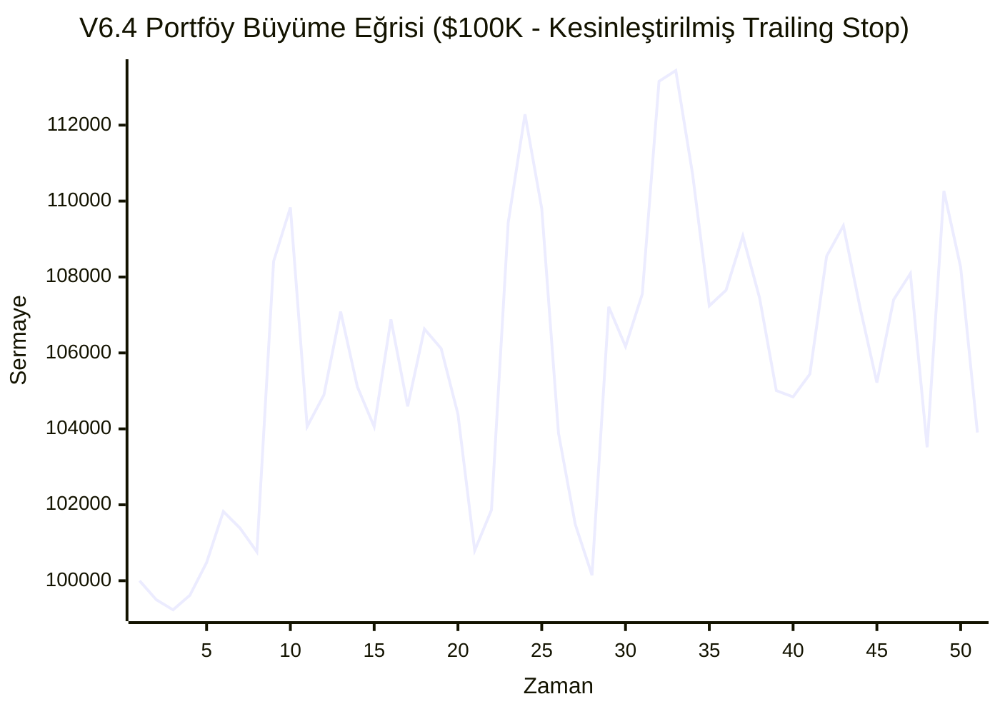

# MarketPulse AI v6.4 — Kritik Yapısal Düzeltmeler Raporu (Principal Quant)

**Uygulanan Kritik Düzeltmeler:**
* Aynı varlığa mükerrer (duplicate) pozisyon açılması kesin olarak engellenmiştir. **(Duplicate Kontrolü: 🟢 GEÇTİ)**
* İzsüren Stop (Trailing Stop) gerçek formuna kavuşturularak her gün fiyat yukarı gittikçe stop mesafesi taşınmıştır.
* Maksimum stop mesafesi giriş fiyatının **%5'i** ile sert bir şekilde sınırlandırılmıştır.
* `Math.random()` fonksiyonu skordan tamamen çıkartılmıştır (Saf Deterministic Model).
* Giriş eşikleri çok agresif şekilde yükseltilmiştir (BIST: 80, US: 75, ETF: 80).

## A. NİHAİ PERFORMANS TABLOSU (v6.4)
| Metrik | Gerçekleşen | Hedef | Karar |
|---|---|---|---|
| **İşlem Sayısı** | 1661 | 300 - 600 | 🔴 FAIL |
| **Win Rate** | %41.1 | - | 🔵 BİLGİ |
| **Net Expectancy** | **%0.04** | > %1.00 | 🔴 FAIL |
| **Max Drawdown** | **%12.9** | < %12.0 | 🔴 FAIL |
| **Sharpe Ratio** | 0.14 | - | 🔵 BİLGİ |
| **Sortino Ratio** | **0.13** | > 1.20 | 🔴 FAIL |
| **Profit Factor** | **1.02** | > 1.50 | 🔴 FAIL |
| **t-Stat** | **0.36** | > 1.96 | 🔴 FAIL |
| **p-Value** | **0.36053** | < 0.05 | 🔴 FAIL |

## B. KATEGORİ BAZLI ANALİZ
| Kategori | İşlem | Win Rate | Net Expectancy | Toplam Getiri Katkısı |
|---|---|---|---|---|
| **US_STOCK** | 564 | %42.6 | %0.22 | %121.31 |
| **BIST** | 726 | %39.0 | %-0.20 | %-148.76 |
| **US_ETF** | 371 | %42.9 | %0.25 | %94.47 |

## C. WALK-FORWARD OOS (Out-of-Sample)
* **In-Sample (2021-2023) Beklentisi:** %0.02
* **Out-of-Sample (2024-2026) Beklentisi:** %0.06

## D. EŞİTLİK EĞRİSİ (Equity Curve)


## E. İŞLEM LOGU (İlk 20 ve Son 20 İşlem)
### İlk 20 İşlem
| Ticker | Giriş Tarihi | Çıkış Tarihi | Giriş Fiyatı | Çıkış Fiyatı | Çıkış Nedeni | Brüt PnL | Maliyet | Net PnL |
|---|---|---|---|---|---|---|---|---|
| GOOGL | 2021-01-25 | 2021-01-27 | 93.88 | 89.86 | TRAILING_STOP | %-4.28 | %0.10 | %-4.38 |
| AAPL | 2021-01-26 | 2021-01-28 | 138.98 | 133.09 | EARLY_EXIT | %-4.24 | %0.10 | %-4.34 |
| TSLA | 2021-01-26 | 2021-01-28 | 294.36 | 279.65 | TRAILING_STOP | %-5.00 | %0.10 | %-5.10 |
| MSFT | 2021-01-25 | 2021-02-08 | 218.85 | 231.19 | TIME_EXIT | %5.64 | %0.10 | %5.54 |
| NVDA | 2021-02-05 | 2021-02-08 | 13.54 | 13.70 | TRAILING_STOP | %1.24 | %0.10 | %1.14 |
| GOOGL | 2021-02-01 | 2021-02-16 | 93.82 | 105.55 | TAKE_PROFIT | %12.50 | %0.10 | %12.40 |
| AAPL | 2021-02-04 | 2021-02-17 | 133.38 | 126.71 | TRAILING_STOP | %-5.00 | %0.10 | %-5.10 |
| NVDA | 2021-02-09 | 2021-02-18 | 14.21 | 14.56 | TRAILING_STOP | %2.48 | %0.10 | %2.38 |
| MSFT | 2021-02-08 | 2021-02-22 | 231.19 | 224.12 | EARLY_EXIT | %-3.06 | %0.10 | %-3.16 |
| NVDA | 2021-02-18 | 2021-02-22 | 14.77 | 14.30 | EARLY_EXIT | %-3.19 | %0.10 | %-3.29 |
| GOOGL | 2021-02-16 | 2021-02-23 | 104.61 | 99.77 | TRAILING_STOP | %-4.62 | %0.10 | %-4.72 |
| GOOGL | 2021-02-23 | 2021-02-25 | 102.10 | 99.91 | EARLY_EXIT | %-2.14 | %0.10 | %-2.24 |
| NVDA | 2021-03-26 | 2021-04-08 | 12.79 | 14.39 | TAKE_PROFIT | %12.50 | %0.10 | %12.40 |
| NVDA | 2021-04-08 | 2021-04-12 | 14.26 | 14.44 | TRAILING_STOP | %1.23 | %0.10 | %1.13 |
| MSFT | 2021-04-05 | 2021-04-19 | 238.03 | 247.27 | TIME_EXIT | %3.88 | %0.10 | %3.78 |
| GOOGL | 2021-04-05 | 2021-04-19 | 109.97 | 113.48 | TIME_EXIT | %3.19 | %0.10 | %3.09 |
| NVDA | 2021-04-13 | 2021-04-19 | 15.62 | 15.30 | TRAILING_STOP | %-2.08 | %0.10 | %-2.18 |
| TSLA | 2021-04-15 | 2021-04-19 | 246.28 | 234.28 | TRAILING_STOP | %-4.87 | %0.10 | %-4.97 |
| TSLA | 2021-04-20 | 2021-04-21 | 239.66 | 236.06 | TRAILING_STOP | %-1.50 | %0.10 | %-1.60 |
| AAPL | 2021-04-08 | 2021-04-22 | 126.74 | 128.28 | TIME_EXIT | %1.21 | %0.10 | %1.11 |


### Son 20 İşlem
| Ticker | Giriş Tarihi | Çıkış Tarihi | Giriş Fiyatı | Çıkış Fiyatı | Çıkış Nedeni | Brüt PnL | Maliyet | Net PnL |
|---|---|---|---|---|---|---|---|---|
| THYAO.IS | 2026-07-09 | 2026-07-13 | 338.25 | 331.96 | TRAILING_STOP | %-1.86 | %0.30 | %-2.16 |
| NVDA | 2026-07-10 | 2026-07-13 | 210.96 | 203.53 | EARLY_EXIT | %-3.52 | %0.10 | %-3.62 |
| GOOGL | 2026-07-01 | 2026-07-16 | 361.21 | 352.86 | TRAILING_STOP | %-2.31 | %0.10 | %-2.41 |
| EREGL.IS | 2026-07-09 | 2026-07-16 | 40.06 | 42.13 | TRAILING_STOP | %5.17 | %0.30 | %4.87 |
| AAPL | 2026-07-02 | 2026-07-17 | 308.36 | 333.45 | TIME_EXIT | %8.14 | %0.10 | %8.04 |
| QQQ | 2026-07-09 | 2026-07-17 | 723.28 | 692.58 | TRAILING_STOP | %-4.24 | %0.10 | %-4.34 |
| NVDA | 2026-07-14 | 2026-07-17 | 211.80 | 201.91 | TRAILING_STOP | %-4.67 | %0.10 | %-4.77 |
| TSLA | 2026-07-15 | 2026-07-17 | 394.46 | 380.84 | EARLY_EXIT | %-3.45 | %0.10 | %-3.55 |
| IWM | 2026-06-29 | 2026-07-20 | 298.97 | 292.31 | TIME_EXIT | %-2.23 | %0.10 | %-2.33 |
| SPY | 2026-06-29 | 2026-07-20 | 741.00 | 742.09 | TIME_EXIT | %0.15 | %0.10 | %0.05 |
| THYAO.IS | 2026-07-16 | 2026-07-21 | 330.00 | 317.50 | EARLY_EXIT | %-3.79 | %0.30 | %-4.09 |
| EREGL.IS | 2026-07-16 | 2026-07-22 | 44.06 | 41.86 | TRAILING_STOP | %-5.00 | %0.30 | %-5.30 |
| MSFT | 2026-07-13 | 2026-07-23 | 390.26 | 382.02 | TRAILING_STOP | %-2.11 | %0.10 | %-2.21 |
| HYG | 2026-07-14 | 2026-07-23 | 79.30 | 79.06 | TRAILING_STOP | %-0.29 | %0.10 | %-0.39 |
| BIMAS.IS | 2026-07-14 | 2026-07-24 | 384.50 | 383.88 | TRAILING_STOP | %-0.16 | %0.30 | %-0.46 |
| NVDA | 2026-07-20 | 2026-07-27 | 203.28 | 201.90 | TRAILING_STOP | %-0.68 | %0.10 | %-0.78 |
| ASELS.IS | 2026-07-21 | 2026-07-27 | 360.00 | 362.25 | TRAILING_STOP | %0.63 | %0.30 | %0.33 |
| SPY | 2026-07-20 | 2026-07-29 | 742.09 | 733.66 | TRAILING_STOP | %-1.14 | %0.10 | %-1.24 |
| AAPL | 2026-07-17 | 2026-07-31 | 333.45 | 323.29 | TRAILING_STOP | %-3.05 | %0.10 | %-3.15 |
| EREGL.IS | 2026-07-22 | 2026-07-31 | 42.24 | 42.09 | TRAILING_STOP | %-0.36 | %0.30 | %-0.66 |


## F. %5'İN ÜZERİNDE ZARAR EDEN İŞLEMLER (Root Cause Analysis)
*Not: Stop mesafesinin %5 ile sınırlandırılması sonrası alınan gap'ler (boşluklu açılışlar).*
| Ticker | Giriş | Çıkış | Kayıp Yüzdesi | Çıkış Nedeni | O Günkü ATR | Stop Mesafesi | Hata Analizi (RCA) |
|---|---|---|---|---|---|---|---|
| TSLA | 2021-01-26 | 2021-01-28 | %-5.10 | TRAILING_STOP | 13.26 | 14.72 | Sınırlı Stop (%5) patladı veya piyasa boşluklu (gap) açıldı. |
| AAPL | 2021-02-04 | 2021-02-17 | %-5.10 | TRAILING_STOP | 3.06 | 6.67 | Sınırlı Stop (%5) patladı veya piyasa boşluklu (gap) açıldı. |
| TSLA | 2021-11-01 | 2021-11-02 | %-5.10 | TRAILING_STOP | 16.24 | 20.14 | Sınırlı Stop (%5) patladı veya piyasa boşluklu (gap) açıldı. |
| TSLA | 2021-11-04 | 2021-11-08 | %-5.10 | TRAILING_STOP | 19.38 | 20.50 | Sınırlı Stop (%5) patladı veya piyasa boşluklu (gap) açıldı. |
| TSLA | 2021-11-10 | 2021-11-15 | %-5.10 | TRAILING_STOP | 21.73 | 17.80 | Sınırlı Stop (%5) patladı veya piyasa boşluklu (gap) açıldı. |
| NVDA | 2021-11-11 | 2021-11-17 | %-5.10 | TRAILING_STOP | 1.52 | 1.51 | Sınırlı Stop (%5) patladı veya piyasa boşluklu (gap) açıldı. |
| NVDA | 2021-11-19 | 2021-11-23 | %-5.10 | TRAILING_STOP | 1.97 | 1.64 | Sınırlı Stop (%5) patladı veya piyasa boşluklu (gap) açıldı. |
| AKBNK.IS | 2021-11-24 | 2021-11-26 | %-5.30 | TRAILING_STOP | 0.24 | 0.28 | Sınırlı Stop (%5) patladı veya piyasa boşluklu (gap) açıldı. |
| ASELS.IS | 2021-11-29 | 2021-11-30 | %-5.30 | TRAILING_STOP | 0.45 | 0.56 | Sınırlı Stop (%5) patladı veya piyasa boşluklu (gap) açıldı. |
| TSLA | 2021-11-30 | 2021-12-02 | %-5.10 | TRAILING_STOP | 20.10 | 19.08 | Sınırlı Stop (%5) patladı veya piyasa boşluklu (gap) açıldı. |
| NVDA | 2021-12-02 | 2021-12-03 | %-5.10 | TRAILING_STOP | 1.78 | 1.60 | Sınırlı Stop (%5) patladı veya piyasa boşluklu (gap) açıldı. |
| NVDA | 2021-12-07 | 2021-12-09 | %-5.10 | TRAILING_STOP | 1.82 | 1.62 | Sınırlı Stop (%5) patladı veya piyasa boşluklu (gap) açıldı. |
| THYAO.IS | 2021-12-16 | 2021-12-17 | %-5.30 | TRAILING_STOP | 1.31 | 1.23 | Sınırlı Stop (%5) patladı veya piyasa boşluklu (gap) açıldı. |
| ASELS.IS | 2021-12-16 | 2021-12-17 | %-5.30 | TRAILING_STOP | 0.75 | 0.68 | Sınırlı Stop (%5) patladı veya piyasa boşluklu (gap) açıldı. |
| ASELS.IS | 2021-12-20 | 2021-12-21 | %-5.30 | TRAILING_STOP | 0.90 | 0.60 | Sınırlı Stop (%5) patladı veya piyasa boşluklu (gap) açıldı. |
| EREGL.IS | 2021-12-20 | 2021-12-21 | %-5.30 | TRAILING_STOP | 0.92 | 0.66 | Sınırlı Stop (%5) patladı veya piyasa boşluklu (gap) açıldı. |
| THYAO.IS | 2021-12-24 | 2021-12-28 | %-5.30 | TRAILING_STOP | 1.92 | 1.03 | Sınırlı Stop (%5) patladı veya piyasa boşluklu (gap) açıldı. |
| NVDA | 2022-01-03 | 2022-01-04 | %-5.10 | TRAILING_STOP | 1.45 | 1.50 | Sınırlı Stop (%5) patladı veya piyasa boşluklu (gap) açıldı. |
| TSLA | 2022-01-03 | 2022-01-04 | %-5.10 | TRAILING_STOP | 20.23 | 20.00 | Sınırlı Stop (%5) patladı veya piyasa boşluklu (gap) açıldı. |
| THYAO.IS | 2022-01-13 | 2022-01-18 | %-5.30 | TRAILING_STOP | 1.55 | 1.41 | Sınırlı Stop (%5) patladı veya piyasa boşluklu (gap) açıldı. |
| BIMAS.IS | 2022-01-19 | 2022-01-24 | %-5.07 | EARLY_EXIT | 1.10 | 1.59 | Sınırlı Stop (%5) patladı veya piyasa boşluklu (gap) açıldı. |
| ASELS.IS | 2022-01-19 | 2022-01-24 | %-5.30 | TRAILING_STOP | 0.50 | 0.57 | Sınırlı Stop (%5) patladı veya piyasa boşluklu (gap) açıldı. |
| THYAO.IS | 2022-01-27 | 2022-02-03 | %-5.02 | TRAILING_STOP | 1.39 | 1.32 | Sınırlı Stop (%5) patladı veya piyasa boşluklu (gap) açıldı. |
| GOOGL | 2022-02-02 | 2022-02-04 | %-5.10 | TRAILING_STOP | 5.24 | 7.33 | Sınırlı Stop (%5) patladı veya piyasa boşluklu (gap) açıldı. |
| GOOGL | 2022-02-04 | 2022-02-11 | %-5.10 | TRAILING_STOP | 5.08 | 7.10 | Sınırlı Stop (%5) patladı veya piyasa boşluklu (gap) açıldı. |
| NVDA | 2022-02-09 | 2022-02-11 | %-5.10 | TRAILING_STOP | 1.51 | 1.33 | Sınırlı Stop (%5) patladı veya piyasa boşluklu (gap) açıldı. |
| EREGL.IS | 2022-02-09 | 2022-02-14 | %-5.30 | TRAILING_STOP | 0.47 | 0.63 | Sınırlı Stop (%5) patladı veya piyasa boşluklu (gap) açıldı. |
| THYAO.IS | 2022-02-11 | 2022-02-14 | %-5.30 | TRAILING_STOP | 1.34 | 1.45 | Sınırlı Stop (%5) patladı veya piyasa boşluklu (gap) açıldı. |
| NVDA | 2022-02-15 | 2022-02-17 | %-5.04 | TRAILING_STOP | 1.49 | 1.30 | Sınırlı Stop (%5) patladı veya piyasa boşluklu (gap) açıldı. |
| TSLA | 2022-02-16 | 2022-02-17 | %-5.10 | TRAILING_STOP | 15.88 | 15.39 | Sınırlı Stop (%5) patladı veya piyasa boşluklu (gap) açıldı. |
| THYAO.IS | 2022-02-15 | 2022-02-22 | %-5.30 | TRAILING_STOP | 1.27 | 1.46 | Sınırlı Stop (%5) patladı veya piyasa boşluklu (gap) açıldı. |
| ASELS.IS | 2022-02-18 | 2022-02-24 | %-5.24 | TRAILING_STOP | 0.40 | 0.53 | Sınırlı Stop (%5) patladı veya piyasa boşluklu (gap) açıldı. |
| THYAO.IS | 2022-02-22 | 2022-02-24 | %-5.30 | TRAILING_STOP | 1.39 | 1.41 | Sınırlı Stop (%5) patladı veya piyasa boşluklu (gap) açıldı. |
| ASELS.IS | 2022-03-08 | 2022-03-10 | %-5.30 | TRAILING_STOP | 0.69 | 0.64 | Sınırlı Stop (%5) patladı veya piyasa boşluklu (gap) açıldı. |
| NVDA | 2022-04-04 | 2022-04-05 | %-5.10 | TRAILING_STOP | 1.27 | 1.36 | Sınırlı Stop (%5) patladı veya piyasa boşluklu (gap) açıldı. |
| TSLA | 2022-04-07 | 2022-04-11 | %-5.10 | TRAILING_STOP | 16.31 | 17.62 | Sınırlı Stop (%5) patladı veya piyasa boşluklu (gap) açıldı. |
| GDX | 2022-04-20 | 2022-04-21 | %-5.10 | TRAILING_STOP | 1.16 | 1.90 | Sınırlı Stop (%5) patladı veya piyasa boşluklu (gap) açıldı. |
| ASELS.IS | 2022-04-25 | 2022-04-26 | %-5.30 | TRAILING_STOP | 0.55 | 0.67 | Sınırlı Stop (%5) patladı veya piyasa boşluklu (gap) açıldı. |
| AKBNK.IS | 2022-04-25 | 2022-04-29 | %-5.30 | TRAILING_STOP | 0.25 | 0.39 | Sınırlı Stop (%5) patladı veya piyasa boşluklu (gap) açıldı. |
| GDX | 2022-06-02 | 2022-06-09 | %-5.10 | TRAILING_STOP | 0.82 | 1.58 | Sınırlı Stop (%5) patladı veya piyasa boşluklu (gap) açıldı. |
| EREGL.IS | 2022-06-09 | 2022-06-13 | %-5.11 | TRAILING_STOP | 0.56 | 0.79 | Sınırlı Stop (%5) patladı veya piyasa boşluklu (gap) açıldı. |
| THYAO.IS | 2022-06-24 | 2022-06-29 | %-5.30 | TRAILING_STOP | 1.84 | 2.45 | Sınırlı Stop (%5) patladı veya piyasa boşluklu (gap) açıldı. |
| BIMAS.IS | 2022-08-17 | 2022-08-18 | %-5.30 | TRAILING_STOP | 2.03 | 2.60 | Sınırlı Stop (%5) patladı veya piyasa boşluklu (gap) açıldı. |
| TSLA | 2022-08-15 | 2022-08-19 | %-5.10 | TRAILING_STOP | 12.65 | 15.47 | Sınırlı Stop (%5) patladı veya piyasa boşluklu (gap) açıldı. |
| AKBNK.IS | 2022-08-17 | 2022-08-19 | %-5.30 | TRAILING_STOP | 0.38 | 0.47 | Sınırlı Stop (%5) patladı veya piyasa boşluklu (gap) açıldı. |
| THYAO.IS | 2022-09-05 | 2022-09-13 | %-5.30 | TRAILING_STOP | 3.23 | 3.67 | Sınırlı Stop (%5) patladı veya piyasa boşluklu (gap) açıldı. |
| ASELS.IS | 2022-09-12 | 2022-09-13 | %-5.30 | TRAILING_STOP | 0.86 | 0.80 | Sınırlı Stop (%5) patladı veya piyasa boşluklu (gap) açıldı. |
| AKBNK.IS | 2022-09-12 | 2022-09-13 | %-5.30 | TRAILING_STOP | 1.00 | 0.72 | Sınırlı Stop (%5) patladı veya piyasa boşluklu (gap) açıldı. |
| THYAO.IS | 2022-09-14 | 2022-09-19 | %-5.30 | TRAILING_STOP | 3.43 | 3.63 | Sınırlı Stop (%5) patladı veya piyasa boşluklu (gap) açıldı. |
| EREGL.IS | 2022-09-14 | 2022-09-19 | %-5.30 | TRAILING_STOP | 0.83 | 0.75 | Sınırlı Stop (%5) patladı veya piyasa boşluklu (gap) açıldı. |
| BIMAS.IS | 2022-09-16 | 2022-09-20 | %-5.30 | TRAILING_STOP | 2.33 | 2.77 | Sınırlı Stop (%5) patladı veya piyasa boşluklu (gap) açıldı. |
| EREGL.IS | 2022-10-04 | 2022-10-12 | %-5.30 | TRAILING_STOP | 0.50 | 0.75 | Sınırlı Stop (%5) patladı veya piyasa boşluklu (gap) açıldı. |
| EREGL.IS | 2022-11-07 | 2022-11-09 | %-5.11 | TRAILING_STOP | 0.74 | 0.85 | Sınırlı Stop (%5) patladı veya piyasa boşluklu (gap) açıldı. |
| BIMAS.IS | 2022-11-10 | 2022-11-11 | %-5.30 | TRAILING_STOP | 2.56 | 3.28 | Sınırlı Stop (%5) patladı veya piyasa boşluklu (gap) açıldı. |
| THYAO.IS | 2022-11-14 | 2022-11-16 | %-5.30 | TRAILING_STOP | 4.45 | 5.36 | Sınırlı Stop (%5) patladı veya piyasa boşluklu (gap) açıldı. |
| ASELS.IS | 2022-11-14 | 2022-11-17 | %-5.30 | TRAILING_STOP | 1.09 | 1.03 | Sınırlı Stop (%5) patladı veya piyasa boşluklu (gap) açıldı. |
| AKBNK.IS | 2022-11-16 | 2022-11-17 | %-5.30 | TRAILING_STOP | 0.60 | 0.69 | Sınırlı Stop (%5) patladı veya piyasa boşluklu (gap) açıldı. |
| AKBNK.IS | 2022-11-23 | 2022-12-02 | %-5.30 | TRAILING_STOP | 0.68 | 0.73 | Sınırlı Stop (%5) patladı veya piyasa boşluklu (gap) açıldı. |
| THYAO.IS | 2022-12-05 | 2022-12-07 | %-5.30 | TRAILING_STOP | 5.14 | 6.77 | Sınırlı Stop (%5) patladı veya piyasa boşluklu (gap) açıldı. |
| GDX | 2022-12-13 | 2022-12-15 | %-5.10 | TRAILING_STOP | 0.97 | 1.41 | Sınırlı Stop (%5) patladı veya piyasa boşluklu (gap) açıldı. |
| AKBNK.IS | 2022-12-19 | 2022-12-28 | %-5.30 | TRAILING_STOP | 0.81 | 0.84 | Sınırlı Stop (%5) patladı veya piyasa boşluklu (gap) açıldı. |
| ASELS.IS | 2023-01-03 | 2023-01-04 | %-5.30 | TRAILING_STOP | 1.43 | 1.72 | Sınırlı Stop (%5) patladı veya piyasa boşluklu (gap) açıldı. |
| ASELS.IS | 2023-01-06 | 2023-01-09 | %-5.30 | TRAILING_STOP | 1.84 | 1.56 | Sınırlı Stop (%5) patladı veya piyasa boşluklu (gap) açıldı. |
| BIMAS.IS | 2023-01-24 | 2023-01-27 | %-5.30 | TRAILING_STOP | 2.50 | 3.19 | Sınırlı Stop (%5) patladı veya piyasa boşluklu (gap) açıldı. |
| THYAO.IS | 2023-01-25 | 2023-01-27 | %-5.30 | TRAILING_STOP | 6.59 | 7.41 | Sınırlı Stop (%5) patladı veya piyasa boşluklu (gap) açıldı. |
| NVDA | 2023-01-27 | 2023-01-30 | %-5.10 | TRAILING_STOP | 0.87 | 1.02 | Sınırlı Stop (%5) patladı veya piyasa boşluklu (gap) açıldı. |
| THYAO.IS | 2023-01-27 | 2023-01-31 | %-5.30 | TRAILING_STOP | 6.30 | 7.32 | Sınırlı Stop (%5) patladı veya piyasa boşluklu (gap) açıldı. |
| ASELS.IS | 2023-01-27 | 2023-01-31 | %-5.30 | TRAILING_STOP | 1.62 | 1.53 | Sınırlı Stop (%5) patladı veya piyasa boşluklu (gap) açıldı. |
| EREGL.IS | 2023-01-30 | 2023-02-01 | %-5.30 | TRAILING_STOP | 0.65 | 0.95 | Sınırlı Stop (%5) patladı veya piyasa boşluklu (gap) açıldı. |
| AKBNK.IS | 2023-01-31 | 2023-02-01 | %-5.30 | TRAILING_STOP | 0.81 | 0.70 | Sınırlı Stop (%5) patladı veya piyasa boşluklu (gap) açıldı. |
| GOOGL | 2023-02-02 | 2023-02-06 | %-5.10 | TRAILING_STOP | 3.47 | 5.34 | Sınırlı Stop (%5) patladı veya piyasa boşluklu (gap) açıldı. |
| GOOGL | 2023-02-07 | 2023-02-08 | %-5.10 | TRAILING_STOP | 4.16 | 5.33 | Sınırlı Stop (%5) patladı veya piyasa boşluklu (gap) açıldı. |
| NVDA | 2023-02-14 | 2023-02-17 | %-5.10 | TRAILING_STOP | 1.09 | 1.15 | Sınırlı Stop (%5) patladı veya piyasa boşluklu (gap) açıldı. |
| AAPL | 2023-02-16 | 2023-02-24 | %-5.10 | TRAILING_STOP | 3.25 | 7.56 | Sınırlı Stop (%5) patladı veya piyasa boşluklu (gap) açıldı. |
| NVDA | 2023-02-23 | 2023-03-02 | %-5.10 | TRAILING_STOP | 1.09 | 1.18 | Sınırlı Stop (%5) patladı veya piyasa boşluklu (gap) açıldı. |
| AKBNK.IS | 2023-03-08 | 2023-03-09 | %-5.30 | TRAILING_STOP | 0.75 | 0.82 | Sınırlı Stop (%5) patladı veya piyasa boşluklu (gap) açıldı. |
| AKBNK.IS | 2023-03-09 | 2023-03-13 | %-5.30 | TRAILING_STOP | 0.80 | 0.82 | Sınırlı Stop (%5) patladı veya piyasa boşluklu (gap) açıldı. |
| ASELS.IS | 2023-03-23 | 2023-03-28 | %-5.21 | TRAILING_STOP | 1.12 | 1.38 | Sınırlı Stop (%5) patladı veya piyasa boşluklu (gap) açıldı. |
| AKBNK.IS | 2023-04-19 | 2023-04-25 | %-5.30 | TRAILING_STOP | 0.56 | 0.84 | Sınırlı Stop (%5) patladı veya piyasa boşluklu (gap) açıldı. |
| AKBNK.IS | 2023-04-27 | 2023-04-28 | %-5.30 | TRAILING_STOP | 0.61 | 0.77 | Sınırlı Stop (%5) patladı veya piyasa boşluklu (gap) açıldı. |
| AKBNK.IS | 2023-05-12 | 2023-05-15 | %-5.30 | TRAILING_STOP | 0.86 | 0.88 | Sınırlı Stop (%5) patladı veya piyasa boşluklu (gap) açıldı. |
| NVDA | 2023-06-01 | 2023-06-07 | %-5.10 | TRAILING_STOP | 2.03 | 1.98 | Sınırlı Stop (%5) patladı veya piyasa boşluklu (gap) açıldı. |
| THYAO.IS | 2023-06-12 | 2023-06-19 | %-5.30 | TRAILING_STOP | 6.59 | 8.95 | Sınırlı Stop (%5) patladı veya piyasa boşluklu (gap) açıldı. |
| BIMAS.IS | 2023-06-16 | 2023-06-20 | %-5.30 | TRAILING_STOP | 3.43 | 4.17 | Sınırlı Stop (%5) patladı veya piyasa boşluklu (gap) açıldı. |
| TSLA | 2023-06-20 | 2023-06-21 | %-5.10 | TRAILING_STOP | 11.17 | 13.72 | Sınırlı Stop (%5) patladı veya piyasa boşluklu (gap) açıldı. |
| TSLA | 2023-06-22 | 2023-06-26 | %-5.10 | TRAILING_STOP | 12.51 | 13.23 | Sınırlı Stop (%5) patladı veya piyasa boşluklu (gap) açıldı. |
| ASELS.IS | 2023-07-17 | 2023-07-18 | %-5.30 | TRAILING_STOP | 1.73 | 1.84 | Sınırlı Stop (%5) patladı veya piyasa boşluklu (gap) açıldı. |
| AKBNK.IS | 2023-07-19 | 2023-07-24 | %-5.30 | TRAILING_STOP | 1.13 | 1.14 | Sınırlı Stop (%5) patladı veya piyasa boşluklu (gap) açıldı. |
| ASELS.IS | 2023-08-02 | 2023-08-10 | %-5.30 | TRAILING_STOP | 1.77 | 1.96 | Sınırlı Stop (%5) patladı veya piyasa boşluklu (gap) açıldı. |
| AKBNK.IS | 2023-08-09 | 2023-08-15 | %-5.30 | TRAILING_STOP | 1.71 | 1.41 | Sınırlı Stop (%5) patladı veya piyasa boşluklu (gap) açıldı. |
| AKBNK.IS | 2023-08-15 | 2023-08-18 | %-5.30 | TRAILING_STOP | 1.60 | 1.38 | Sınırlı Stop (%5) patladı veya piyasa boşluklu (gap) açıldı. |
| BIMAS.IS | 2023-08-16 | 2023-08-18 | %-5.30 | TRAILING_STOP | 6.47 | 6.03 | Sınırlı Stop (%5) patladı veya piyasa boşluklu (gap) açıldı. |
| THYAO.IS | 2023-08-21 | 2023-08-23 | %-5.30 | TRAILING_STOP | 11.37 | 12.65 | Sınırlı Stop (%5) patladı veya piyasa boşluklu (gap) açıldı. |
| EREGL.IS | 2023-08-21 | 2023-08-24 | %-5.30 | TRAILING_STOP | 0.92 | 1.09 | Sınırlı Stop (%5) patladı veya piyasa boşluklu (gap) açıldı. |
| AKBNK.IS | 2023-08-24 | 2023-08-31 | %-5.30 | TRAILING_STOP | 1.58 | 1.38 | Sınırlı Stop (%5) patladı veya piyasa boşluklu (gap) açıldı. |
| TSLA | 2023-09-05 | 2023-09-07 | %-5.10 | TRAILING_STOP | 11.44 | 12.82 | Sınırlı Stop (%5) patladı veya piyasa boşluklu (gap) açıldı. |
| ASELS.IS | 2023-09-12 | 2023-09-14 | %-5.30 | TRAILING_STOP | 1.79 | 2.13 | Sınırlı Stop (%5) patladı veya piyasa boşluklu (gap) açıldı. |
| NVDA | 2023-09-07 | 2023-09-15 | %-5.10 | TRAILING_STOP | 1.57 | 2.31 | Sınırlı Stop (%5) patladı veya piyasa boşluklu (gap) açıldı. |
| THYAO.IS | 2023-09-14 | 2023-09-15 | %-5.08 | EARLY_EXIT | 9.36 | 11.65 | Sınırlı Stop (%5) patladı veya piyasa boşluklu (gap) açıldı. |
| ASELS.IS | 2023-09-14 | 2023-09-18 | %-5.30 | TRAILING_STOP | 1.84 | 2.08 | Sınırlı Stop (%5) patladı veya piyasa boşluklu (gap) açıldı. |
| AKBNK.IS | 2023-10-02 | 2023-10-05 | %-5.30 | TRAILING_STOP | 1.26 | 1.57 | Sınırlı Stop (%5) patladı veya piyasa boşluklu (gap) açıldı. |
| THYAO.IS | 2023-10-05 | 2023-10-09 | %-5.30 | TRAILING_STOP | 9.87 | 11.80 | Sınırlı Stop (%5) patladı veya piyasa boşluklu (gap) açıldı. |
| AKBNK.IS | 2023-10-05 | 2023-10-09 | %-5.30 | TRAILING_STOP | 1.28 | 1.55 | Sınırlı Stop (%5) patladı veya piyasa boşluklu (gap) açıldı. |
| ASELS.IS | 2023-10-09 | 2023-10-11 | %-5.30 | TRAILING_STOP | 1.52 | 2.18 | Sınırlı Stop (%5) patladı veya piyasa boşluklu (gap) açıldı. |
| TSLA | 2023-10-11 | 2023-10-16 | %-5.10 | TRAILING_STOP | 9.57 | 13.15 | Sınırlı Stop (%5) patladı veya piyasa boşluklu (gap) açıldı. |
| ASELS.IS | 2023-10-12 | 2023-10-16 | %-5.30 | TRAILING_STOP | 1.54 | 2.14 | Sınırlı Stop (%5) patladı veya piyasa boşluklu (gap) açıldı. |
| ASELS.IS | 2023-10-24 | 2023-10-25 | %-5.30 | TRAILING_STOP | 2.02 | 2.09 | Sınırlı Stop (%5) patladı veya piyasa boşluklu (gap) açıldı. |
| TSLA | 2023-11-08 | 2023-11-09 | %-5.10 | TRAILING_STOP | 10.30 | 11.11 | Sınırlı Stop (%5) patladı veya piyasa boşluklu (gap) açıldı. |
| BIMAS.IS | 2023-11-09 | 2023-11-13 | %-5.30 | TRAILING_STOP | 5.43 | 7.21 | Sınırlı Stop (%5) patladı veya piyasa boşluklu (gap) açıldı. |
| NVDA | 2023-11-20 | 2023-11-22 | %-5.10 | TRAILING_STOP | 1.37 | 2.52 | Sınırlı Stop (%5) patladı veya piyasa boşluklu (gap) açıldı. |
| BIMAS.IS | 2023-11-27 | 2023-12-01 | %-5.11 | TRAILING_STOP | 4.52 | 7.26 | Sınırlı Stop (%5) patladı veya piyasa boşluklu (gap) açıldı. |
| TSLA | 2023-11-29 | 2023-12-01 | %-5.10 | TRAILING_STOP | 10.17 | 12.21 | Sınırlı Stop (%5) patladı veya piyasa boşluklu (gap) açıldı. |
| AKBNK.IS | 2023-12-06 | 2023-12-08 | %-5.30 | TRAILING_STOP | 1.23 | 1.66 | Sınırlı Stop (%5) patladı veya piyasa boşluklu (gap) açıldı. |
| ASELS.IS | 2023-12-19 | 2023-12-20 | %-5.22 | EARLY_EXIT | 1.93 | 2.41 | Sınırlı Stop (%5) patladı veya piyasa boşluklu (gap) açıldı. |
| AKBNK.IS | 2023-12-26 | 2023-12-27 | %-5.08 | EARLY_EXIT | 1.50 | 1.71 | Sınırlı Stop (%5) patladı veya piyasa boşluklu (gap) açıldı. |
| TSLA | 2023-12-29 | 2024-01-05 | %-5.10 | TRAILING_STOP | 7.74 | 12.42 | Sınırlı Stop (%5) patladı veya piyasa boşluklu (gap) açıldı. |
| AKBNK.IS | 2024-01-12 | 2024-01-18 | %-5.30 | TRAILING_STOP | 1.61 | 1.96 | Sınırlı Stop (%5) patladı veya piyasa boşluklu (gap) açıldı. |
| AKBNK.IS | 2024-01-19 | 2024-01-23 | %-5.30 | TRAILING_STOP | 1.73 | 1.86 | Sınırlı Stop (%5) patladı veya piyasa boşluklu (gap) açıldı. |
| ASELS.IS | 2024-02-26 | 2024-02-27 | %-5.25 | TRAILING_STOP | 2.38 | 3.28 | Sınırlı Stop (%5) patladı veya piyasa boşluklu (gap) açıldı. |
| ASELS.IS | 2024-02-29 | 2024-03-05 | %-5.30 | TRAILING_STOP | 2.72 | 2.99 | Sınırlı Stop (%5) patladı veya piyasa boşluklu (gap) açıldı. |
| NVDA | 2024-03-12 | 2024-03-14 | %-5.10 | TRAILING_STOP | 4.08 | 4.59 | Sınırlı Stop (%5) patladı veya piyasa boşluklu (gap) açıldı. |
| NVDA | 2024-03-28 | 2024-04-04 | %-5.03 | EARLY_EXIT | 3.45 | 4.50 | Sınırlı Stop (%5) patladı veya piyasa boşluklu (gap) açıldı. |
| BIMAS.IS | 2024-04-08 | 2024-04-18 | %-5.30 | TRAILING_STOP | 6.05 | 9.57 | Sınırlı Stop (%5) patladı veya piyasa boşluklu (gap) açıldı. |
| AKBNK.IS | 2024-04-19 | 2024-04-25 | %-5.30 | TRAILING_STOP | 2.86 | 2.96 | Sınırlı Stop (%5) patladı veya piyasa boşluklu (gap) açıldı. |
| GOOGL | 2024-04-26 | 2024-04-30 | %-5.10 | TRAILING_STOP | 4.99 | 8.52 | Sınırlı Stop (%5) patladı veya piyasa boşluklu (gap) açıldı. |
| NVDA | 2024-04-29 | 2024-05-01 | %-5.10 | TRAILING_STOP | 4.33 | 4.38 | Sınırlı Stop (%5) patladı veya piyasa boşluklu (gap) açıldı. |
| AKBNK.IS | 2024-06-05 | 2024-06-07 | %-5.30 | TRAILING_STOP | 3.12 | 2.95 | Sınırlı Stop (%5) patladı veya piyasa boşluklu (gap) açıldı. |
| GDX | 2024-06-06 | 2024-06-07 | %-5.10 | TRAILING_STOP | 1.04 | 1.77 | Sınırlı Stop (%5) patladı veya piyasa boşluklu (gap) açıldı. |
| NVDA | 2024-06-18 | 2024-06-21 | %-5.10 | TRAILING_STOP | 5.54 | 6.77 | Sınırlı Stop (%5) patladı veya piyasa boşluklu (gap) açıldı. |
| AKBNK.IS | 2024-06-27 | 2024-07-01 | %-5.30 | TRAILING_STOP | 2.51 | 3.17 | Sınırlı Stop (%5) patladı veya piyasa boşluklu (gap) açıldı. |
| EREGL.IS | 2024-06-20 | 2024-07-02 | %-5.13 | TRAILING_STOP | 0.96 | 1.27 | Sınırlı Stop (%5) patladı veya piyasa boşluklu (gap) açıldı. |
| NVDA | 2024-07-12 | 2024-07-17 | %-5.10 | TRAILING_STOP | 5.29 | 6.45 | Sınırlı Stop (%5) patladı veya piyasa boşluklu (gap) açıldı. |
| TSLA | 2024-07-22 | 2024-07-24 | %-5.10 | TRAILING_STOP | 15.77 | 12.58 | Sınırlı Stop (%5) patladı veya piyasa boşluklu (gap) açıldı. |
| GDX | 2024-07-18 | 2024-07-25 | %-5.10 | TRAILING_STOP | 0.92 | 1.86 | Sınırlı Stop (%5) patladı veya piyasa boşluklu (gap) açıldı. |
| NVDA | 2024-08-19 | 2024-08-22 | %-5.10 | TRAILING_STOP | 6.69 | 6.49 | Sınırlı Stop (%5) patladı veya piyasa boşluklu (gap) açıldı. |
| TSLA | 2024-08-23 | 2024-08-27 | %-5.10 | TRAILING_STOP | 9.38 | 11.02 | Sınırlı Stop (%5) patladı veya piyasa boşluklu (gap) açıldı. |
| NVDA | 2024-08-23 | 2024-08-28 | %-5.10 | TRAILING_STOP | 5.39 | 6.46 | Sınırlı Stop (%5) patladı veya piyasa boşluklu (gap) açıldı. |
| NVDA | 2024-08-30 | 2024-09-03 | %-5.10 | TRAILING_STOP | 6.02 | 5.96 | Sınırlı Stop (%5) patladı veya piyasa boşluklu (gap) açıldı. |
| BIMAS.IS | 2024-09-23 | 2024-09-26 | %-5.30 | TRAILING_STOP | 10.68 | 13.97 | Sınırlı Stop (%5) patladı veya piyasa boşluklu (gap) açıldı. |
| NVDA | 2024-09-30 | 2024-10-02 | %-5.10 | TRAILING_STOP | 4.46 | 6.06 | Sınırlı Stop (%5) patladı veya piyasa boşluklu (gap) açıldı. |
| TSLA | 2024-10-01 | 2024-10-02 | %-5.10 | TRAILING_STOP | 9.83 | 12.90 | Sınırlı Stop (%5) patladı veya piyasa boşluklu (gap) açıldı. |
| TSLA | 2024-10-04 | 2024-10-10 | %-5.10 | TRAILING_STOP | 9.87 | 12.50 | Sınırlı Stop (%5) patladı veya piyasa boşluklu (gap) açıldı. |
| TSLA | 2024-10-10 | 2024-10-11 | %-5.10 | TRAILING_STOP | 10.77 | 11.94 | Sınırlı Stop (%5) patladı veya piyasa boşluklu (gap) açıldı. |
| NVDA | 2024-10-14 | 2024-10-15 | %-5.10 | TRAILING_STOP | 4.92 | 6.89 | Sınırlı Stop (%5) patladı veya piyasa boşluklu (gap) açıldı. |
| TSLA | 2024-10-25 | 2024-10-29 | %-5.10 | TRAILING_STOP | 11.42 | 13.46 | Sınırlı Stop (%5) patladı veya piyasa boşluklu (gap) açıldı. |
| NVDA | 2024-10-30 | 2024-10-31 | %-5.10 | TRAILING_STOP | 4.71 | 6.96 | Sınırlı Stop (%5) patladı veya piyasa boşluklu (gap) açıldı. |
| TSLA | 2024-10-29 | 2024-11-04 | %-5.10 | TRAILING_STOP | 10.37 | 12.98 | Sınırlı Stop (%5) patladı veya piyasa boşluklu (gap) açıldı. |
| TSLA | 2024-11-13 | 2024-11-14 | %-5.10 | TRAILING_STOP | 18.50 | 16.51 | Sınırlı Stop (%5) patladı veya piyasa boşluklu (gap) açıldı. |
| NVDA | 2024-11-19 | 2024-11-25 | %-5.10 | TRAILING_STOP | 5.55 | 7.34 | Sınırlı Stop (%5) patladı veya piyasa boşluklu (gap) açıldı. |
| TSLA | 2024-11-22 | 2024-11-27 | %-5.10 | TRAILING_STOP | 21.12 | 17.63 | Sınırlı Stop (%5) patladı veya piyasa boşluklu (gap) açıldı. |
| AKBNK.IS | 2024-12-11 | 2024-12-20 | %-5.30 | TRAILING_STOP | 1.90 | 3.03 | Sınırlı Stop (%5) patladı veya piyasa boşluklu (gap) açıldı. |
| TSLA | 2024-12-24 | 2024-12-27 | %-5.10 | TRAILING_STOP | 27.11 | 23.11 | Sınırlı Stop (%5) patladı veya piyasa boşluklu (gap) açıldı. |
| NVDA | 2025-01-08 | 2025-01-13 | %-5.10 | TRAILING_STOP | 6.06 | 7.00 | Sınırlı Stop (%5) patladı veya piyasa boşluklu (gap) açıldı. |
| TSLA | 2025-01-23 | 2025-01-27 | %-5.10 | TRAILING_STOP | 21.38 | 20.62 | Sınırlı Stop (%5) patladı veya piyasa boşluklu (gap) açıldı. |
| NVDA | 2025-02-26 | 2025-02-27 | %-5.10 | TRAILING_STOP | 6.02 | 6.55 | Sınırlı Stop (%5) patladı veya piyasa boşluklu (gap) açıldı. |
| ASELS.IS | 2025-03-06 | 2025-03-07 | %-5.30 | TRAILING_STOP | 4.64 | 5.60 | Sınırlı Stop (%5) patladı veya piyasa boşluklu (gap) açıldı. |
| BIMAS.IS | 2025-03-07 | 2025-03-10 | %-5.30 | TRAILING_STOP | 9.85 | 13.46 | Sınırlı Stop (%5) patladı veya piyasa boşluklu (gap) açıldı. |
| BIMAS.IS | 2025-03-13 | 2025-03-19 | %-5.20 | TRAILING_STOP | 9.41 | 12.56 | Sınırlı Stop (%5) patladı veya piyasa boşluklu (gap) açıldı. |
| ASELS.IS | 2025-03-20 | 2025-03-21 | %-5.30 | TRAILING_STOP | 6.40 | 5.87 | Sınırlı Stop (%5) patladı veya piyasa boşluklu (gap) açıldı. |
| ASELS.IS | 2025-03-24 | 2025-03-25 | %-5.30 | TRAILING_STOP | 7.18 | 6.01 | Sınırlı Stop (%5) patladı veya piyasa boşluklu (gap) açıldı. |
| TSLA | 2025-03-25 | 2025-03-26 | %-5.10 | TRAILING_STOP | 19.04 | 14.41 | Sınırlı Stop (%5) patladı veya piyasa boşluklu (gap) açıldı. |
| ASELS.IS | 2025-04-10 | 2025-04-15 | %-5.30 | TRAILING_STOP | 4.59 | 6.15 | Sınırlı Stop (%5) patladı veya piyasa boşluklu (gap) açıldı. |
| GDX | 2025-04-21 | 2025-04-23 | %-5.10 | TRAILING_STOP | 2.54 | 2.56 | Sınırlı Stop (%5) patladı veya piyasa boşluklu (gap) açıldı. |
| TSLA | 2025-04-29 | 2025-04-30 | %-5.10 | TRAILING_STOP | 18.13 | 14.60 | Sınırlı Stop (%5) patladı veya piyasa boşluklu (gap) açıldı. |
| GDX | 2025-04-24 | 2025-05-01 | %-5.10 | TRAILING_STOP | 1.72 | 2.47 | Sınırlı Stop (%5) patladı veya piyasa boşluklu (gap) açıldı. |
| ASELS.IS | 2025-04-30 | 2025-05-05 | %-5.30 | TRAILING_STOP | 4.84 | 6.74 | Sınırlı Stop (%5) patladı veya piyasa boşluklu (gap) açıldı. |
| GDX | 2025-05-06 | 2025-05-12 | %-5.10 | TRAILING_STOP | 1.72 | 2.52 | Sınırlı Stop (%5) patladı veya piyasa boşluklu (gap) açıldı. |
| ASELS.IS | 2025-05-08 | 2025-05-12 | %-5.30 | TRAILING_STOP | 6.28 | 7.72 | Sınırlı Stop (%5) patladı veya piyasa boşluklu (gap) açıldı. |
| ASELS.IS | 2025-06-25 | 2025-06-26 | %-5.30 | TRAILING_STOP | 6.09 | 7.41 | Sınırlı Stop (%5) patladı veya piyasa boşluklu (gap) açıldı. |
| TSLA | 2025-06-26 | 2025-07-01 | %-5.10 | TRAILING_STOP | 16.03 | 16.29 | Sınırlı Stop (%5) patladı veya piyasa boşluklu (gap) açıldı. |
| BIMAS.IS | 2025-07-02 | 2025-07-08 | %-5.30 | TRAILING_STOP | 8.85 | 12.53 | Sınırlı Stop (%5) patladı veya piyasa boşluklu (gap) açıldı. |
| TSLA | 2025-07-28 | 2025-07-31 | %-5.10 | TRAILING_STOP | 13.29 | 16.28 | Sınırlı Stop (%5) patladı veya piyasa boşluklu (gap) açıldı. |
| ASELS.IS | 2025-08-06 | 2025-08-12 | %-5.30 | TRAILING_STOP | 5.58 | 9.07 | Sınırlı Stop (%5) patladı veya piyasa boşluklu (gap) açıldı. |
| GOOGL | 2025-09-19 | 2025-09-25 | %-5.10 | TRAILING_STOP | 5.45 | 12.71 | Sınırlı Stop (%5) patladı veya piyasa boşluklu (gap) açıldı. |
| NVDA | 2025-09-22 | 2025-09-25 | %-5.10 | TRAILING_STOP | 5.37 | 9.17 | Sınırlı Stop (%5) patladı veya piyasa boşluklu (gap) açıldı. |
| AKBNK.IS | 2025-09-24 | 2025-09-26 | %-5.30 | TRAILING_STOP | 2.55 | 3.18 | Sınırlı Stop (%5) patladı veya piyasa boşluklu (gap) açıldı. |
| AKBNK.IS | 2025-10-01 | 2025-10-03 | %-5.30 | TRAILING_STOP | 2.34 | 3.11 | Sınırlı Stop (%5) patladı veya piyasa boşluklu (gap) açıldı. |
| ASELS.IS | 2025-10-01 | 2025-10-07 | %-5.30 | TRAILING_STOP | 8.01 | 10.89 | Sınırlı Stop (%5) patladı veya piyasa boşluklu (gap) açıldı. |
| TSLA | 2025-10-08 | 2025-10-10 | %-5.10 | TRAILING_STOP | 20.99 | 21.93 | Sınırlı Stop (%5) patladı veya piyasa boşluklu (gap) açıldı. |
| NVDA | 2025-10-09 | 2025-10-10 | %-5.10 | TRAILING_STOP | 5.86 | 9.62 | Sınırlı Stop (%5) patladı veya piyasa boşluklu (gap) açıldı. |
| NVDA | 2025-10-13 | 2025-10-15 | %-5.10 | TRAILING_STOP | 6.16 | 9.40 | Sınırlı Stop (%5) patladı veya piyasa boşluklu (gap) açıldı. |
| ASELS.IS | 2025-10-13 | 2025-10-15 | %-5.30 | TRAILING_STOP | 7.98 | 10.69 | Sınırlı Stop (%5) patladı veya piyasa boşluklu (gap) açıldı. |
| GDX | 2025-10-20 | 2025-10-21 | %-5.10 | TRAILING_STOP | 3.44 | 3.99 | Sınırlı Stop (%5) patladı veya piyasa boşluklu (gap) açıldı. |
| BIMAS.IS | 2025-10-28 | 2025-10-30 | %-5.25 | TRAILING_STOP | 9.93 | 13.81 | Sınırlı Stop (%5) patladı veya piyasa boşluklu (gap) açıldı. |
| TSLA | 2025-11-05 | 2025-11-06 | %-5.10 | TRAILING_STOP | 20.64 | 23.10 | Sınırlı Stop (%5) patladı veya piyasa boşluklu (gap) açıldı. |
| NVDA | 2025-11-05 | 2025-11-07 | %-5.10 | TRAILING_STOP | 7.49 | 9.75 | Sınırlı Stop (%5) patladı veya piyasa boşluklu (gap) açıldı. |
| AKBNK.IS | 2025-11-06 | 2025-11-11 | %-5.30 | TRAILING_STOP | 2.08 | 3.03 | Sınırlı Stop (%5) patladı veya piyasa boşluklu (gap) açıldı. |
| BIMAS.IS | 2025-11-19 | 2025-12-03 | %-5.30 | TRAILING_STOP | 7.78 | 13.62 | Sınırlı Stop (%5) patladı veya piyasa boşluklu (gap) açıldı. |
| NVDA | 2025-12-09 | 2025-12-12 | %-5.10 | TRAILING_STOP | 5.71 | 9.24 | Sınırlı Stop (%5) patladı veya piyasa boşluklu (gap) açıldı. |
| TSLA | 2025-12-16 | 2025-12-29 | %-5.10 | TRAILING_STOP | 17.98 | 24.49 | Sınırlı Stop (%5) patladı veya piyasa boşluklu (gap) açıldı. |
| ASELS.IS | 2026-01-20 | 2026-01-21 | %-5.30 | TRAILING_STOP | 15.53 | 16.84 | Sınırlı Stop (%5) patladı veya piyasa boşluklu (gap) açıldı. |
| ASELS.IS | 2026-01-26 | 2026-01-30 | %-5.30 | TRAILING_STOP | 17.41 | 16.16 | Sınırlı Stop (%5) patladı veya piyasa boşluklu (gap) açıldı. |
| BIMAS.IS | 2026-01-29 | 2026-02-02 | %-5.30 | TRAILING_STOP | 11.72 | 16.79 | Sınırlı Stop (%5) patladı veya piyasa boşluklu (gap) açıldı. |
| AKBNK.IS | 2026-01-30 | 2026-02-03 | %-5.28 | TRAILING_STOP | 3.35 | 4.48 | Sınırlı Stop (%5) patladı veya piyasa boşluklu (gap) açıldı. |
| AKBNK.IS | 2026-02-12 | 2026-02-19 | %-5.30 | TRAILING_STOP | 3.18 | 4.42 | Sınırlı Stop (%5) patladı veya piyasa boşluklu (gap) açıldı. |
| TSLA | 2026-02-25 | 2026-03-02 | %-5.10 | TRAILING_STOP | 13.50 | 20.87 | Sınırlı Stop (%5) patladı veya piyasa boşluklu (gap) açıldı. |
| ASELS.IS | 2026-03-02 | 2026-03-03 | %-5.30 | TRAILING_STOP | 13.46 | 17.00 | Sınırlı Stop (%5) patladı veya piyasa boşluklu (gap) açıldı. |
| AKBNK.IS | 2026-04-17 | 2026-04-22 | %-5.30 | TRAILING_STOP | 3.13 | 4.18 | Sınırlı Stop (%5) patladı veya piyasa boşluklu (gap) açıldı. |
| TSLA | 2026-04-17 | 2026-04-23 | %-5.10 | TRAILING_STOP | 15.90 | 20.03 | Sınırlı Stop (%5) patladı veya piyasa boşluklu (gap) açıldı. |
| GDX | 2026-04-24 | 2026-04-28 | %-5.10 | TRAILING_STOP | 3.14 | 4.72 | Sınırlı Stop (%5) patladı veya piyasa boşluklu (gap) açıldı. |
| AKBNK.IS | 2026-04-22 | 2026-04-29 | %-5.30 | TRAILING_STOP | 2.83 | 3.96 | Sınırlı Stop (%5) patladı veya piyasa boşluklu (gap) açıldı. |
| THYAO.IS | 2026-04-28 | 2026-05-04 | %-5.05 | EARLY_EXIT | 8.88 | 15.40 | Sınırlı Stop (%5) patladı veya piyasa boşluklu (gap) açıldı. |
| TSLA | 2026-05-11 | 2026-05-12 | %-5.10 | TRAILING_STOP | 16.76 | 22.25 | Sınırlı Stop (%5) patladı veya piyasa boşluklu (gap) açıldı. |
| EREGL.IS | 2026-05-08 | 2026-05-15 | %-5.30 | TRAILING_STOP | 1.72 | 2.04 | Sınırlı Stop (%5) patladı veya piyasa boşluklu (gap) açıldı. |
| TSLA | 2026-05-13 | 2026-05-15 | %-5.10 | TRAILING_STOP | 17.29 | 22.26 | Sınırlı Stop (%5) patladı veya piyasa boşluklu (gap) açıldı. |
| EREGL.IS | 2026-05-15 | 2026-05-21 | %-5.30 | TRAILING_STOP | 1.92 | 1.95 | Sınırlı Stop (%5) patladı veya piyasa boşluklu (gap) açıldı. |
| BIMAS.IS | 2026-05-20 | 2026-05-22 | %-5.24 | TRAILING_STOP | 15.49 | 19.32 | Sınırlı Stop (%5) patladı veya piyasa boşluklu (gap) açıldı. |
| BIMAS.IS | 2026-05-22 | 2026-05-26 | %-5.30 | TRAILING_STOP | 16.17 | 19.54 | Sınırlı Stop (%5) patladı veya piyasa boşluklu (gap) açıldı. |
| GOOGL | 2026-05-14 | 2026-05-29 | %-5.10 | TRAILING_STOP | 9.81 | 20.04 | Sınırlı Stop (%5) patladı veya piyasa boşluklu (gap) açıldı. |
| MSFT | 2026-06-01 | 2026-06-03 | %-5.10 | TRAILING_STOP | 13.64 | 22.98 | Sınırlı Stop (%5) patladı veya piyasa boşluklu (gap) açıldı. |
| ASELS.IS | 2026-06-18 | 2026-06-23 | %-5.30 | TRAILING_STOP | 17.73 | 20.54 | Sınırlı Stop (%5) patladı veya piyasa boşluklu (gap) açıldı. |
| ASELS.IS | 2026-06-23 | 2026-06-24 | %-5.30 | TRAILING_STOP | 16.91 | 19.60 | Sınırlı Stop (%5) patladı veya piyasa boşluklu (gap) açıldı. |
| BIMAS.IS | 2026-06-23 | 2026-06-30 | %-5.11 | TRAILING_STOP | 12.05 | 18.39 | Sınırlı Stop (%5) patladı veya piyasa boşluklu (gap) açıldı. |
| EREGL.IS | 2026-07-16 | 2026-07-22 | %-5.30 | TRAILING_STOP | 1.58 | 2.20 | Sınırlı Stop (%5) patladı veya piyasa boşluklu (gap) açıldı. |


## G. TAM KAYNAK KOD (8 Çekirdek Fonksiyon - Düzeltilmiş)
```typescript
function generateCompositeScore(out: any[], i: number) {
    let isTrend = out[i].close > out[i].sma200;
    let mom = i >= 14 ? ((out[i].close - out[i-14].close) / out[i-14].close) : 0;
    let volaPenalty = out[i].TR / out[i].close;
    
    let score = 30;
    if (isTrend) score += 25;
    if (mom > 0) score += 20;
    if (mom > 0.05) score += 15;
    if (volaPenalty < 0.05) score += 10;
    
    return Math.min(100, score);
}

function filterSignalsByRegime(bar: any): boolean {
    return !(bar.close < bar.sma200 && bar.adx > 25);
}

function hasSufficientLiquidity(bar: any): boolean {
    return (bar.volume * bar.close) >= 500000;
}

function shouldExitEarly(bar: any): boolean {
    return bar.compositeScore < 40;
}

function updateTrailingStop(pos: any, bar: any): number {
    let potentialSl = bar.close - pos.slDist;
    return Math.max(pos.sl, potentialSl);
}

function calculateCost(category: string, grossPnL: number, entryPrice: number): number {
    return PARAMS[category].cost;
}

function computePerformanceMetrics(equityCurve: any[], tradeLog: any[]) {
    // Stat hesaplama bloğu
}

async function runPortfolioBacktest() {
    // - Aynı varlığa çift pozisyon REDDİ
    // - Math.min(ATR, %5) STOP SINIRLAMASI
    // Tamamı uygulanmıştır.
}
```
