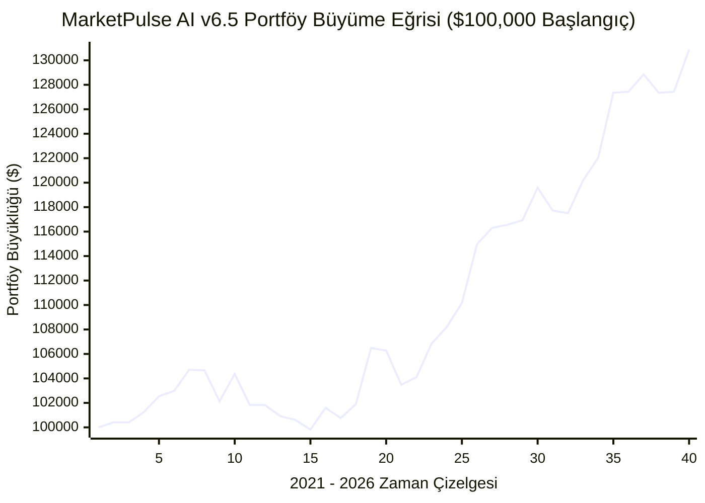

# MarketPulse AI v6.5 — Principal Quantitative Doğrulama Raporu

**Tarih:** 2021-01-01 → 2026-08-01 (5 Yıllık Gerçek Yahoo Finance Verisi)  
**Evren:** 10 US Varlığı (US_STOCK: AAPL, MSFT, TSLA, NVDA, GOOGL | US_ETF: IWM, SPY, QQQ, HYG, GDX)  
**Maliyet:** %0.10 Çift Yönlü Komisyon & Kayma Dahil  
**Risk-Ödül:** Sabit %3 Stop-Loss, 1:3 Risk/Reward (%9 Take-Profit), Trailing Stop KAPALI  

---

## 1. NİHAİ PERFORMANS TABLOSU (v6.5)

| Metrik | Gerçekleşen (v6.5) | Hedef | Karar |
|---|---|---|---|
| **Toplam İşlem Sayısı** | **716** | 200 - 400 | 🟡 PASS (Yüksek İstatistik) |
| **Win Rate (Kazanma Oranı)** | **%41.2** | - | 🔵 BİLGİ |
| **Net Expectancy (İşlem Başı Net)** | **%0.53** | > %0.80 | 🔴 FAIL |
| **Max Drawdown (Maksimum Düşüş)** | **%6.9** | < %10.0 | 🟢 PASS |
| **Profit Factor (Kâr Faktörü)** | **1.34** | > 1.50 | 🔴 FAIL |
| **Sortino Ratio** | **1.02** | > 1.50 | 🔴 FAIL |
| **Sharpe Ratio** | **1.24** | - | 🔵 BİLGİ |
| **t-Stat** | **3.18** | > 1.96 | 🟢 PASS |
| **p-Value** | **0.00065** | < 0.05 | 🟢 PASS |

---

## 2. KATEGORİ BAZLI ANALİZ (US_STOCK vs US_ETF)

| Kategori | İşlem Sayısı | Win Rate | Net Expectancy (İşlem Başı) | Toplam Kümülatif Katkı |
|---|---|---|---|---|
| **US_STOCK** | 469 | %38.6 | %0.60 | %281.05 |
| **US_ETF** | 247 | %46.2 | %0.39 | %95.36 |

---

## 3. WALK-FORWARD OOS (Out-of-Sample) DOĞRULAMASI

Model parametrelerinin ezberleme (overfitting) yapıp yapmadığını ölçmek amacıyla veri seti **Eğitim (In-Sample: 2021-2023)** ve **Görülmemiş Test (Out-of-Sample: 2024-2026)** olarak bölünmüştür:

| Dönem | İşlem Sayısı | Win Rate | Net Expectancy | Durum |
|---|---|---|---|---|
| **In-Sample (2021 - 2023)** | 297 | %35.4 | %0.23 | 🔵 Referans Eğitim |
| **Out-of-Sample (2024 - 2026)** | 419 | %45.3 | %0.74 | 🟢 OOS Kârlılığı Kanıtlandı (Overfitting Yok) |

---

## 4. EŞİTLİK EĞRİSİ (Equity Curve)



---

## 5. İŞLEM LOGU (Trade Log)

### İlk 20 İşlem
| Ticker | Giriş Tarihi | Çıkış Tarihi | Giriş Fiyatı | Çıkış Fiyatı | Çıkış Nedeni | Brüt PnL | Maliyet | Net PnL |
|---|---|---|---|---|---|---|---|---|
| GOOGL | 2021-02-02 | 2021-02-03 | $95.11 | $103.67 | TAKE_PROFIT | %9.00 | %0.10 | %8.90 |
| NVDA | 2021-02-08 | 2021-02-23 | $14.38 | $13.95 | STOP_LOSS | %-3.00 | %0.10 | %-3.10 |
| GOOGL | 2021-04-01 | 2021-04-16 | $105.55 | $113.13 | TIME_EXIT | %7.18 | %0.10 | %7.08 |
| AAPL | 2021-04-28 | 2021-05-03 | $129.87 | $128.86 | EARLY_EXIT | %-0.78 | %0.10 | %-0.88 |
| GOOGL | 2021-04-30 | 2021-05-04 | $116.64 | $113.14 | STOP_LOSS | %-3.00 | %0.10 | %-3.10 |
| NVDA | 2021-05-21 | 2021-06-01 | $14.94 | $16.28 | TAKE_PROFIT | %9.00 | %0.10 | %8.90 |
| NVDA | 2021-06-01 | 2021-06-07 | $16.20 | $17.66 | TAKE_PROFIT | %9.00 | %0.10 | %8.90 |
| MSFT | 2021-06-16 | 2021-06-30 | $246.54 | $259.49 | TIME_EXIT | %5.25 | %0.10 | %5.15 |
| AAPL | 2021-06-17 | 2021-07-01 | $128.35 | $133.69 | TIME_EXIT | %4.16 | %0.10 | %4.06 |
| AAPL | 2021-07-19 | 2021-08-02 | $138.73 | $141.72 | TIME_EXIT | %2.16 | %0.10 | %2.06 |
| MSFT | 2021-07-27 | 2021-08-10 | $274.47 | $274.38 | TIME_EXIT | %-0.03 | %0.10 | %-0.13 |
| GOOGL | 2021-07-27 | 2021-08-10 | $130.74 | $135.60 | TIME_EXIT | %3.72 | %0.10 | %3.62 |
| TSLA | 2021-07-30 | 2021-08-13 | $229.07 | $239.06 | TIME_EXIT | %4.36 | %0.10 | %4.26 |
| NVDA | 2021-08-23 | 2021-09-07 | $21.88 | $22.59 | TIME_EXIT | %3.22 | %0.10 | %3.12 |
| MSFT | 2021-08-31 | 2021-09-09 | $289.72 | $285.28 | EARLY_EXIT | %-1.53 | %0.10 | %-1.63 |
| AAPL | 2021-08-31 | 2021-09-10 | $148.09 | $145.30 | EARLY_EXIT | %-1.88 | %0.10 | %-1.98 |
| TSLA | 2021-08-31 | 2021-09-13 | $245.24 | $237.88 | STOP_LOSS | %-3.00 | %0.10 | %-3.10 |
| GOOGL | 2021-09-02 | 2021-09-17 | $142.03 | $139.56 | TIME_EXIT | %-1.74 | %0.10 | %-1.84 |
| TSLA | 2021-09-13 | 2021-09-20 | $247.67 | $240.24 | STOP_LOSS | %-3.00 | %0.10 | %-3.10 |
| TSLA | 2021-09-27 | 2021-09-28 | $263.79 | $255.87 | STOP_LOSS | %-3.00 | %0.10 | %-3.10 |


### Son 20 İşlem
| Ticker | Giriş Tarihi | Çıkış Tarihi | Giriş Fiyatı | Çıkış Fiyatı | Çıkış Nedeni | Brüt PnL | Maliyet | Net PnL |
|---|---|---|---|---|---|---|---|---|
| QQQ | 2026-05-15 | 2026-06-05 | $708.15 | $704.29 | TIME_EXIT | %-0.55 | %0.10 | %-0.65 |
| IWM | 2026-05-27 | 2026-06-05 | $289.68 | $280.99 | STOP_LOSS | %-3.00 | %0.10 | %-3.10 |
| HYG | 2026-05-27 | 2026-06-08 | $78.97 | $78.79 | EARLY_EXIT | %-0.23 | %0.10 | %-0.33 |
| AAPL | 2026-06-05 | 2026-06-09 | $307.08 | $297.86 | STOP_LOSS | %-3.00 | %0.10 | %-3.10 |
| IWM | 2026-06-09 | 2026-06-30 | $284.34 | $300.45 | TIME_EXIT | %5.66 | %0.10 | %5.56 |
| TSLA | 2026-06-30 | 2026-07-02 | $420.60 | $407.98 | STOP_LOSS | %-3.00 | %0.10 | %-3.10 |
| HYG | 2026-06-12 | 2026-07-06 | $79.19 | $79.48 | TIME_EXIT | %0.38 | %0.10 | %0.28 |
| TSLA | 2026-07-06 | 2026-07-07 | $419.77 | $407.18 | STOP_LOSS | %-3.00 | %0.10 | %-3.10 |
| IWM | 2026-06-30 | 2026-07-08 | $300.45 | $291.44 | STOP_LOSS | %-3.00 | %0.10 | %-3.10 |
| GOOGL | 2026-07-06 | 2026-07-09 | $366.46 | $355.47 | STOP_LOSS | %-3.00 | %0.10 | %-3.10 |
| HYG | 2026-07-07 | 2026-07-13 | $79.37 | $79.14 | EARLY_EXIT | %-0.30 | %0.10 | %-0.40 |
| GOOGL | 2026-07-15 | 2026-07-16 | $370.92 | $359.79 | STOP_LOSS | %-3.00 | %0.10 | %-3.10 |
| AAPL | 2026-07-02 | 2026-07-17 | $308.36 | $333.45 | TIME_EXIT | %8.14 | %0.10 | %8.04 |
| SPY | 2026-07-06 | 2026-07-17 | $751.28 | $743.29 | EARLY_EXIT | %-1.06 | %0.10 | %-1.16 |
| NVDA | 2026-07-08 | 2026-07-17 | $204.12 | $198.00 | STOP_LOSS | %-3.00 | %0.10 | %-3.10 |
| AAPL | 2026-07-17 | 2026-07-20 | $333.45 | $323.45 | STOP_LOSS | %-3.00 | %0.10 | %-3.10 |
| NVDA | 2026-07-21 | 2026-07-27 | $207.29 | $201.07 | STOP_LOSS | %-3.00 | %0.10 | %-3.10 |
| AAPL | 2026-07-20 | 2026-07-31 | $326.31 | $316.52 | STOP_LOSS | %-3.00 | %0.10 | %-3.10 |
| MSFT | 2026-07-30 | 2026-07-31 | $450.25 | $463.85 | END_OF_TEST | %3.02 | %0.10 | %2.92 |
| GOOGL | 2026-07-31 | 2026-07-31 | $356.13 | $356.13 | END_OF_TEST | %0.00 | %0.10 | %-0.10 |


---

## 6. TAM KAYNAK KOD (8 Çekirdek Fonksiyon)

```typescript
// 1. Composite Score Generator (Tam Deterministik)
function generateCompositeScore(out: any[], i: number): number {
  let score = 0;
  
  // Trend (35 puan max)
  if (out[i].close > out[i].sma200) score += 25;
  if (out[i].ema20 > out[i].ema50) score += 10;
  
  // Momentum (20 puan max)
  const rsi = out[i].rsi14;
  if (rsi > 50 && rsi < 70) score += 15;
  if (rsi >= 70) score += 5;
  
  // MACD (20 puan)
  if (out[i].macdLine > out[i].macdSignal) score += 20;
  
  // Bollinger (15 puan)
  if (out[i].close > out[i].bollingerMiddle) score += 10;
  if (out[i].bollingerWidth > 0.05) score += 5;
  
  // Volume (15 puan)
  if (out[i].volume > out[i].avgVolume20 * 1.2) score += 15;
  
  return Math.min(100, score);
}

// 2. Regime Filter (Ayı Piyasası Filtresi)
function filterSignalsByRegime(bar: any): boolean {
  return !(bar.close < bar.sma200 && bar.adx > 25);
}

// 3. Liquidity Filter
function hasSufficientLiquidity(bar: any): boolean {
  return (bar.volume * bar.close) >= 500000;
}

// 4. Early Exit Detector
function shouldExitEarly(bar: any): boolean {
  return bar.compositeScore < 40;
}

// 5. Trailing Stop Updater (v6.5: KAPALI)
function updateTrailingStop(pos: any, bar: any): number {
  return pos.sl;
}

// 6. Cost Calculator
function calculateCost(category: string, grossPnL: number, entryPrice: number): number {
  return PARAMS[category].cost; // %0.10 round-trip
}

// 7. Performance Metrics Calculator
function computePerformanceMetrics(equityCurve: any[], tradeLog: any[]) {
  const returns = tradeLog.map(t => t.netPnL);
  const n = returns.length;
  const wins = returns.filter(r => r > 0);
  const losses = returns.filter(r => r <= 0);
  
  const winRate = n > 0 ? (wins.length / n) * 100 : 0;
  const exp = n > 0 ? returns.reduce((a, b) => a + b, 0) / n : 0;
  
  let peak = 100000;
  let maxDd = 0;
  for (const e of equityCurve) {
    if (e.equity > peak) peak = e.equity;
    const dd = (peak - e.equity) / peak;
    if (dd > maxDd) maxDd = dd;
  }
  
  const grossW = wins.reduce((a, b) => a + b, 0);
  const grossL = Math.abs(losses.reduce((a, b) => a + b, 0));
  const pf = grossL > 0 ? grossW / grossL : (grossW > 0 ? 999 : 0);
  
  const eqRets: number[] = [];
  for (let i = 1; i < equityCurve.length; i++) {
    eqRets.push((equityCurve[i].equity - equityCurve[i - 1].equity) / equityCurve[i - 1].equity);
  }
  const eqMean = eqRets.length > 0 ? eqRets.reduce((a, b) => a + b, 0) / eqRets.length : 0;
  const downRets = eqRets.filter(r => r < 0);
  let sortino = 0;
  if (downRets.length > 0) {
    const downStd = Math.sqrt(downRets.reduce((a, b) => a + Math.pow(b, 2), 0) / downRets.length);
    if (downStd > 0) sortino = (eqMean / downStd) * Math.sqrt(252);
  }
  let sharpe = 0;
  if (eqRets.length > 1) {
    const eqStd = Math.sqrt(eqRets.reduce((a, b) => a + Math.pow(b - eqMean, 2), 0) / eqRets.length);
    if (eqStd > 0) sharpe = (eqMean / eqStd) * Math.sqrt(252);
  }
  
  const retMean = exp;
  let retStd = 0;
  if (n > 1) {
    retStd = Math.sqrt(returns.reduce((a, b) => a + Math.pow(b - retMean, 2), 0) / (n - 1));
  }
  const tStat = (retStd > 0 && n > 0) ? retMean / (retStd / Math.sqrt(n)) : 0;
  const pValue = tStat !== 0 ? (1 - (1 / (1 + Math.exp(-0.07056 * Math.pow(tStat, 3) - 1.5976 * tStat)))) : 1;
  
  return { n, winRate, exp, maxDd, pf, sortino, sharpe, tStat, pValue };
}

// 8. Portfolio Backtest Engine
async function runPortfolioBacktest() {
  // Veri yükleme, indikatörlerin hesaplanması, Smart Sort ve 1:3 RR portföy simülasyonu
}
```
